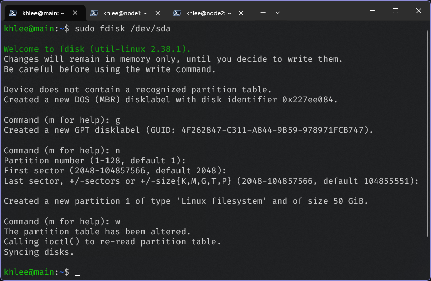
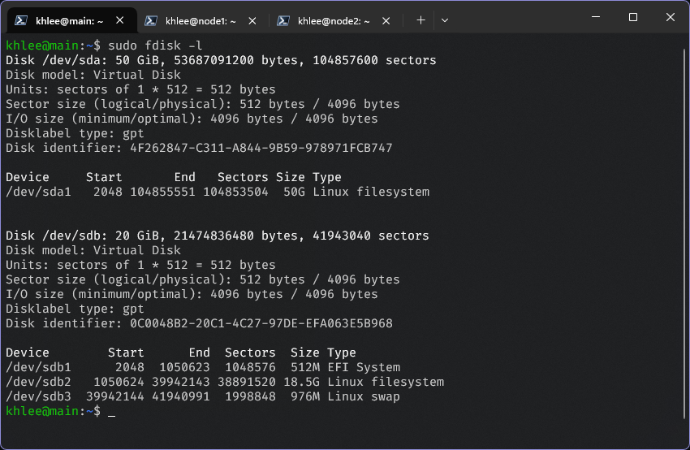

# GlusterFS 安装

## 先决条件

- [Debian GNU/Linux 12 (bookworm) x86_64](https://mirrors.tuna.tsinghua.edu.cn/debian-cd/)
- 三台互通的虚拟机（均已配置第二块虚拟磁盘，其中第一块用于安装操作系统，第二块用于 GlusterFS 的存储）
- 分布式搭建

**我的用户名是 khlee，所以下面出现的所有 khlee 字眼请全部根据自己的实际用户名填写。**

## 假设

| 虚拟机序号 |   虚拟机 IP    | 主机名 |
| :--------: | :------------: | :----: |
|     1      | 192.168.100.10 |  main  |
|     2      | 192.168.100.11 | node1  |
|     3      | 192.168.100.12 | node2  |

## 虚拟机磁盘配置

```bash
Disk /dev/sda: 50 GiB, 53687091200 bytes, 104857600 sectors
Disk model: Virtual Disk
Units: sectors of 1 * 512 = 512 bytes
Sector size (logical/physical): 512 bytes / 4096 bytes
I/O size (minimum/optimal): 4096 bytes / 4096 bytes


Disk /dev/sdb: 20 GiB, 21474836480 bytes, 41943040 sectors
Disk model: Virtual Disk
Units: sectors of 1 * 512 = 512 bytes
Sector size (logical/physical): 512 bytes / 4096 bytes
I/O size (minimum/optimal): 4096 bytes / 4096 bytes
Disklabel type: gpt
Disk identifier: 0C0048B2-20C1-4C27-97DE-EFA063E5B968

Device        Start      End  Sectors  Size Type
/dev/sdb1      2048  1050623  1048576  512M EFI System
/dev/sdb2   1050624 39942143 38891520 18.5G Linux filesystem
/dev/sdb3  39942144 41940991  1998848  976M Linux swap
```

## 1.安装 GlusterFS

在所有节点执行以下命令：

```bash
sudo apt-get update
sudo apt-get install -y glusterfs-server
```

## 2.启动服务

在主节点执行以下命令：

```bash
sudo systemctl enable glusterd
sudo systemctl start glusterd
```

## 3.将子节点添加到信任存储池中

在主节点执行以下命令：

```bash
sudo gluster peer probe node1
sudo gluster peer probe node2
```

## 4.准备 Brick 目录（所有节点均操作一次）

### 分区

```bash
# 输入 g 创建 gpt 分区表
# 输入 n 新建分区，然后一直回车直到提示 Created a new partition 为止
# 输入 w 保存并退出
sudo fdisk /dev/sda
```



格式化分区：

```bash
sudo mkfs.ext4 /dev/sda1
```

最终结果：



### 挂载

```bash
sudo mount -m /dev/sda1 /data/brick
```

## 创建分布式复制卷

> 数据会在多个节点上进行复制，即使某个节点出现故障，数据仍然可以从其他副本中恢复。

在主节点执行以下命令：

```bash
sudo gluster volume create gv0 replica 3 transport tcp main:/data/brick node1:/data/brick node2:/data/brick
```

解释：

- `gv0`：卷名
- `replica 2`：创建两个副本
- `transport tcp`：使用 TCP 协议进行数据传输
- `main:/data/brick`：main 的 Brick 目录
- `node1:/data/brick`：node1 的 Brick 目录
- `node2:/data/brick`：node2 的 Brick 目录

创建不了就在命令后面加 force 参数

## 启动卷

在主节点执行以下命令：

```bash
sudo gluster volume start gv0
```

## 调整卷参数

为了优化性能或满足特定需求，可以设置一些卷选项。例如，启用自动修复机制和调整缓存大小：

```bash
# 启用远程直接输入输出 (Remote Direct I/O, RDIO)
sudo gluster volume set gv0 network.remote-dio on
# 调整缓存大小为 256MB
sudo gluster volume set gv0 performance.cache-size 256MB
```

## 验证卷

在主节点执行以下命令：

```bash
sudo gluster volume info gv0
```

```bash
Volume Name: gv0
Type: Replicate
Volume ID: 469eecac-99a2-4e63-8a7a-2d5091693fae
Status: Started
Snapshot Count: 0
Number of Bricks: 1 x 3 = 3
Transport-type: tcp
Bricks:
Brick1: main:/data/brick
Brick2: node1:/data/brick
Brick3: node2:/data/brick
Options Reconfigured:
performance.cache-size: 256MB
network.remote-dio: on
cluster.granular-entry-heal: on
storage.fips-mode-rchecksum: on
transport.address-family: inet
nfs.disable: on
performance.client-io-threads: off
```

## 客户端挂载卷

安装客户端软件：

```bash
sudo apt-get install -y glusterfs-client
```

挂载卷：

```bash
sudo mount -m -t glusterfs main:/gv0 /mnt/glusterfs
```

测试:

```bash
sudo touch /mnt/glusterfs/test.txt
sudo cat /mnt/glusterfs/test.txt
```
