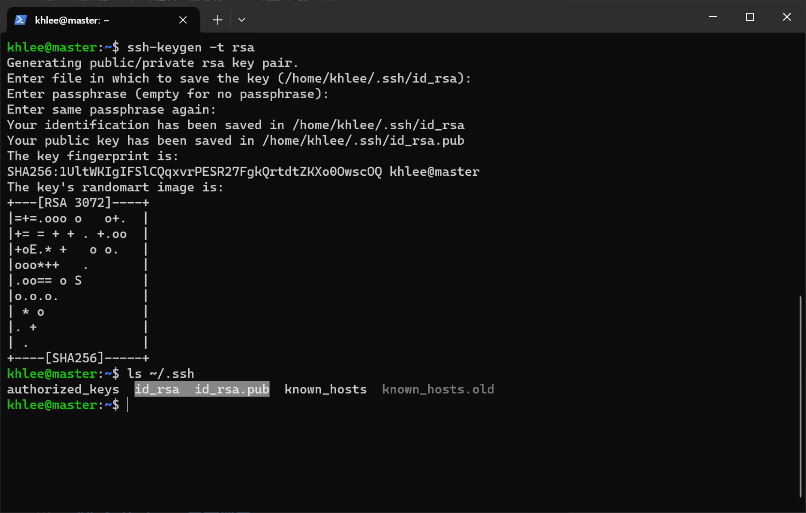
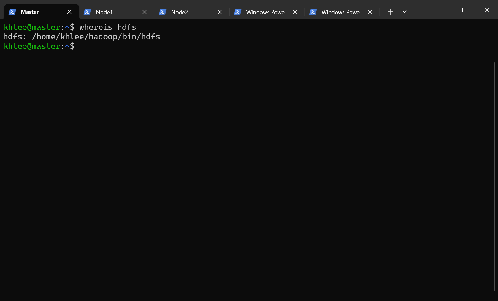
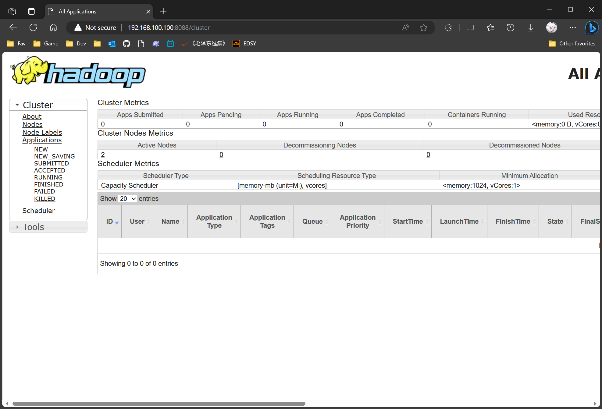
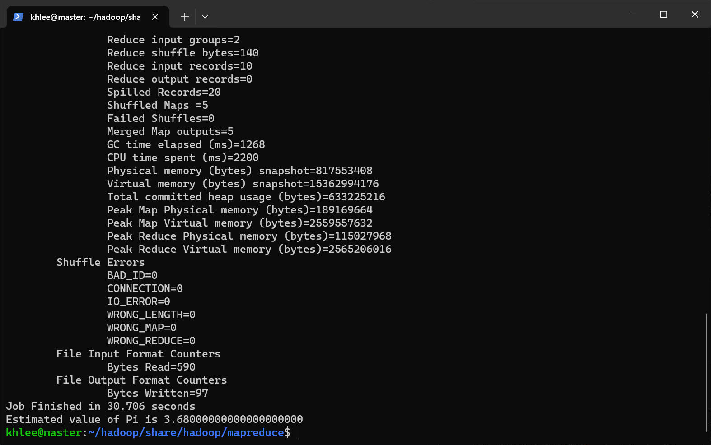

# HADOOP 搭建文档

## 先决条件

- [Debian GNU/Linux 12 (bookworm) x86_64](https://mirrors.tuna.tsinghua.edu.cn/debian-cd/12.4.0/amd64/iso-cd/)（位于 `~/Downloads`）
- [openjdk-8u43-linux-x64.tar.gz](https://jdk.java.net/java-se-ri/8-MR5)（位于 `~/Downloads`）
- [hadoop-3.3.6.tar.gz](https://hadoop.apache.org/releases.html)
- 三台互通的虚拟机
- 分布式搭建

**我的用户名是 khlee，所以下面出现的所有 khlee 字眼请全部根据自己的实际用户名填写。**

## 假设

| 虚拟机序号 |    虚拟机 IP    |
| :--------: | :-------------: |
|     1      | 192.168.100.100 |
|     2      | 192.168.100.101 |
|     3      | 192.168.100.102 |

## 1.修改主机名

修改主机名主要是为了在集群中分辨主次。

在 IP 为 `192.168.100.100` 服务器上操作：

```bash
# 宿主
hostnamectl set-hostname master
```

在 IP 为 `192.168.100.101` 服务器上操作：

```bash
# 节点
hostnamectl set-hostname node1
```

在 IP 为 `192.168.100.102` 服务器上操作：

```bash
# 节点
hostnamectl set-hostname node2
```

## 2.修改 hosts 规则

> 注意：请在 master 节点上操作
> [hosts 是什么](https://baike.baidu.com/item/hosts/10474546)

修改 /etc/hosts 文件:

```bash
sudo vim /etc/hosts
```

在尾部追加几条规则，修改后的内容如图所示：


## 3.同步 hosts 规则

> 注意：请在 master 节点上操作

通过 [scp](https://zhuanlan.zhihu.com/p/97108679) 命令将 master 节点上已经修改过的 hosts 文件发送到 `node1` 和 `node2`：

```bash
scp /etc/hosts root@node1:/etc/hosts
scp /etc/hosts root@node2:/etc/hosts
```

## 4.配置 SSH 免密登录

> 注意：请在 master 节点上操作
> [什么是 RSA 密钥？](https://zhuanlan.zhihu.com/p/26810938)

生成一个 RSA 密钥，一直回车即可。

```bash
ssh-keygen -t rsa
```



创建可信配置（SSH 免密登录）：

```bash
# 给自己添加可信配置, 方便后面启动集群
ssh-copy-id master

# 节点1
ssh-copy-id node1

# 节点2
ssh-copy-id node2
```

请自行测试免密登录是否成功配置。

## 5.配置 root 身份远程登录

分别在 `node1`、`node2` 上操作：

```bash
# 复制免密登录配置到 root 用户
sudo cp -r ~/.ssh /root/
```

在 `master` 上测试是否成功配置免密登录配置：

```bash
# 测试是否可以 root 的身份远程登录到 node1
ssh root@node1

# 测试是否可以 root 的身份远程登录到 node2
ssh root@node2
```

## 6.配置环境变量

> 注意：请在 master 节点上操作
> [什么是环境变量？](https://baike.baidu.com/item/%E7%8E%AF%E5%A2%83%E5%8F%98%E9%87%8F/1730949)

当一个用户登录 Linux 系统或使用 su 命令切换到另一个用户时，首先要确保执行的启动脚本就是 `/etc/profile`，此文件内部内部有一段代码会遍历执行 `/etc/profile.d/` 目录内部的所有脚本。因为每次修改环境变量都很麻烦，所以我们可以在 `/etc/profile.d/` 目录内部新建一个我们的脚本用来存储环境变脸和一些 alias，简化环境变量的修改和刷新。

编辑 `/etc/profile.d/big_data_env.sh` 文件：

```bash
sudo vim /etc/profile.d/big_data_env.sh
```

在末尾写入以下内容：

```bash
alias env-edit='sudo vim /etc/profile.d/big_data_env.sh'
alias env-update='source /etc/profile.d/big_data_env.sh'
alias env-sync-to-node1='scp /etc/profile.d/big_data_env.sh root@node1:/etc/profile.d/'
alias env-sync-to-node2='scp /etc/profile.d/big_data_env.sh root@node2:/etc/profile.d/'
```

使其立即生效：

```bash
source /etc/profile.d/big_data_env.sh
```

这样一来我们就“创造”了两个新的命令，其中:

- env-edit 命令用来编辑环境变量
- env-update 命令用来生效您对环境变量的修改
- env-sync-to-node1 将环境变量同步到 node1
- env-sync-to-node2 将环境变量同步到 node2

不要忘了给其他节点同步一下修改：

```bash
env-sync-to-node1

env-sync-to-node2
```

## 7.解压缩 Hadoop 与 JDK

> 注意：请在 master 节点上操作

```bash
cd ~/Downloads

tar -zxf ./hadoop-3.3.6.tar.gz
tar -zxf ./openjdk-8u43-linux-x64.tar.gz

mv ./hadoop-3.3.6 ~/hadoop
mv ./java-se-8u43-ri ~/jdk
```

## 8.为 Hadoop 与 JDK 配置环境变量

> 注意：请在 master 节点上操作

打开环境变量配置文件：

```bash
env-edit
```

追加以下内容：

```bash
export JAVA_HOME=~/jdk
export HADOOP_HOME=~/hadoop
export PATH=$PATH:$JAVA_HOME/bin:$HADOOP_HOME/bin:$HADOOP_HOME/sbin
```

生效环境变量：

```bash
env-update
```

检查配置是否成功：

```bash
whereis hdfs
```



## 9.Hadoop 配置

> 注意：请在 master 节点上操作

进入到 hadoop 配置文件的目录下：

```bash
cd ~/hadoop/etc/hadoop/
```

### 配置 hadoop-env.sh

由于 hadoop 运行时依赖 Java，所以我们需要在此文件里为 hadoop 配置环境变量；我们还需要在此文件里指定启动 namenode、datanode、secondary namenode、resource manager、node manager 时所使用的用户。

编辑 hadoop-env.sh：

```bash
sudo vim ./hadoop-env.sh
```

在文件末尾追加以下内容：

```bash
# 这里 khlee 是我的用户名

export JAVA_HOME=/home/khlee/jdk

# Hadoop 用户名
export HADOOP_SHELL_EXECNAME=khlee

# NameNode 用户名
export HDFS_NAMENODE_USER=khlee

# DataNode 用户名
export HDFS_DATANODE_USER=khlee

# Secondary NameNode 用户名
export HDFS_SECONDARYNAMENODE_USER=khlee

# Yarn Resource Manager 用户名
export YARN_RESOURCEMANAGER_USER=khlee

# Yarn NodeManager 用户名
export YARN_NODEMANAGER_USER=khlee
```

### 配置 core-site.xml

编辑 core-site.xml：

```bash
sudo vim ./core-site.xml
```

修改后：

```xml
<?xml version="1.0" encoding="UTF-8"?>
<?xml-stylesheet type="text/xsl" href="configuration.xsl"?>

<configuration>
  <!-- 指定 NameNode -->
  <property>
    <name>fs.defaultFS</name>
    <value>hdfs://master:9000</value>
  </property>

  <!-- 指定 hadoop 的缓存目录 -->
  <property>
    <name>hadoop.tmp.dir</name>
    <value>file:/home/khlee/hadoop/tmp</value>
  </property>

  <!-- 允许跨域的方法列表 -->
  <property>
    <name>hadoop.http.cross-origin.allowed-methods</name>
    <value>GET,PUT,POST,OPTIONS,HEAD,DELETE</value>
  </property>

  <!-- 允许跨域访问的来源 -->
  <property>
    <name>hadoop.http.cross-origin.allowed-origins</name>
    <value>*</value>
  </property>

  <!--  允许 JT 和 NN 的 tracker 网页端执行杀任务删文件等操作   -->
  <property>
    <name>mapreduce.jobtracker.webinterface.trusted</name>
    <value>true</value>
  </property>
</configuration>
```

| 参数名               | 默认值                   | 参数解释           |
| -------------------- | ------------------------ | ------------------ |
| fs.defaultFS         | file://                  | 文件系统主机和端口 |
| io.file.bufffer.size | 131072                   | 流文件的缓冲区大小 |
| hadoop.tmp.dir       | /tmp/hadoop-${user_name} | 临时目录           |

### 配置 hdfs-site.xml

编辑 hdfs-site.xml：

```bash
sudo vim ./hdfs-site.xml
```

修改后：

```xml
<?xml version="1.0" encoding="UTF-8"?>
<?xml-stylesheet type="text/xsl" href="configuration.xsl"?>

<configuration>
  <!-- 指定 SecondaryNameNode 的主机名和端口号 -->
  <property>
    <name>dfs.namenode.secondary.http-address</name>
    <value>node1:50090</value>
  </property>

  <!-- 设置 hadoop 集群容灾备份数量 -->
  <property>
    <name>dfs.replication</name>
    <value>1</value>
  </property>

  <!-- NameNode 数据目录 -->
  <property>
    <name>dfs.namenode.name.dir</name>
    <value>file:/home/khlee/hadoop/tmp/dfs/name</value>
  </property>

  <!-- DataNode 数据目录 -->
  <property>
    <name>dfs.datanode.data.dir</name>
    <value>file:/home/khlee/hadoop/tmp/dfs/data</value>
  </property>
</configuration>
```

| 参数名                              | 默认值                            | 参数解释                     |
| ----------------------------------- | --------------------------------- | ---------------------------- |
| dfs.namenode.secondary.http-address | 127.0.0.1:50090                   | SecondaryNameNode            |
| dfs.replication                     | 3                                 | 缺省的块复制数量             |
| dfs.namenode.name.dir               | file://${hadoop.tmp.dir}/dfs/name | dfs 名称节点存储位置         |
| dfs.datanode.data.dir               | file://${hadoop.tmp.dir}/dfs/data | dfs 数据节点存储数据块的位置 |

### 配置 mapred-site.xml

编辑 mapred-site.xml：

```bash
sudo vim ./mapred-site.xml
```

修改后：

```xml
<?xml version="1.0"?>
<?xml-stylesheet type="text/xsl" href="configuration.xsl"?>

<configuration>
  <!-- 进行 mapreduce 作业时使用 yarn 框架 -->
  <property>
    <name>mapreduce.framework.name</name>
    <value>yarn</value>
  </property>

  <!-- 作业历史服务器的主机名和端口号 -->
  <property>
    <name>mapreduce.jobhistory.address</name>
    <value>master:10020</value>
  </property>

  <!-- 作业历史服务器 WEB UI 的主机名和端口号 -->
  <property>
    <name>mapreduce.jobhistory.address</name>
    <value>master:19888</value>
  </property>

  <!-- 配置 MapReduce ApplicationMaster 的环境变量 -->
  <property>
    <name>yarn.app.mapreduce.am.env</name>
    <value>HADOOP_MAPRED_HOME=/home/khlee/hadoop/</value>
  </property>

  <!-- 配置 Map 任务的环境变量 -->
  <property>
      <name>mapreduce.map.env</name>
      <value>HADOOP_MAPRED_HOME=/home/khlee/hadoop/</value>
  </property>

  <!-- 配置 Reduce 任务的环境变量 -->
  <property>
      <name>mapreduce.reduce.env</name>
      <value>HADOOP_MAPRED_HOME=/home/khlee/hadoop/</value>
  </property>
</configuration>
```

| 参数名                              | 默认值        | 参数解释                                                                               |
| ----------------------------------- | ------------- | -------------------------------------------------------------------------------------- |
| mapreduce.framework.name            | local         | 取 local \| classic \| yarn 其中之一，若非 yarn 则不会使用 yarn 集群来实现资源的分配。 |
| mapreduce.jobhistory.address        | 0.0.0.0:10020 | 定义历史服务器的地址和端口，通过历史服务器查看已经运行完的 Mapreduce 作业记录。        |
| mapreduce.jobhistory.webapp.address | 0.0.0.0:19888 | 定义历史服务器 web 应用访问地址和端口。                                                |

### 配置 yarn-site.xml

编辑 yarn-site.xml：

```bash
sudo vim ./yarn-site.xml
```

修改后：

```xml
<?xml version="1.0"?>

<configuration>
  <!-- 把 yarn 集群的资源管理者设置为 master -->
  <property>
    <name>yarn.resourcemanager.hostname</name>
    <value>master</value>
  </property>

  <!-- 自定义服务 -->
  <property>
    <name>yarn.nodemanager.aux-services</name>
    <value>mapreduce_shuffle</value>
  </property>
</configuration>
```

| 参数名                                        | 默认值                                  | 参数解释                                                                                                                               |
| --------------------------------------------- | --------------------------------------- | -------------------------------------------------------------------------------------------------------------------------------------- |
| yarn.resourcemanager.address                  | 0.0.0.0:8032                            | ResourceManager 提供给客户端访问的地址. 客户端通过该地址向 RM 提交应用程序，杀死应用程序等                                             |
| yarn.resourcemanager.scheduler.address        | 0.0.0.0:8030                            | 定义历史服务器的地址和端口，通过历史服务器查看已经运行完的 Mapreduce 作业记录                                                          |
| yarn.resourcemanager.resource-tracker.address | 0.0.0.0:8031                            | ResourceManager 提供给 NodeManager 的地址. NodeManager 通过该地址向 RM 汇报心跳，领取任务等                                            |
| yarn.resourcemanager.admin.address            | 0.0.0.0:8033                            | ResourceManager 提供给管理员的访问地址. 管理员通过该地址向 RM 发送管理命令等                                                           |
| yarn.resourcemanager.webapp.address           | 0.0.0.0:8088                            | ResourceManager 对 web 服务提供地址. 用户可通过该地址在浏览器中查看集群各类信息                                                        |
| yarn.nodemanager.aux-services                 | org.apache.hadoop.mapred.ShuffleHandler | 通过该配置项，用户可以自定义一些服务，例如 Map-Reduce 的 shuffle 功能就是采用这种方式实现的，这样就可以在 NodeManager 上扩展自己的服务 |

### 配置 workers

包含在此文件内的主机名，都将被 master 认为是集群里的一个节点。所以我们需要在此文件内写入所有节点的主机名，这样 master 才知道集群里都有哪些主机。

编辑 workers：

```bash
sudo vim ./workers
```

填写所有节点：

```text
node1
node2
```

## 10.分发文件

> 注意：请在 master 节点上操作

发送 haddop 到 `node1`、`node2` 节点：

```bash
# 可以先删掉 $HADOOP_HOME/share/doc 目录后再发送，更快
scp -r ~/hadoop node1:~/ &
scp -r ~/hadoop node2:~/ &
scp -r ~/jdk node1:~/ &
scp -r ~/jdk node2:~/
```

发送环境变量文件：

```bash
env-sync-to-node1
env-sync-to-node2
```

## 11.生效环境变量

> 注意：请在所有节点上操作一次

```bash
source /etc/profile.d/big_data_env.sh
```

## 12.启动 Hadoop 集群

> 注意：请在 master 节点上操作

格式化元数据：（万不可多次执行此命令）

```bash
hdfs namenode -format
```

> 如果不小心多次执行了此命令，或在发送文件到 hdfs 时遇到问题，请尝试在所有节点上清空您在 [core-site.xml](#配置-core-site.xml) 里配置的数据缓存目录并重新格式化 namenode 解决：
>
> ```bash
> # 在所有节点上执行
> rm -rf $HADOOP_HOME/tmp
> ```
>
> 再次执行格式化：
>
> ```bash
> # 在 master 节点上执行
> hdfs namenode -format
> ```

正常情况下只要红色那一列都是 INFO 一般都没问题：


启动 hdfs 和 yarn：

```bash
start-dfs.sh && start-yarn.sh
```


## 13.检查启动情况

> 注意：请在 master 节点上操作

### 查看是否处于安全模式

如果启动集群后处于安全模式，那么就说明是过程中出现了数据损坏等问题，请仔细检查日志输出内容排查问题：

```bash
hdfs dfsadmin -safemode get
```


### 检查 hadoop 进程

执行命令：

```bash
jps
```


可以看到 master 上出现了 NameNode 进程；节点 node1 和 node2 上出现了 DataNode、NodeManager 进程；node2 作为辅助节点，也出现了 SecondaryNameNode 进程。

### 测试 WEB UI

浏览器打开 <http://192.168.100.100:9870>


浏览器打开 <http://192.168.100.101:8088>



浏览器打开 <http://192.168.100.101:9000>


以上代表正常工作。

## 14.测试 Hadoop

> 以下内容在 master 节点上操作

计算测试：

```bash
# 切换目录
cd $HADOOP_HOME/share/hadoop/mapreduce/

# 运行 mapreduce 计算测试
hadoop jar hadoop-mapreduce-examples-3.1.3.jar pi 5 5
```



查看 hdfs 报告：

```bash
hdfs dfsadmin -report
```


## 快速跳转

[回到顶部](#hadoop-搭建文档)

[Zookeeper 搭建文档](../zookeeper/README.md)
