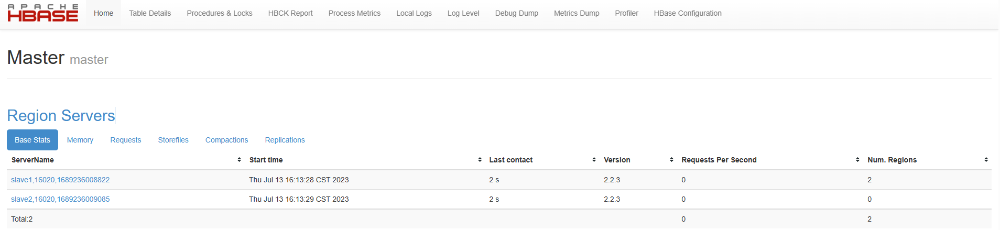

# Hbase 搭建文档

## 前提条件

- hadoop 集群已经启动
- mysql 已部署完毕
- hive 已部署完毕
- zookeeper 已经启动
- hbase-2.2.3-bin.tar.gz（位于/opt/tar下）
- 分布式搭建

---

## 1.解压

> 以下内容在 master 节点上操作

进入 /opt/app/ 目录内：

```bash
cd /opt/apps
```

解压 hbase-2.2.3-bin.tar.gz 到当前目录：

```bash
tar -zxf /opt/tar/hbase-2.2.3-bin.tar.gz
```

重命名 hbase ：

```bashl
mv ./hbase-2.2.3 ./hbase
```

---

## 2.配置环境变量

> 以下内容在 master 节点上操作

编辑环境变量：

```bash
env-edit
```

在文件末尾添加：

```bash
export HBASE_HOME=/opt/apps/hbase
export PATH=$PATH:$HBASE_HOME/bin
```

---

## 3.修改配置文件

> 以下内容在 master 节点上操作

进入配置文件目录：

```bash
cd /opt/apps/hbase/conf/
```

编辑 hbase-env.sh：

```bash
vi hbase-env.sh
```

找到并取消注释，然后修改:

```bash
# 配置 Java 环境变量
export JAVA_HOME=/opt/apps/jdk/

# 使用独立部署的 zookeeper
export HBASE_MANAGES_ZK=false

# 禁止 Hbase 查找 Hadoop 的 Classs 以防止冲突问题
export HBASE_DISABLE_HADOOP_CLASSPATH_LOOKUP="false"
```

配置 hbase-site.xml：

```bash
vi hbase-site.xml
```

配置后：

```xml
<?xml version="1.0"?>
<?xml-stylesheet type="text/xsl" href="configuration.xsl"?>

<configuration>
    <!-- hbase 的数据保存在 hdfs 对应目录下 -->
    <property>
        <name>hbase.rootdir</name>
        <value>hdfs://master:9000/hbase</value>
    </property>
    <!-- 是否是分布式环境 -->
    <property> 
        <name>hbase.cluster.distributed</name> 
        <value>true</value> 
    </property> 
    <!-- 冗余度 -->
    <property>
        <name>dfs.replication</name>
        <value>2</value>
    </property>
    <!-- 连接 zookeeper -->
    <property>
        <name>hbase.zookeeper.property.clientPort</name>
        <value>2181</value>
    </property>
    <!-- zookeeper 数据目录 -->
    <property> 
        <name>hbase.zookeeper.property.dataDir</name> 
        <value>/opt/apps/hbase</value>       
    </property>
    <!-- 配置 zookeeper 数据目录的地址，三个节点都启动 -->
    <property> 
        <name>hbase.zookeeper.quorum</name> 
        <value>master,slave1,slave2</value>     
    </property>
    <!--
        关闭 hbase kerberos 认证（使用本地文件系统存储，不使用 HDFS 的情况下需要将此配置设置为 false）
        王大拿踩的坑：https://blog.csdn.net/qq_58768870/article/details/121111992
    -->
    <property> 
        <name>hbase.unsafe.stream.capability.enforce</name> 
        <value>false</value>     
    </property>
</configuration>
```

修改配置文件（master 节点）：

```bash
vi regionservers
```

删掉默认的内容并将内容改为：

```bash
slave1
slave2
```


进入此目录将相应的 jar 包重命名，否则会与 Hadoop 冲突：

```bash
cd $HBASE_HOME/lib/client-facing-thirdparty/

mv ./slf4j-log4j12-1.7.25.jar slf4j-log4j12-1.7.25.jar.bak
```

---

## 4.分发文件

> 以下内容在 master 节点上操作

分发文件到 slave1、slave2 ：

```bash
scp -r /opt/apps/hbase slave1:/opt/apps/
scp -r /opt/apps/hbase slave2:/opt/apps/
```

修改 slave1、slave2 下 regionservers 文件：
> master 节点以外的所有节点的 regionservers 文件需要包含 master 节点

```bash
ssh slave1 "echo 'master' >> /opt/apps/hbase/conf/regionservers"
ssh slave2 "echo 'master' >> /opt/apps/hbase/conf/regionservers"
```


## 5.生效环境变量

> 以下内容在所有节点上操作

```bash
env-update
```

---

## 6.启动测试

> 以下内容在 master 节点上操作

master 节点上启动：

```bash
start-hbase.sh
```

检查进程（三个节点）：

```bash
jps
```

master 节点从出现 Hmaster 进程，slave1、slave2 上出现 HregionServer 进程：

> 如果 slave1、slave2 上没有出现 HregionServer 进程，请参考 [FAQ](#hbase-没有正常启动) 部分章节。


浏览器打开 16010 端口查看 hbase 的 WebUI 启动情况：



---

## 7.Hbase shell

> 以下内容在 master 节点上操作  
> 确保您已经启动了 hadoop 和 zookeeper

进入 hbase 命令行：

```bash
hbase shell
```

常用命令 - 表操作：

行为|命令
-|-
创建表|`create '表名', '列簇名1', '列簇名2', '列簇名N'`
添加列簇|`alter '表名', '列簇名'`
删除列簇|`alter '表名', {NAME=>'列簇名', METHOD=>'delete'}`
启用/禁用表|`enable/disable '表名'`
是否启用/禁用|`is_enabled/is_disabled`
删除表|仅能删除已被禁用的表：`drop '表名'`
查看表结构|`describe '表名'`
检查表是否存在|`exists '表名'`

常用命令 - 增删改查：

行为|命令
-|-
添加记录|`put '表名', '行键', '列簇:列名', '值'`
删除记录|`delete '表名', '行键', '列簇:列名'`
删除整行的值|`deleteall '表名', '行键'`
更新记录|再添加一次，覆盖原来的（put）
查看记录|`get '表名', '行键'`
查看表中记录数|`count '表名'`

常用命令 - 搜索：

行为|命令
-|-
扫描整张表|`scan '表名'`
扫描整个列簇|`scan '表名', {COLUMN=>'列簇'}`
查看某表某列所有数据|`scan '表名', {COLUMN=>'列簇:列名'}`
限制查询结果行数（先根据 RowKey 定位 Region，再向后扫描）|`scan '表名', {STARTROW=>'起始行名', LIMIT=>行数, VERSIONS=>版本数}`
限制查询结果行数（先根据 RowKey 定位 Region，再向后扫描）|`scan '表名', {STARTROW=>'起始行名', STOPROW=>终止行名, VERSIONS=>版本数}`
限制查询结果行数（先根据 RowKey 定位 Region，再向后扫描）|`scan '表名', {TIMERANGE=>[起始时间戳（毫秒）, 终止时间戳（毫秒）], VERSIONS=>版本数}`
使用等值过滤进行搜索|`scan '表名', FILTER=>"ValueFilter(=, 'binary': 值)"`
使用值包含子串过滤进行搜索|`scan '表名', FILTER=>"ValueFilter(=, 'subsreing': 字串)"`
使用列名的前缀进行搜索|`scan '表名', FILTER=>"ColumnPrefixFilter('前缀')"`
使用 RowKey 的前缀进行搜索|`scan '表名', FILTER=>"PrefixFilter('前缀')"`

退出 hbase 命令行:

```bash
exit
```

---

## HBase 没有正常启动

确保所有节点的时区一致、时间误差±3s。

检查时区：

```bash
date -R
```

通过 ntp 工具联网校时：

```bash
# 安装 ntp
yum -y install ntp

# 同步网络时间
ntpdate cn.pool.ntp.org
```

如果没有网络环境，也可以通过手动设置时间来减小节点之间的误差：

```bash
date -s "hh:mm:ss"
ssh slave1 "date -s 'hh:mm:ss'"
ssh slave2 "date -s 'hh:mm:ss'"
```

## 快速跳转

[回到顶部](#hbase-搭建文档)
