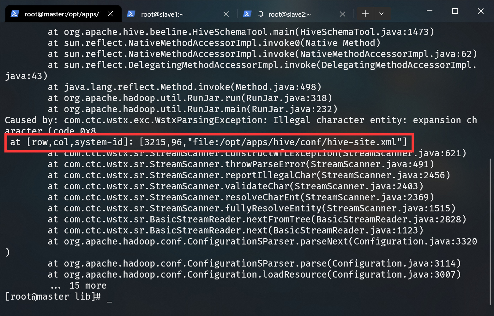
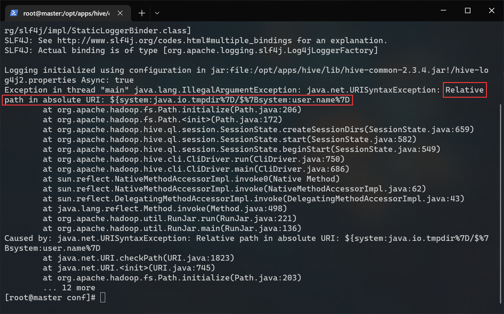
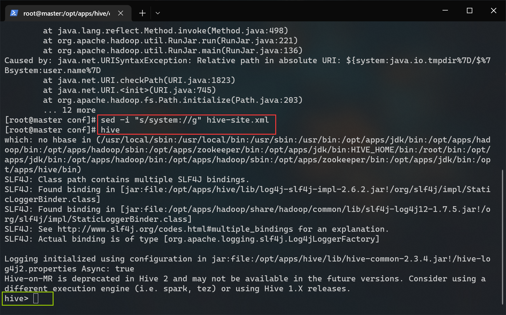
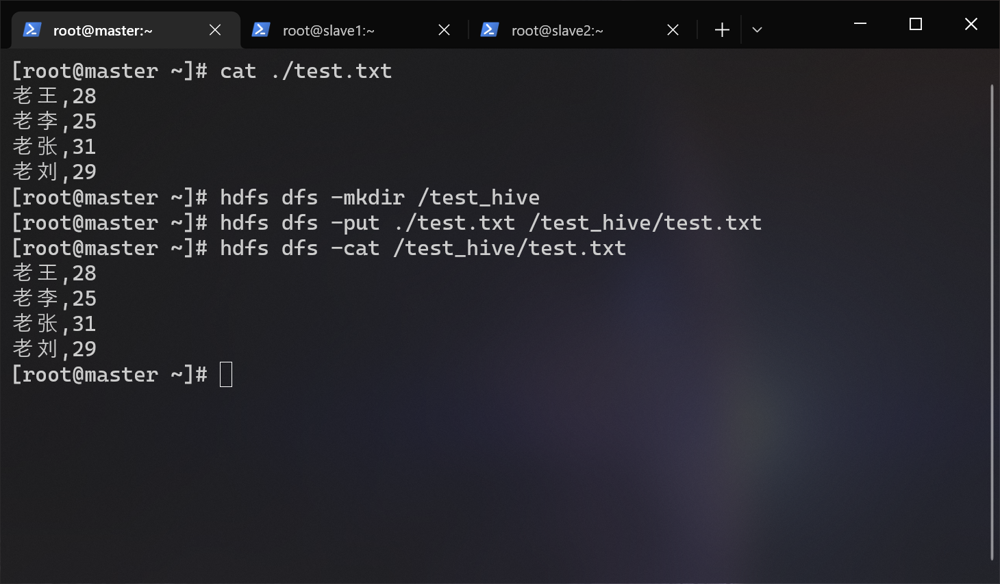
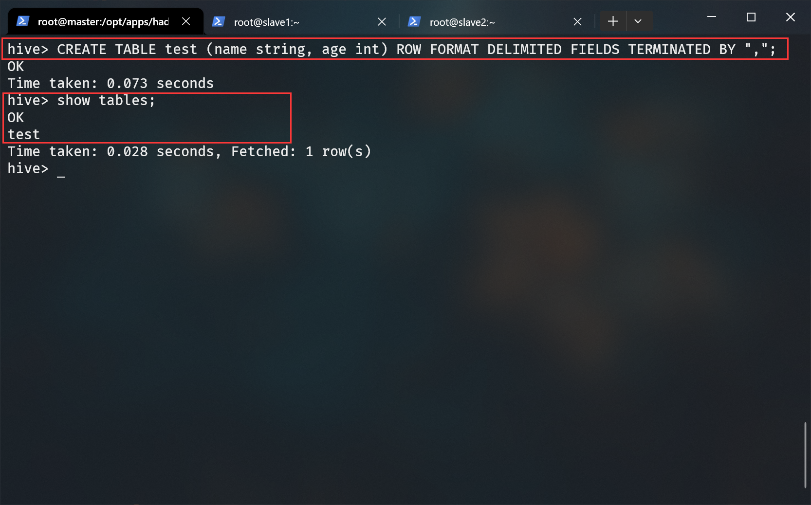
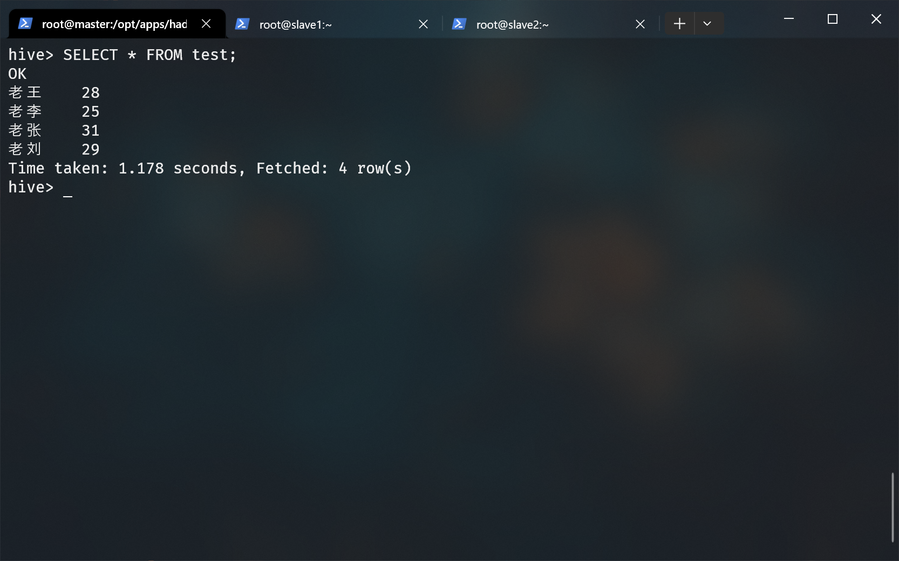
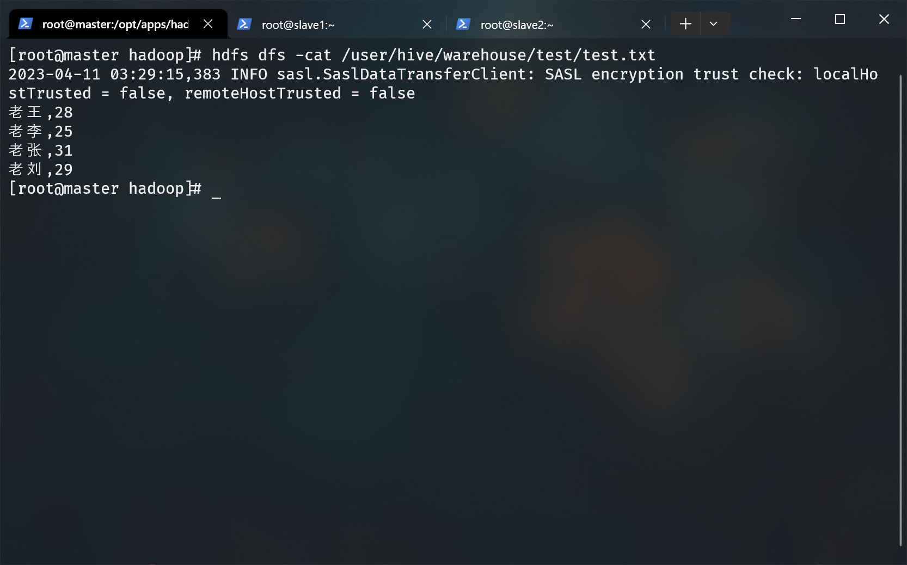

# HIVE 搭建文档

## 简介

### Hive 是什么

Apache Hive 是建立在 Hadoop 之上的一个由 Facebook 实现并开源的数据仓库系统。它可以将存储在 Hadoop 上的结构化数据、半结构化数据文件映射为一张数据表，并基于表提供了类似 SQL 的查询语法（HQL）用于访问和分析存储在 Hadoop 上的大型数据集。Hive 的核心是将 HQL 语句转为 MapReduce 程序，然后将程序提交到 Hadoop 集群执行。

### Hive 与 Hadoop 的关系

Hive 作为一个数据仓库系统具备存储和分析数据的能力，只不过 Hive 利用了 Hadoop 实现了数据存储的能力。简而言之就是 Hive 利用 Hadoop 的 HDFS 存储数据，利用 Mapreduce 查询分析数据。

### Hive 出现的意义

Hive 使得开发者专注于编写 HQL 进行数据分析，避免了 MapReduce 高昂的学习成本，提升了数据分析的效率。

## 前提条件

- hadoop 集群已经启动
- mysql 已部署完毕
- apache-hive-3.1.2-bin.tar.gz（位于/opt/tar下）
- mysql-connector-java-5.1.37.jar（位于/opt/tar下）
- 非分布式搭建

## 1.解压 hive

```bash
# 进入 /opt/apps 目录
cd /opt/apps/

# 解压 apache-hive-3.1.2-bin.tar.gz 到当前目录
tar -zxf /opt/tar/apache-hive-3.1.2-bin.tar.gz

# 重命名 hive
mv ./apache-hive-3.1.2-bin ./hive
```

## 2.置入 jar 包

因为 hive 需要操作 mysql，所以需要将 java 连接 mysql 需要用到的驱动复制到 hive/lib/ 下：

```bash
cp /opt/tar/mysql-connector-java-5.1.37.jar /opt/apps/hive/lib/
```

guava 内部提供了很多高级的数据结构，如不可变的集合、图库，以及并发、I/O、散列、缓存、基元、字符串等实用工具。而 hive 与 hadoop 则使用到了其中的一些功能。但是随着版本的更新，其中的一些代码与旧版本不可以互通，所以我们需要使 hive 和 hadoop 依赖的 guava 版本保持一致：

```bash
# 进入 hive 的 jar 库目录
cd /opt/apps/hive/lib

# 删除 hive 里的 guava
rm -f guava-19.0.jar

# 从 hadoop 复制高版本的 guava 到 hive
cp $HADOOP_HOME/share/hadoop/common/lib/guava-27.0-jre.jar ./
```

## 3.配置环境变量

编辑环境变量：

```bash
env-edit
```

在文件末尾添加：

```bash
export HIVE_HOME=/opt/apps/hive
export PATH=$PATH:$HIVE_HOME/bin
```

生效环境变量

```bash
env-update
```

## 4.配置 hive-env.sh

进入到 hive 配置文件的目录下：

```bash
cd $HIVE_HOME/conf
```

拷贝模板：

```bash
cp ./hive-env.sh.template ./hive-env.sh
```

编辑 hive-env.sh：

```bash
vi ./hive-env.sh
```

在文件末尾添加：

```bash
export JAVA_HOME=/opt/apps/jdk
export HADOOP_HOME=/opt/apps/hadoop
export HIVE_HOME=/opt/apps/hive
export HIVE_CONF_DIR=$HIVE_HOME/conf
```

## 5.配置 hive-site.xml

> 请确保您已进入 Hive 的配置目录

拷贝模板：

```bash
cp ./hive-default.xml.template ./hive-site.xml
```

编辑 hive-site.xml：

```bash
vi ./hive-site.xml
```

修改以下配置：

> 直接在 hive-site.xml 文件查找对应项修改参数，切勿全部删除！！！  
> vi 编辑器命令模式下使用 "/关键字" 搜索，按 N 键跳转到下一个搜索结果。

```xml
<!--配置数据库地址-->
<property>
 <name>javax.jdo.option.ConnectionURL</name>
 <value>jdbc:mysql://localhost:3306/hivedb?createDatabaseIfNotExist=true&amp;useSSL=false</value> 
</property>
<!--配置数据库驱动-->
<property>
 <name>javax.jdo.option.ConnectionDriverName</name>
 <value>com.mysql.jdbc.Driver</value>
</property>
<!--配置数据库用户名-->
<property>
 <name>javax.jdo.option.ConnectionUserName</name>
 <value>你的 mysql 账号</value>
</property>
<!--配置MySQL数据库root的密码-->
<property>
 <name>javax.jdo.option.ConnectionPassword</name>
 <value>你的 mysql 密码</value>
</property>
<!-- 在 hibe cli 内显示当前所在的数据库 -->
<property>
 <name>hive.cli.print.current.db</name>
 <value>true</value>
</property>
<!-- 在 hibe cli 内显示表头 -->
<property>
 <name>hive.cli.print.header</name>
 <value>true</value>
</property>
<!-- 关闭版本验证 -->
<property>
 <name>hive.metastore.schema.verification</name>
 <value>false</value>
</property>
<!-- 以本地模式运行 -->
<property> 
 <name>hive.exec.mode.local.auto</name> 
 <value>true</value> 
</property> 

```

## 6.配置 log4j.properties

> 请确保您已进入 Hive 的配置目录

拷贝模板即可：

```bash
cp hive-log4j2.properties.template hive-log4j2.properties
```

## 7.schema 初始化

执行初始化：

```bash
schematool -dbType mysql -initSchema
```



芜湖寄了！说来挺可笑，默认情况下 hive-site.xml 文件的第 3215 行居然存在会导致 schema 初始化失败的非法字符。。。

编辑 hive-site.xml：

```bash
vi ./hive-site.xml
```

在 vi 命令模式下输入 `:3215` 来快速跳转到第 3215 行，删掉 `&#8;` 这四个字符：


再次尝试初始化：

```bash
schematool -dbType mysql -initSchema
```


## 8.启动 hive

启动 hive ：

```bash
hive
```

如果出现这个报错：（绝对URI中的相对路径）



解决方案是把 hive-site.xml 文件中绝对路径字眼 “system:” 全部删掉：

```bash
# sed 命令用于批量替换文本内容
# sed -i "s/要替换的/替换为/g" 目标文件路径
sed -i "s/system://g" /opt/apps/hive/conf/hive-site.xml
```

再次尝试启动 hive：

```bash
hive
```

成功：


输入 `exit;` 或按下 `ctrl + d` 即可退出 hive cli。

## 9.使用 hive

目的：使用 hive 处理存储在 hdfs 内的结构化数据，使得我们可以通过 SQL 语句操作这些数据。  

我们先来创建一个结构化的数据：

```bash
vi ~/test.txt
```

写入这些东西：

```text
老王,28
老李,25
老张,31
老刘,29
```


在 hdfs 里创建一个 test_hive 目录：

```bash
hdfs dfs -mkdir /test_hive
```

把我们刚刚写的 test.txt 发送到 hdfs 文件系统的 /test_hive 目录里 ：

```bash
hdfs dfs -put ~/test.txt /test_hive/test.txt
```

> 如果发送文件到 hdfs 时遇到错误，请尝试重启您的 hadoop。  
>
> ```bash
> # 停止 hadoop 集群
> stop-all.sh
> 
> # 启动 hadoop 集群
> start-all.sh
> ```
>
> 如果还是不行，请尝试此方案（会清空 hdfs 内所有的数据）：
>
> ```bash
> # 停止 hadoop 集群
> stop-all.sh
> 
> # 清空您在 core-site.xml 里设置的 hadoop.tmp.dir 目录（在所有节点上执行这句）
> rm -rf $HADOOP/tmp
> 
> # 重新格式化 namenode（在 master 节点上执行这句）
> hdfs namenode -format
> 
> # 启动 hadoop 集群
> start-all.sh
> ```
>
> 具体请参考 [hadoop 搭建文档](../hadoop/README) 第八步的引用部分。  

回到正题，cat 一下，证明已经发送到 hdfs 里了：

```bash
hdfs dfs -cat /test_hive/test.txt
```



启动 hive ：

```bash
hive
```

创建一个拥有两个字段 name 和 age 的数据表 test。这个表以 “,” 分隔列、以换行符分隔行：

```sql
CREATE TABLE test (
 name string,
 age int
) ROW FORMAT DELIMITED FIELDS TERMINATED BY ",";
```



从 hdfs 导入 `/test_hive/test.txt` 内的数据到 test 数据表：

```sql
-- LOAD DATA INPATH 'hdfs 路径' INTO TABLE 表名;
LOAD DATA INPATH '/test_hive/test.txt' INTO TABLE test;
```


执行一个大家熟悉的命令来验证下：

```sql
SELECT * FROM test;
```



输入 `exit` 或按下 `ctrl + d` 退出 hive cli：

```bash
exit;
```

在 hdfs 里可查看到 hive 的数据表信息：

```bash
hdfs dfs -cat /user/hive/warehouse/test/test.txt
```



## 快速跳转

[回到顶部](#hive-搭建文档)
