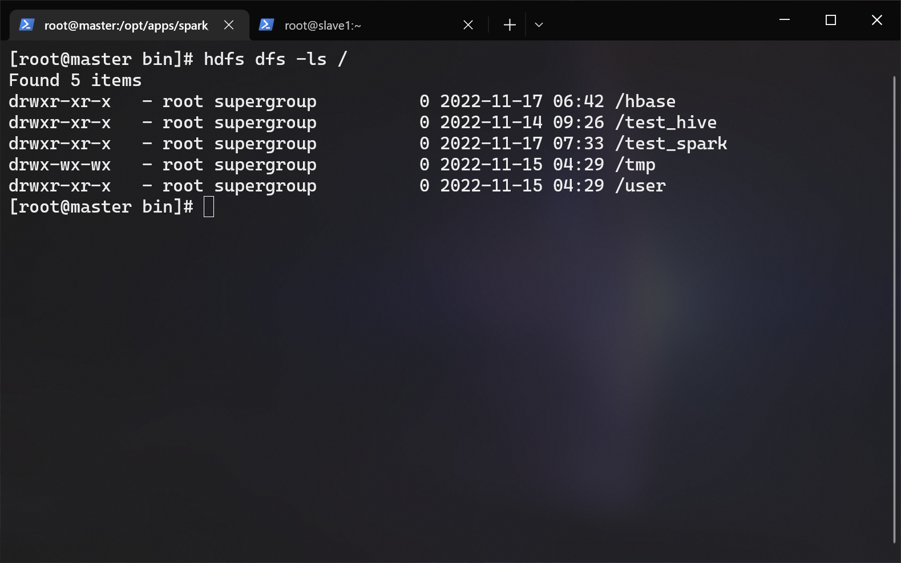
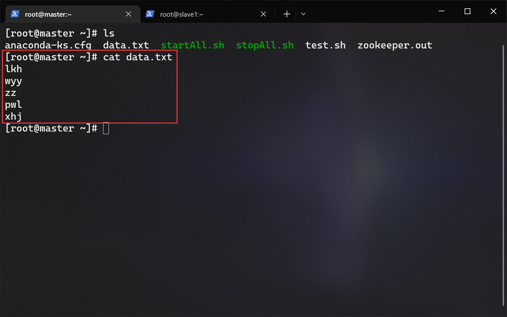
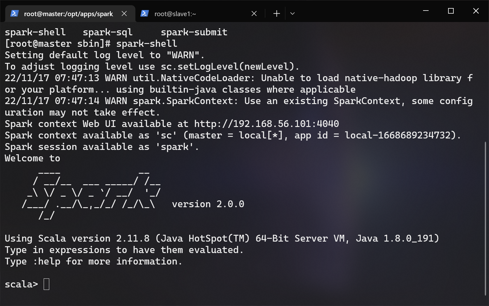
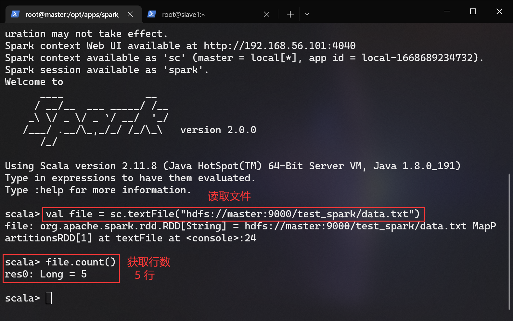

# SCALA & SPARK 搭建文档

## 前提条件

- hadoop 集群已经启动
- scala3-3.2.2.tar.gz（位于/opt/tar下）
- spark-3.1.1-bin-hadoop3.2.tgz（位于/opt/tar下）
- 分布式搭建

## 1.解压

> 以下内容在 master 节点上操作

进入 /opt/app/ 目录内：

```bash
cd /opt/apps
```

分别解压 scala3-3.2.2.tar.gz 与 spark-3.1.1-bin-hadoop3.2.tgz 到当前目录：

```bash
tar -zxf /opt/tar/scala3-3.2.2.tar.gz
tar -zxf /opt/tar/spark-3.1.1-bin-hadoop3.2.tgz
```

重命名 scala 与 spark ：

```bashl
mv ./scala3-3.2.2 ./scala
mv ./spark-3.1.1-bin-hadoop3.2 ./spark
```

## 2.配置环境变量

> 以下内容在 master 节点上操作

编辑环境变量：

```bash
env-edit
```

在文件末尾添加：

```bash
export SPARK_HOME=/opt/apps/spark
export SCALA_HOME=/opt/apps/scala
export PATH=$PATH:$SPARK_HOME/bin:$SPARK_HOME/sbin:$SCALA_HOME/bin
```

## 3.配置 spark-env.sh

> 以下内容在 master 节点上操作

进入配置目录：

```bash
cd $SPARK_HOME/conf
```

使用预置模板：

```bash
cp ./spark-env.sh.template ./spark-env.sh
```

编辑它：

```bash
vi ./spark-env.sh
```

在末尾添加这些：

```bash
export SCALA_HOME=/opt/apps/scala
export JAVA_HOME=/opt/apps/jdk
export HADOOP_CONF_DIR=/opt/apps/hadoop/etc/hadoop

export SPARK_MASTER_IP=master
export SPARK_MASTER_HOST=master
export SPARK_MASTER_PORT=7077

export SPARK_WORKER_MEMORY=1g
export SPARK_WORKER_HOST=master
export SPARK_WORKER_PORT=7078
```

## 4.配置 slaves

> 以下内容在 master 节点上操作  

进入配置目录：

```bash
cd $SPARK_HOME/conf
```

使用预置模板：

```bash
cp ./workers.template ./workers
```

编辑它：

```bash
vi ./workers
```

删掉默认存在的 localhost，在末尾写入这些：

```bash
master
slave1
slave2
```

## 5.分发文件

> 以下内容在 master 节点上操作

分发 scala、spark 到 slave1、slave2：

```bash
scp -r $SCALA_HOME slave1:/opt/apps/
scp -r $SCALA_HOME slave2:/opt/apps/

scp -r $SPARK_HOME slave1:/opt/apps/
scp -r $SPARK_HOME slave2:/opt/apps/
```

分发环境变量文件到 slave1、slave2（正常版）：

```bash
scp /etc/profile.d/big_data_env.sh slave1:/etc/profile.d/
scp /etc/profile.d/big_data_env.sh slave2:/etc/profile.d/
```

分发环境变量文件到 slave1、slave2（骚操作）：

```bash
cd /etc/profile.d/
scp ./big_data_env.sh slave1:$(pwd)/
scp ./big_data_env.sh slave2:$(pwd)/
```

## 6.生效环境变量

> 以下内容在所有节点上操作

```bash
env-update
```

## 7.启动与测试

> 以下内容在 master 节点上操作

由于环境变量所映射的目录内存在同名文件（名称冲突），所以我们需要进入目录去执行脚本来启动某些服务。

启动 spark ：

```bash
$SPARK_HOME/sbin/start-all.sh
```

先往 hdfs 内创建一个测试目录：

```bash
hdfs dfs -mkdir /test_spark
```



随便写一个测试文件：

```bash
vi ~/data.txt
```



发送到 hdfs 的 test_spark 目录内：

```bash
hdfs dfs -put ~/data.txt /test_spark/
```


进入 spark shell ：

```bash
cd /opt/apps/spark/sbin/
spark-shell
```



统计 hdfs 内的 /test_spark/data.txt 有多少行：

```scala
val file = sc.textFile("hdfs://master:9000/test_spark/data.txt")
file.count()
```



退出 spark shell ：

```scala
:quit
```

## 快速跳转

[回到顶部](#SCALA-&-SPARK-搭建文档)
