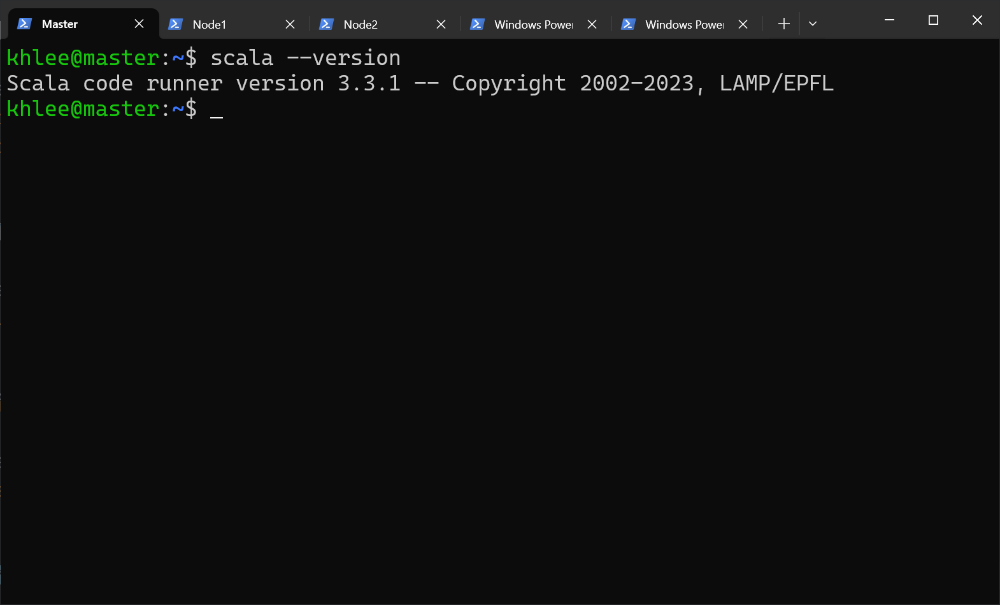

# Scala 安装

## 先决条件

- [Debian GNU/Linux 12 (bookworm) x86_64](https://mirrors.tuna.tsinghua.edu.cn/debian-cd/12.4.0/amd64/iso-cd/)
- [scala3-3.3.1.tar.gz](https://github.com/lampepfl/dotty/releases/tag/3.3.1)（位于 `~/Downloads`）
- 单机搭建

**我的用户名是 khlee，所以下面出现的所有 khlee 字眼请全部根据自己的实际用户名填写。**

## 1.解压

```bash
cd ~/Downloads
tar -zxf ./scala3-3.3.1.tar.gz
mv scala3-3.3.1 ../scala
```

## 2.配置环境变量

编辑环境变量：

```bash
env-edit
```

在文件末尾添加：

```bash
export SCALA_HOME=~/scala
export PATH=$PATH:$SCALA_HOME/bin
```

生效环境变量：

```bash
env-update
```

验证输出：

```bash
scala --version
```



## 3.分发文件

执行命令：

```bash
scp -r ~/scala node1:~/ &
scp -r ~/scala node2:~/
```

## 4.同步环境变量

执行命令：

```bash
env-sync-to-node1
env-sync-to-node2
```

生效环境变量：（在所有节点执行一次）

```bash
env-update
```

## 快速跳转

[回到顶部](#scala-安装)

[Spark 安装](../spark/README.md)
