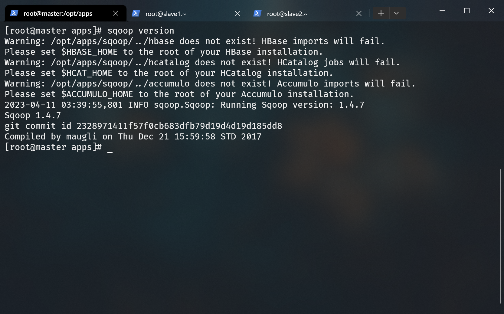
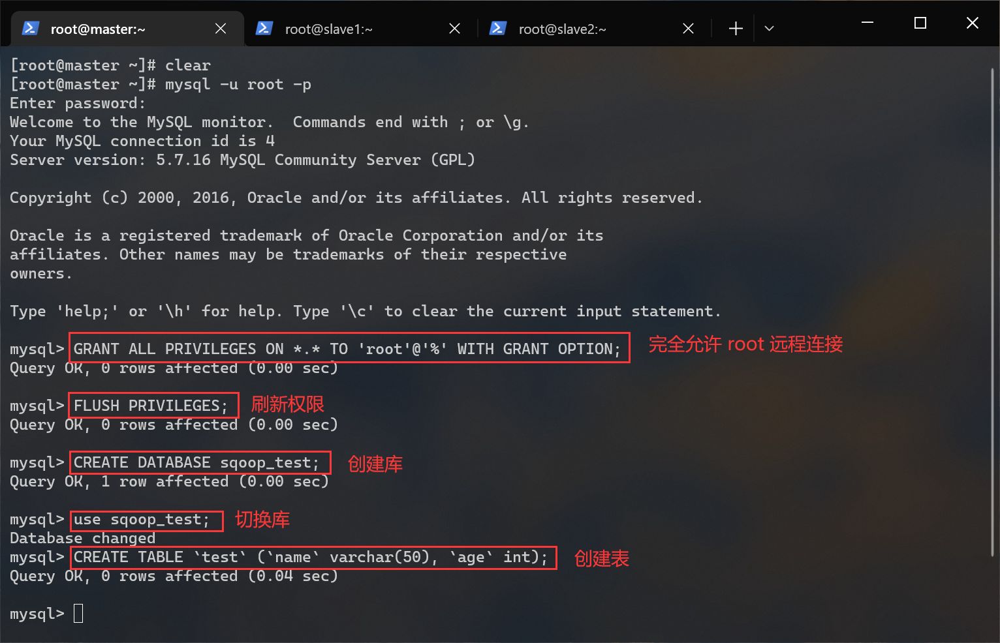
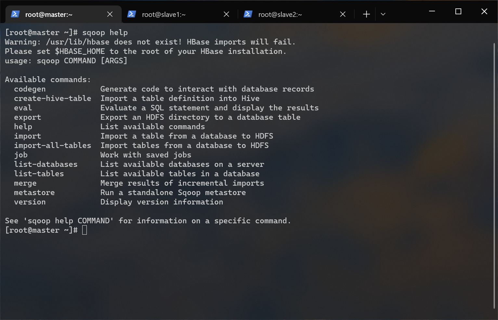
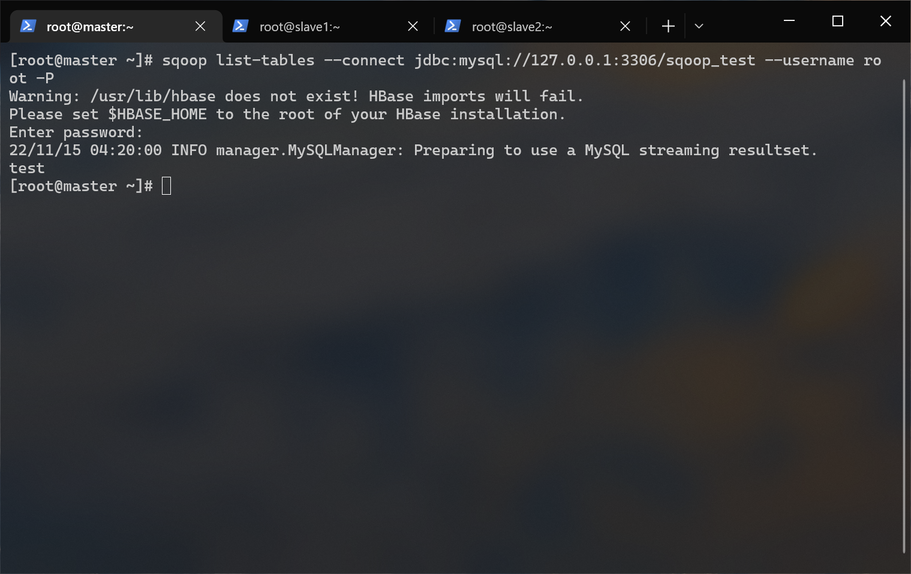

# SQOOP 搭建文档

## 前提条件

- hadoop 集群已经启动
- mysql 已部署完毕
- hive 已部署完毕
- mysql-connector-java-5.1.37.jar（位于/opt/tar下）
- sqoop-1.4.7.bin__hadoop-2.6.0.tar.gz（位于/opt/tar下）
- 非分布式搭建

## 1.解压

进入 /opt/app/ 目录内：

```bash
cd /opt/apps
```

解压 sqoop-1.4.7.bin__hadoop-2.6.0.tar.gz 到当前目录：

```bash
tar -zxf /opt/tar/sqoop-1.4.7.bin__hadoop-2.6.0.tar.gz
```

重命名 sqoop ：

```bash
mv ./sqoop-1.4.7.bin__hadoop-2.6.0 ./sqoop
```

## 2.放入 MySQL 驱动包

因为我们要通过 sqoop 操作 mysql，所以需要将java 连接 mysql 需要用到的驱动复制到 sqoop/lib 下：

```bash
cp /opt/tar/mysql-connector-java-5.1.37.jar /opt/apps/sqoop/lib/
```

## 3.配置环境变量

编辑环境变量：

```bash
env-edit
```

在文件末尾添加：

```bash
export SQOOP_HOME=/opt/apps/sqoop
export PATH=$PATH:$SQOOP_HOME/bin
```

## 4.生效环境变量

```bash
env-update
```

## 5.验证安装

执行这条指令：

```bash
sqoop version
```



## 6.使用 sqoop 前的准备工作

修改 mysql 的配置文件：

```bash
vi /etc/my.cnf
```

在 my.cnf 配置文件中，bind-address 如果是 127.0.0.1，则 mysql 只接受本地连接，不接受远程连接。在 bind-address 后面增加远程访问 IP 地址或者注释掉这句话就可以远程登陆了。所以我们需要注释掉这一行：

```bash
# 没有下面这一行的话就无需这一步操作
#bind-address = 127.0.0.1
```

以 root 身份登录到 mysql ：

```bash
mysql -u root -p
```

依照我们之前在[mysql 搭建文档](../mysql/README.md)说过的方法，完全允许 root 远程连接 mysql：  
命令解释：

- GRANT：赋权命令
- ALL PRIVILEGES：当前用户的所有权限
- ON：介词
- \*.\*：当前用户对所有数据库和表的操作权限
- TO：介词
- 'root'@'%'：权限赋给 root 用户，所有 ip 都能连接
- WITH GRANT OPTION：允许级联赋权

```sql
/*
  在开发环境建议这么做，在生产环境上是很危险的操作。
*/
GRANT ALL PRIVILEGES ON *.* TO 'root'@'%' WITH GRANT OPTION;
```

刷新权限：

```sql
FLUSH PRIVILEGES;
```

创建一个用于测试 sqoop 的数据库和表：

```sql
-- 创建 sqoop_test 数据库
CREATE DATABASE sqoop_test;

-- 切换到 sqoop_test 数据库
USE sqoop_test;

-- 创建 test 表
CREATE TABLE test (
  name VARCHAR(50),
  age INT
) ENGINE=InnoDB DEFAULT CHARSET=utf8;
```



插入一些数据：

```sql
INSERT INTO test VALUES
  ("张三", 20),
  ("李四", 24),
  ("王五", 22),
  ("王五", 22);
```


## 7.sqoop 指令菜单

查看 sqoop 指令帮助：

```bash
sqoop help
```



命令|解释
-|-
import|导入数据到集群
export|从集群导出数据
codegen|生成与数据库记录交互的代码
create-hive-table|创建 hive 表
eval|查看 sql 执行结果
import-all-tables|导出某个数据库内的所有表到 hdfs
job|生成一个 job
list-databases|列出所有数据库名称
list-tables|列出某个数据库内的所有表
merge|将 hdfs 中不同目录下的数据合在一起，并存放在指定的目录中
metastore|记录 Sqoop job 的元数据信息，如果不启动 Metastore 实例，则默认的元数据存储日录为 ~/.sqoop
help|打印 sqoop 帮助信息
version|打印 sqoop 版本信息

## 8.测试 sqoop 连接 mysql

使用 sqoop 打印 mysql 内所有数据库名：

> 通过 `sqoop help list-databases` 命令打印帮助信息。

```bash
sqoop list-databases \
--connect jdbc:mysql://localhost:3306 \
--username root \
-P
```


使用 sqoop 打印 sqoop_test 数据库内所有的数据表名：

> 通过 `sqoop help list-tables` 命令打印帮助信息。

```bash
sqoop list-tables \
--connect jdbc:mysql://localhost:3306/sqoop_test \
--username root \
-P
```



## 9.导出 mysql 数据表到 hdfs

> 通过 `sqoop help import` 命令打印帮助信息。  
> 在此之前，请确保 Hadoop 已经启动。

```bash
sqoop import \
--connect jdbc:mysql://localhost:3306/sqoop_test \
--table test \
--username root \
-P \
--m 1
```

如果遇到这个错误：


错误原因：

- 使用了 localhost 或 127.0.0.1 作为数据库地址导致
- mysql wait_timeout 参数时长设置过短
- mysql 地址出错

两个解决方案：

- 修改 mysql 的 wait_timeout 时长
- 将 url 中 localhost 或 127.0.0.1 修改为当前这台节点的内网 IP 或 内网IP映射（master）。

我们采用后面的方法。
删除之前导入的数据表：

```bash
hdfs dfs -rm -r /user/root/test
```

再次导入：

```bash
sqoop import --connect jdbc:mysql://192.168.56.101:3306/sqoop_test --table test --username root -P --m 1
```


如果卡在了 Running Job，请强制结束这些任务并重新尝试：

```bash
# 列出所有的任务
hadoop job -list

# 通过 job id 强制结束他们
hadoop job -kill id
```

查看导入结果：

```bash
hdfs dfs -cat /user/root/test/part-m-00000
```


## 10.导出 hdfs 数据表到 mysql

> 在此之前，请确保 Hadoop 已经启动。

进入 mysql ：

```bash
mysql -u root -p
```

切换到 sqoop_test 数据库：

```bash
USE sqoop_test;
```

在 sqoop_test 数据库创建一个 test_from_hdfs 表：

```sql
CREATE TABLE test_from_hdfs (
  name VARCHAR(50),
  age INT
) ENGINE=InnoDB DEFAULT CHARSET=utf8;
```

退出 mysql，开始使用 sqoop 导入数据：

```bash
sqoop export \
--connect jdbc:mysql://192.168.56.101:3306/sqoop_test \
--username root \
-P \
--table test_from_hdfs \
--m 1 \
--export-dir /user/root/test \
--input-fields-terminated-by ","
```


登入 mysql：

```bash
mysql -u root -p
```

查看下我们创建的 test_from_hdfs 表：

```sql
SELECT * FROM sqoop_test.test_from_hdfs;
```


可以看到数据导入成功了，但是有一个新的问题。那就是所有的汉字都显示成了问号，篇幅原因我们放在下一节细说。

## 解决从 hdfs 导入到 mysql 中的数据中，中文变问号的问题

进入 mysql ：

```bash
mysql -u root -p
```

查看编码信息：

```sql
SHOW VARIABLES LIKE 'character%'; 
```


可以看到有些地方的编码是 latin1，这种编码并不能显示中文。

编辑 my.cnf ：

```bash
vi /etc/my.cnf
```

添加这两行到末尾：

```conf
character-set-server=utf8
init_connect='SET NAMES utf8'
```

重启 mysql 服务：

```bash
systemctl restart mysqld.service

# 如果上一条命令卡住的话用这两条
systemctl stop mysqld.service
systemctl start mysqld.service
```

进入 mysql 查看编码信息：

```sql
SHOW VARIABLES LIKE 'character%'; 
```


可以看到编码全是 utf8 了。

清空我们在第九步从 hdfs 导出到 mysql 的 sqoop_test.test_from_hdfs 数据表：

```sql
TRUNCATE sqoop_test.test_from_hdfs;
```

再次尝试使用 sqoop 导入数据：

```bash
sqoop export --connect jdbc:mysql://192.168.56.101:3306/sqoop_test --username root -P --table test_from_hdfs --m 1 --export-dir /user/root/test --input-fields-terminated-by ","
```

登入 mysql：

```bash
mysql -u root -p
```

再次查看下我们创建的 test_from_hdfs 表：

```sql
SELECT * FROM sqoop_test.test_from_hdfs;
```


完美解决！

## 快速跳转

[回到顶部](#sqoop-搭建文档)
