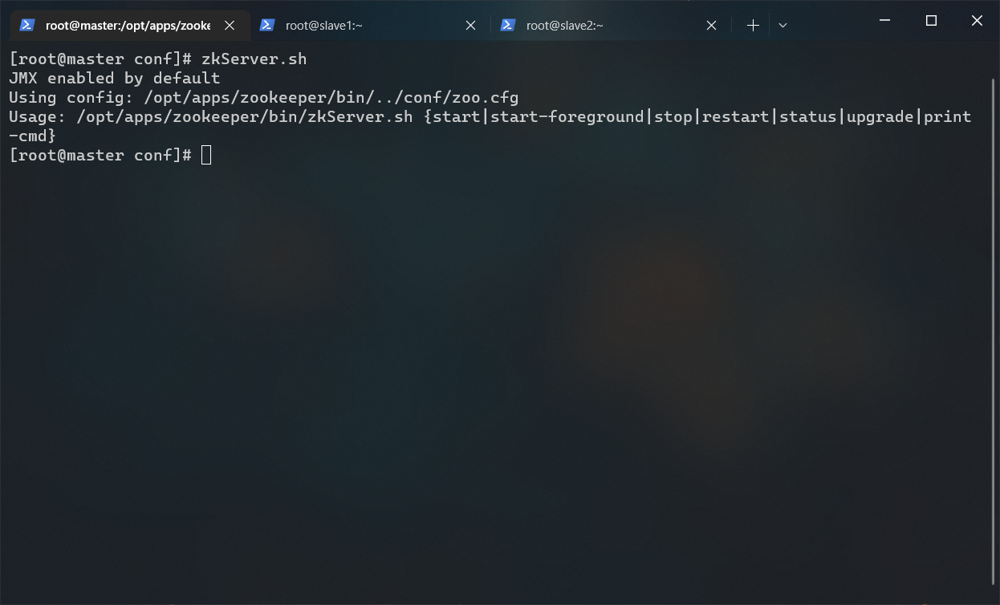
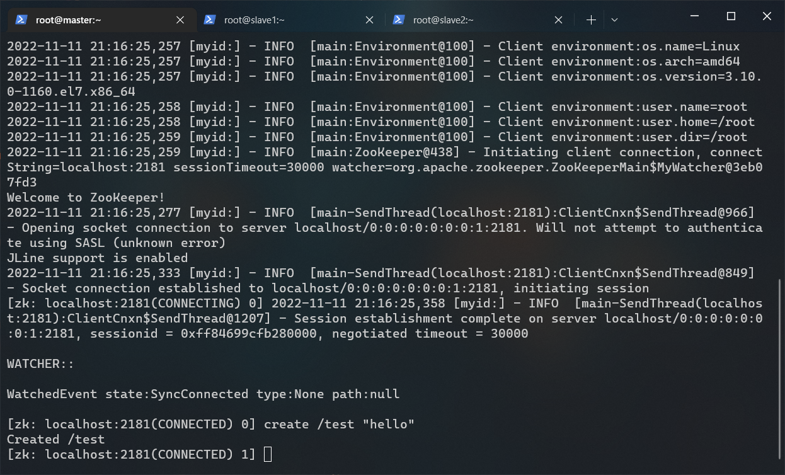
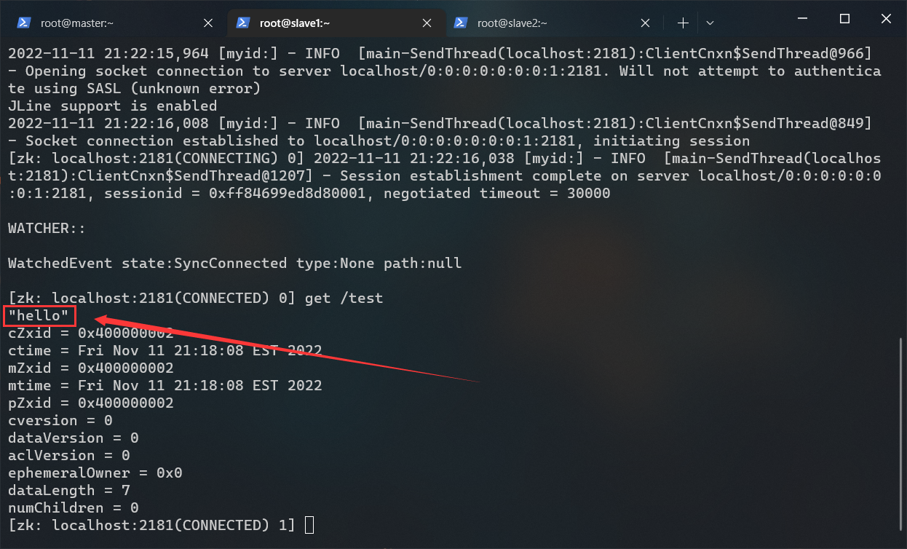

# ZOOKEEPER 搭建文档

## 前提条件

- 已经成功部署 Hadoop
- apache-zookeeper-3.5.7-bin.tar.gz（位于 /opt/tar/）
- 分布式搭建

## 假设

第一台服务器的IP: 192.168.56.101（主机名 master）  
第二台服务器的IP: 192.168.56.102（主机名 slave1）  
第三台服务器的IP: 192.168.56.103（主机名 slave2）

## 1.解压 zookeeper

> 以下内容在 master 节点上操作

```bash
# 进入 /opt/apps 目录
cd /opt/apps/

# 解压 apache-zookeeper-3.5.7-bin.tar.gz 到当前目录
tar -zxf /opt/tar/apache-zookeeper-3.5.7-bin.tar.gz

# 重命名 zookeeper
mv ./apache-zookeeper-3.5.7-bin ./zookeeper
```

## 2.配置 zookeeper

> 以下内容在 master 节点上操作

创建 data 目录用于存储数据：

```bash
mkdir /opt/apps/zookeeper/data
```

创建 logs 目录用于存储日志：

```bash
mkdir /opt/apps/zookeeper/logs
```

进入配置文件夹：

```bash
cd /opt/apps/zookeeper/conf
```

以 zoo_sample.cfg 为模板创建配置：

```bash
cp ./zoo_sample.cfg ./zoo.cfg
```

打开配置文件：

```bash
vi ./zoo.cfg
```

修改后：

```bash
# The number of milliseconds of each tick
tickTime=2000
# The number of ticks that the initial
# synchronization phase can take
initLimit=10
# The number of ticks that can pass between
# sending a request and getting an acknowledgement
syncLimit=5
# the directory where the snapshot is stored.
# do not use /tmp for storage, /tmp here is just
# example sakes.
dataDir=/opt/apps/zookeeper/data
dataLogsDir=/opt/apps/zookeeper/logs
# the port at which the clients will connect
clientPort=2181
#
# Be sure to read the maintenance section of the
# administrator guide before turning on autopurge.
#
# http://zookeeper.apache.org/doc/current/zookeeperAdmin.html#sc_maintenance
#
# The number of snapshots to retain in dataDir
#autopurge.snapRetainCount=3
# Purge task interval in hours
# Set to "0" to disable auto purge feature
#autopurge.purgeInterval=1
server.1=master:2888:3888
server.2=slave1:2888:3888
server.3=slave2:2888:3888
```

---

## 3.配置环境变量

> 以下内容在 master 节点上操作

编辑环境变量：

```bash
# 这个命令是我们在 hadoop 篇通过 alias 创建的，除此之外还有一个 env-update 用于更新环境变量
env-edit
```

在末尾追加以下内容：

```bash
export ZK_HOME=/opt/apps/zookeeper
export PATH=$PATH:$ZK_HOME/bin:$JAVA_HOME/bin
```

> 关于 zookeeper 的一个大坑：  
> jdk 环境变量必须在 zookeeper 环境变量之后配置  
> 如果没有这样做，那么在启动 zookeeper 会提示端口占用  
>
> 方案1：  
> 将 jdk 环境变量放到文件末尾  
>
> 方案2：  
> 在 zookeeper 环境变量后面加上 $JAVA_HOME/bin  
>
> 这里采用方案2

刷新环境变量：

```bash
env-update
```

测试环境变量：

```bash
zkServer.sh
```



## 5.分发文件

> 以下内容在 master 节点上操作

下发 zookeeper：

```bash
scp -r $ZK_HOME slave1:/opt/apps/ &
scp -r $ZK_HOME slave2:/opt/apps/
```

下发环境变量：

```bash
scp /etc/profile.d/big_data_env.sh slave1:/etc/profile.d/big_data_env.sh
scp /etc/profile.d/big_data_env.sh slave2:/etc/profile.d/big_data_env.sh
```

当然，如果你足够了解 shell 的话，可以使用这种方法简化路径：

```bash
cd /etc/profile.d/
scp ./big_data_env.sh slave1:$(pwd)/
scp ./big_data_env.sh slave2:$(pwd)/
```

## 6.生效环境变量

> 以下内容在所有节点上操作

```bash
env-update
```

## 6.配置 myid

> 以下内容在 master 节点上操作

每台服务器的 myid 必须是唯一的。其实我们上一步已经为每一节点分配好了 myid！它在 [zoo.cfg](#配置 zookeeper) 最下方：

```bash
# server.myid=主机名:2888:3888

# master 节点的 myid 是 1
server.1=master:2888:3888

# slave1 节点的 myid 是 2
server.2=slave1:2888:3888

# slave2 节点的 myid 是 3
server.3=slave2:2888:3888
```

设置 master 节点的 myid：

```bash
echo 1 > /opt/apps/zookeeper/data/myid
```

设置 slave1 节点的 myid：

```bash
# 远程执行命令：ssh [主机名@]地址 "要远程执行的命令"
ssh slave1 "echo 2 > /opt/apps/zookeeper/data/myid"
```

设置 slave2 节点的 myid：

```bash
ssh slave2 "echo 3 > /opt/apps/zookeeper/data/myid"
```

## 7.启动与测试

> 以下内容大部分在 master 节点上操作，小部分需要在所有节点上操作

在所有节点上执行此命令来启动 zookeeper：

```bash
# zkServer.sh 支持下列参数：
# start | start-foreground | stop | restart | status | upgrade | print-cmd
zkServer.sh start
```

在 master 节点打开 zookeeper cli：

```bash
zkCli.sh
```

在 master 节点的 zookeeper cli 里执行此命令：

```bash
create /test "hello"
```



在 slave1 节点打开 zookeeper cli：

```bash
zkCli.sh
```

在 slave1 节点的 zookeeper cli 执行此命令：

```bash
get /test
```



在 slave2 节点打开 zookeeper cli：

```bash
zkCli.sh
```

在 slave2 节点的 zookeeper cli 执行此命令：

```bash
get /test
```


slave1 与 slave2 均出现 "hello" 即视为部署成功。

## 快速跳转

[回到顶部](#zookeeper-搭建文档)
