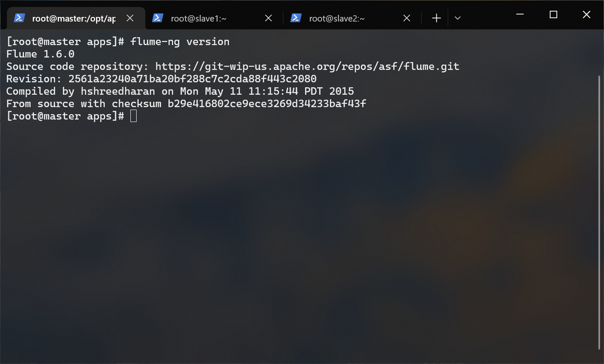
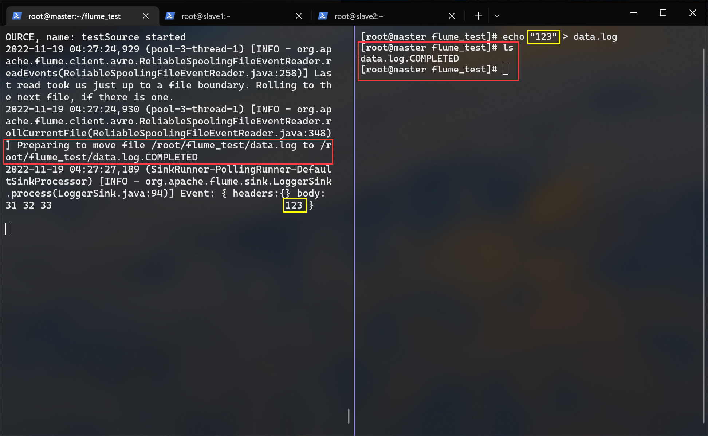
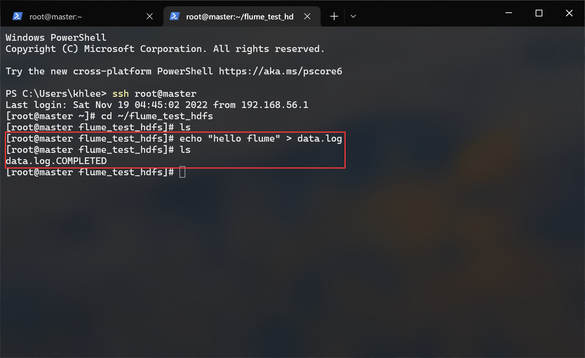

# <span id="top">Flume 搭建文档</span>

## 前提条件
- hadoop 集群已经启动
- apache-flume-1.6.0-bin.tar.gz（位于/opt/tar下）
- 非分布式搭建

---

## 介绍
Flume 是 Cloudera 提供的一个高可用的，高可靠的，分布式的海量日志采集、聚合和传输系统。Flume 基于流式架构，灵活简单。

### Source 组件
负责接收数据到 Flume Agent 的组件。

### Channel 组件
Channel 是位于 Source 和 Sink 之间的缓冲区。Memory Channel 是内存中的队列。Memory Channel 在不需要关心数据丢失的情景下适用。File Channel 将所有事件写到磁盘。

### Sink 组件
Sink 不断地轮询 Channel 中的事件且批量地移除它们，并将这些事件批量写入到存储或 索引系统、或者被发送到另一个 Flume Agent。

### 注意
Source 可以搭配多个 Channel；但一个 Sink 只能搭配一个 Channel。

---

## 1.解压
进入 /opt/app/ 目录内：
``` bash
cd /opt/apps
```

解压 apache-flume-1.6.0-bin.tar.gz 到当前目录：
``` bash
tar -zxf /opt/tar/apache-flume-1.6.0-bin.tar.gz
```

重命名 hbase ：
``` bashl
mv ./apache-flume-1.6.0-bin ./flume
```

---

## 2.配置环境变量
编辑用户根目录下的 .bashrc 文件：
``` bash
vi ~/.bashrc
```

在文件末尾添加：
``` bash
export FLUME_HOME=/opt/apps/flume
export PATH=$PATH:$FLUME_HOME/bin
```

## 3.生效环境变量
``` bash
source ~/.bashrc
```

测试下：
``` bash
flume-ng version
```


---

## 4.修改配置文件
进入配置文件目录：
``` bash
cd /opt/apps/flume/conf
```

使用预置模板：
``` bash
cp ./flume-env.sh.template ./flume-env.sh
```

编辑它：
``` bash
vi ./flume-env.sh
```

在文件末尾添加：
``` bash
export JAVA_HOME=/opt/apps/jdk
```

---

## 5.本地测试
目的：监控指定目录，当目录有新的日志产生时，把日志一行行打印到控制台。

创建用于测试的目录：
``` bash
mkdir ~/flume_test
```

创建并进入 jobs 目录：
``` bash
# 创建
mkdir /opt/apps/flume/agent

# 进入
cd /opt/apps/flume/agent
```

在 jobs 目录内写一个我们自己的 agent 文件：
``` bash
vi ./test.conf
```

test.conf 的内容是这样的：
> 大坑：自定义 Agent 名称不能有下划线
``` conf
# 其中 test 为任务名

# 自定义 Agent 的名称
test.sources = testSource
test.channels = testChannel
test.sinks = testSink

# 描述 Channel 组件属性
test.channels.testChannel.type = memory

# 描述 Source 组件属性
test.sources.testSource.channels = testChannel
test.sources.testSource.type = spooldir
test.sources.testSource.spoolDir = /root/flume_test

# 描述 Sink 组件属性
test.sinks.testSink.channel = testChannel
test.sinks.testSink.type = logger
```

启动 Flume Agent :
> `-n` 任务名
> `-c` flume 配置文件目录
> `-f` agent 文件路径
> `-Dflume.root.logger=INFO,console` 运行时动态修改 `flume.root.logger` 参数属性值，并将控制台日志打印级别设置为 INFO 级别。
``` bash
flume-ng agent -n test -c /opt/apps/flume/conf -f /opt/apps/flume/agent/test.conf -Dflume.root.logger=INFO.console
```

进入测试目录写一个日志：
``` bash
# 进入测试目录
cd ~/flume_test

# 随便写一个后缀为 log 的文件
echo "123123" > test.log
```

查看测试目录变化：
``` bash
ls ~/flume_test
```


在启动 Agent 的终端窗口可以看到刚刚采集的消息内容。另外，对于 Spooling Directory 中的文件，其内容写入 Channel 后，该文件将会被标记并且增加 **.COMPLETED** 的后缀。

---

## 6.hdfs 测试
目的：监控指定目录，当目录有新的日志产生时，把日志保存到 hdfs。

创建用于测试的目录：
``` bash
mkdir ~/flume_test_hdfs
```

在 jobs 目录内写一个新的 agent 文件：
``` bash
# 进入 agent 目录
cd /opt/apps/flume/agent/

# 创建一个新的 agent
vi ./test_hdfs.conf
```

test_hdfs.conf 的内容是这样的：
> 大坑：自定义 Agent 名称不能有下划线
``` conf
# 其中 test_hdfs 为任务名

# 自定义 Agent 的名称
test_hdfs.sources = testHDFSSource
test_hdfs.channels = testHDFSChannel
test_hdfs.sinks = testHDFSSink

# 描述 Channel 组件属性
test_hdfs.channels.testHDFSChannel.type = memory
test_hdfs.channels.testHDFSChannel.capacity = 10000
test_hdfs.channels.testHDFSChannel.transactionCapacity = 100

# 描述 source 组件属性
test_hdfs.sources.testHDFSSource.channels = testHDFSChannel
test_hdfs.sources.testHDFSSource.type = spooldir
test_hdfs.sources.testHDFSSource.spoolDir = /root/flume_test_hdfs

# 定义拦截器并为消息添加时间戳
test_hdfs.sources.testHDFSSource.interceptors = i1
test_hdfs.sources.testHDFSSource.interceptors.i1.type = org.apache.flume.interceptor.TimestampInterceptor$Builder

# 描述 Sink 组件属性
test_hdfs.sinks.testHDFSSink.channel = testHDFSChannel
test_hdfs.sinks.testHDFSSink.type = hdfs
test_hdfs.sinks.testHDFSSink.hdfs.path = hdfs://master:9000/flume_test/%Y%m%d
test_hdfs.sinks.testHDFSSink.hdfs.filePrefix = events-
test_hdfs.sinks.testHDFSSink.hdfs.fileType = DataStream

# 不按照条数生成文件
test_hdfs.sinks.testHDFSSink.hdfs.rollCount = 0

# hdfs 上的临时文件达到 128mb 时生成一个 hdfs 文件
test_hdfs.sinks.testHDFSSink.hdfs.rollSize = 134217728

# 每隔 60 秒生成一个新的 hdfs 文件
test_hdfs.sinks.sink2.hdfs.rollInterval = 60
```

启动 flume agent :
``` bash
flume-ng agent -n test_hdfs -c /opt/apps/flume/conf -f /opt/apps/flume/agent/test_hdfs.conf -Dflume.root.logger=INFO,console
```

进入测试目录写一个日志：
``` bash
# 进入测试目录
cd ~/flume_test_hdfs

# 随便写一个后缀为 log 的文件
echo "hello flume" > data.log
```


查看 hdfs 目录变化：


---

## 快速跳转
[回到顶部](#top)  
[KAFKA 部署文档](../kafka/README.md)