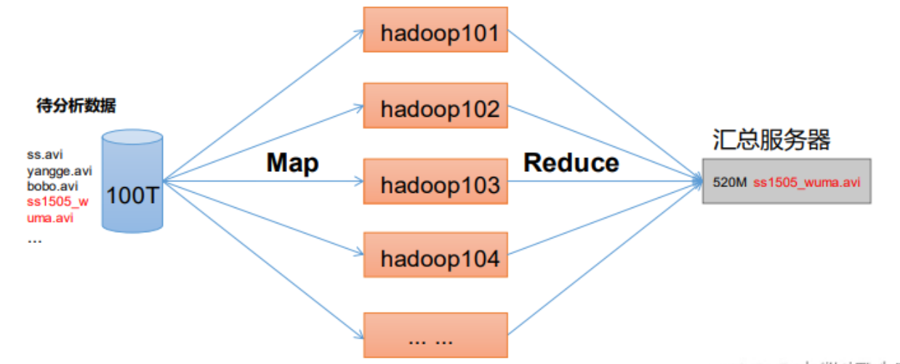
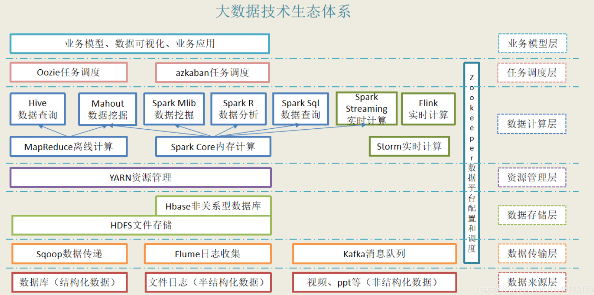
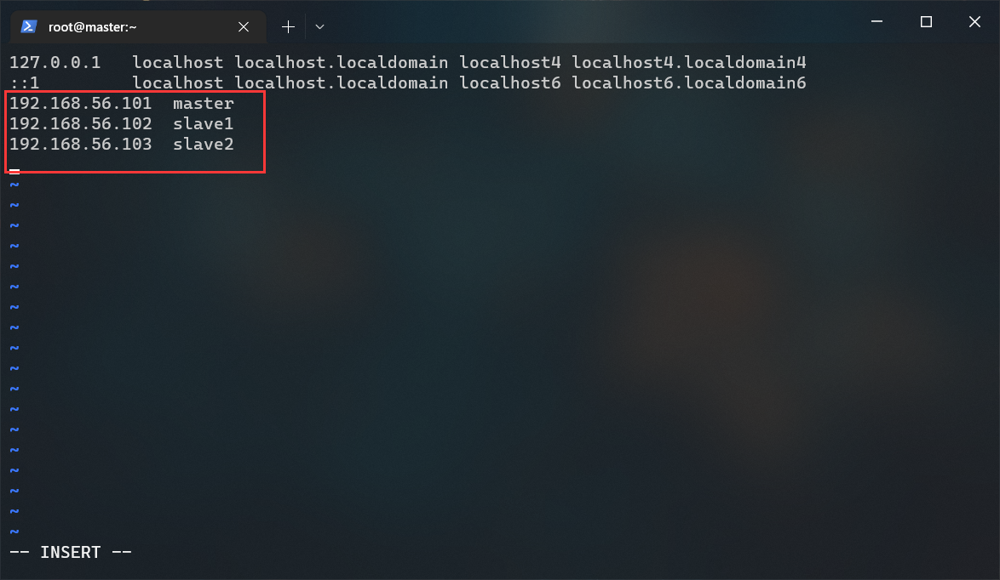
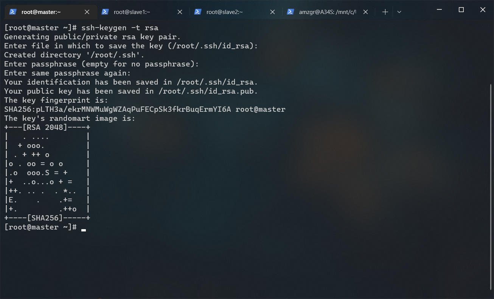
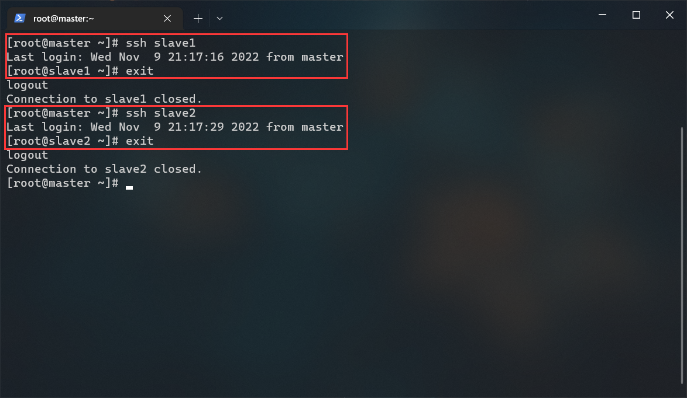
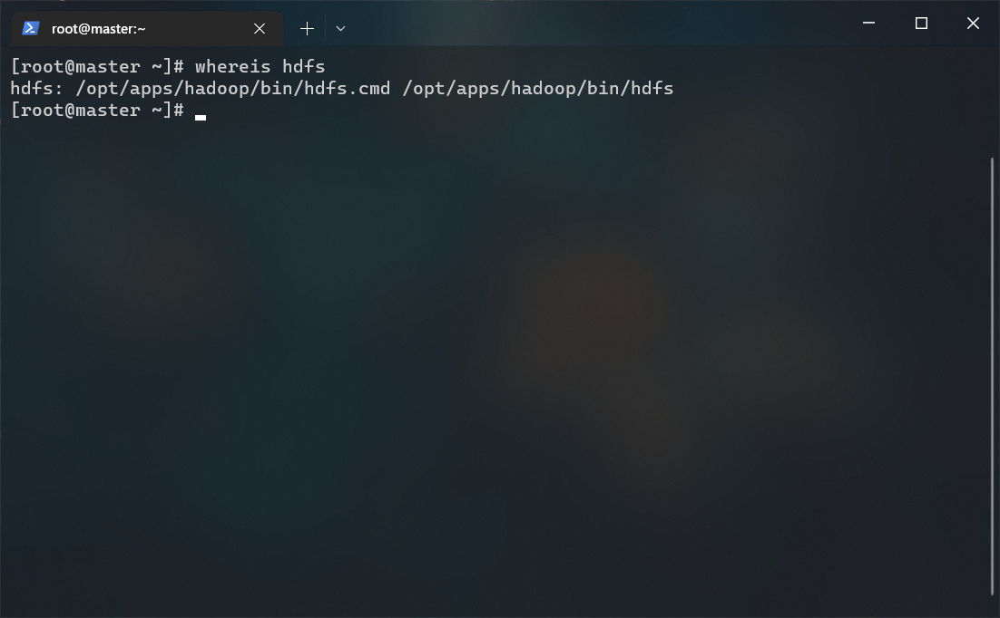
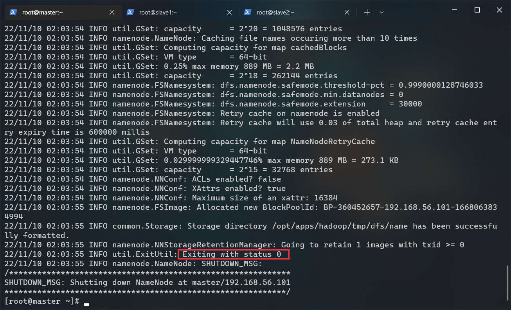
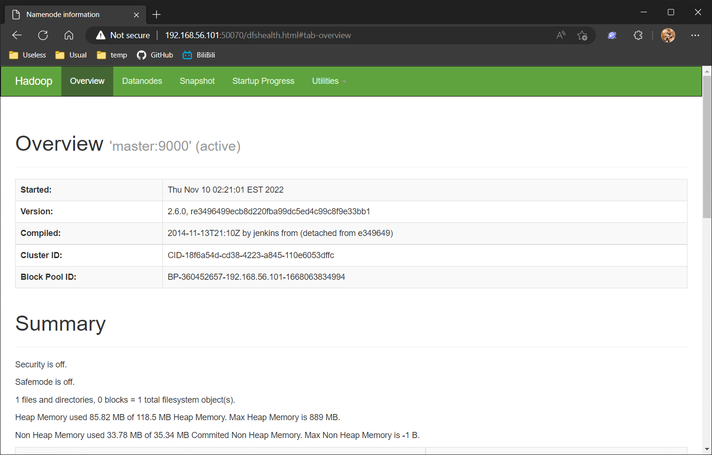
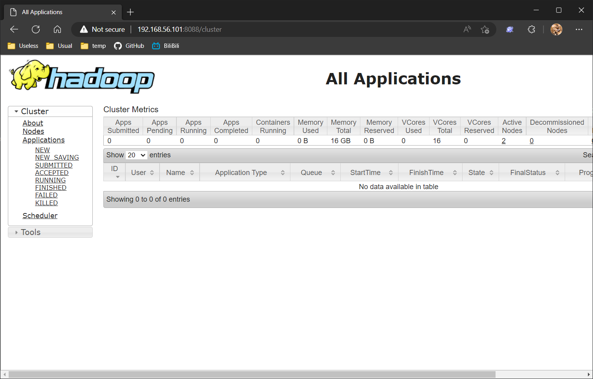
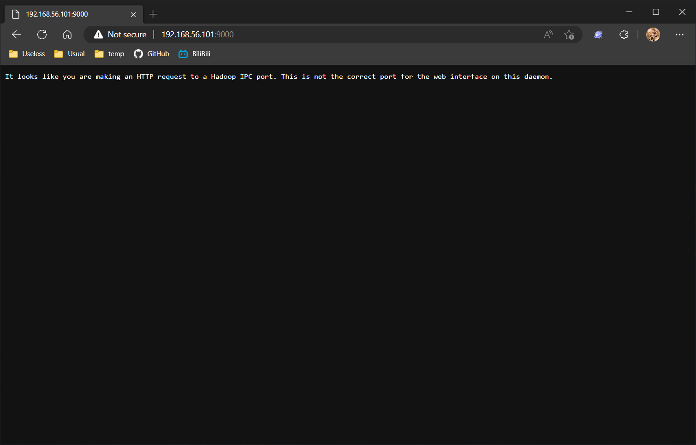

# HADOOP 搭建文档

## 前提条件
- CentOS-7-x86_64-Minimal-2009.iso
- jdk-8u212-linux-x64.tar.gz（位于 /opt/tar/）
- hadoop-3.1.3.tar.gz（位于 /opt/tar/）
- 三台互通的虚拟机

---

## 假设
第一台服务器的IP: 192.168.56.101  
第二台服务器的IP: 192.168.56.102   
第三台服务器的IP: 192.168.56.103

---

## 介绍
Hadoop 是一个由 Apache 基金会所开发的分布式系统基础架构。广义上来说，Hadoop 通常是指一个更广泛的概念——Hadoop 生态圈。
### HDFS
HDFS 是一个分布式文件系统。
#### NameNode
存储文件的元数据，如文件名，文件目录结构，文件属性（生成时间、副本数、文件权限），以及每个文件的块列表和块所在的 DataNode 等。
#### SecondaryNameNode
SecondaryNameNode 的作用是合并 fsimage 和 edits文件。  

NameNode 的存储目录树的信息，而目录树的信息则存放在 fsimage 文件中，当 NameNode 启动的时候会首先读取整个 fsimage 文件，将信息装载到内存中。  

edits 文件存储日志信息，在 NameNode 上所有对目录的操作，增加，删除，修改等都会保存到 edits 文件中，并不会同步到 fsimage 中，当 NameNode 关闭的时候，也不会将 fsimage 和 edits 进行合并。  

所以当 NameNode 启动的时候，首先装载 fsimage 文件，然后按照 edits 中的记录执行一遍所有记录的操作，最后把信息的目录树写入 fsimage 中，并删掉 edits 文件，重新启用新的 edits 文件。  

但是如果 NameNode 执行了很多操作的话，就会导致 edits 文件很大，那么在下一次启动的过程中，就会导致 NameNode 的启动速度很慢，慢到几个小时也不是不可能，所以出现了 SecondNameNode。 

SecondaryNameNode 会按照一定的规则被唤醒，进行 fsimage 和 edits 的合并，防止文件过大。合并的过程是，将 NameNode 的 fsimage 和 edits 下载到 SecondryNameNode 所在的节点的数据目录，然后合并到 fsimage 文件，最后上传到 NameNode 节点。合并的过程中不影响 NameNode 节点的使用。
#### DataNode
在本地文件系统存储文件块数据，以及块数据的校验和。
#### Secondary NameNode
每隔一段时间对 NameNode 元数据备份。并非 NameNode 的热备。当 NameNode 挂掉的时候，它并不能马上替换 NameNode 并提供服务。
### YARN
YARN 是一种资源协调者，是 Hadoop 的资源管理器。
#### ResourceManager
整个集群资源（内存、CPU等）的老大。
#### ApplicationMaster
单个任务运行的老大。
#### NodeManager
单个节点服务器资源老大。
#### Container
容器，相当一台独立的服务器，里面封装了任务运行所需要的资源，如内存、CPU、磁盘、网络等。
### HDFS、Yarn、MapReduce 三者的关系图

### MapReduce


---

## 大数据技术生态体系图


---

## 1.修改主机名
修改主机名主要是为了在集群中分辨主次。  

在第一台服务器上操作：
``` bash
# 宿主
hostnamectl set-hostname master
```

在第二台服务器上操作：
``` bash
# 节点
hostnamectl set-hostname slave1
```

在第三台服务器上操作：

``` bash
# 节点
hostnamectl set-hostname slave2
```

执行以上操作，依次为每一台主机设置一个主机名。

---

## 2.修改 hosts 规则
> 以下内容仅在 master 节点上操作  
> [hosts 有什么作用？](https://baike.baidu.com/item/hosts/10474546)

修改 /etc/hosts 文件:
``` bash
vi /etc/hosts
```

在尾部追加几条规则，修改后的内容如图所示：


---

## 3.同步 hosts 规则
> 以下内容仅在 master 节点上操作

通过 scp 命令将 master 节点上已经修改过的 hosts 文件发送到 slave1 和 slave2：
``` bash
# scp 源 目标 (如果目标已存在则覆盖)
scp /etc/hosts slave1:/etc/hosts
scp /etc/hosts slave2:/etc/hosts
```

## 4.关闭防火墙
> 以下内容在所有节点上操作一次

systemctl 用于控制服务，使用 systemctl 关闭防火墙：
``` bash
# 命令格式：systemctl [要执行的操作] [服务名.service]
# 关闭防火墙
systemctl stop firewalld.service

# 禁止开机自启
systemctl disable firewalld.service
```

查看防火墙状态，确认上面执行的是否已经生效：
``` bash
systemctl status firewalld.service
```


---

## 5.配置 SSH 免密登录
> 以下内容仅在 master 节点上操作  
> [什么是 RSA 密钥？](https://zhuanlan.zhihu.com/p/26810938)

生成一个 RSA 密钥，一直回车即可。
``` bash
# ssh-keygen -t 密钥类型
ssh-keygen -t rsa
```


创建可信配置（SSH免密登录）：
``` bash
# 给自己添加可信配置呢，此举方便后面启动集群。
ssh-copy-id master

# 节点1
ssh-copy-id slave1

# 节点2
ssh-copy-id slave2
```
测试是否配置成功免密登录


---

## 6.Hadoop 集群部署
> 以下内容在 master 节点上操作

``` bash
# 切换到 opt 目录
cd /opt

# 新建 apps 目录并进入
mkdir apps && cd apps

# 解压 hadoop 和 jdk
tar -zxf /opt/tar/hadoop-3.1.3.tar.gz
tar -zxf /opt/tar/jdk-8u212-linux-x64.tar.gz

# 重命名 hadoop
mv ./hadoop-3.1.3 ./hadoop

# 重命名 jdk
mv ./jdk1.8.0_212 ./jdk
```

## 7.配置环境变量
> 以下内容仅在 master 节点上操作  
> [什么是环境变量？](https://baike.baidu.com/item/%E7%8E%AF%E5%A2%83%E5%8F%98%E9%87%8F/1730949)

> 当一个用户登录 Linux 系统或使用 su 命令切换到另一个用户时，首先要确保执行的启动脚本就是 `/etc/profile`，此文件内部内部有一段代码会遍历执行 `/etc/profile.d/` 目录内部的所有脚本。

打开 `/etc/profile.d/big_data_env.sh` 文件：
``` bash
# 此文件虽然不存在，但直接编辑就相当于新建文件
vi /etc/profile.d/big_data_env.sh
```

写入以下内容：
``` bash
export  HADOOP_HOME=/opt/apps/hadoop
export  PATH=$PATH:$HADOOP_HOME/bin:$HADOOP_HOME/sbin
export  JAVA_HOME=/opt/apps/jdk
export  PATH=$PATH:$JAVA_HOME/bin
```

刷新环境变量：
``` bash
source /etc/profile.d/big_data_env.sh
```

你可能注意到了，每次修改环境变量都很麻烦，因为我们要输入一长串的路径，所以我们可以通过 alias 简化环境变量的修改和刷新：
编辑 `/etc/profile.d/custom_command.sh` 文件：
``` bash
# 此文件虽然不存在，但直接编辑就相当于新建文件
vi /etc/profile.d/custom_command.sh
```

在末尾写入一下内容：
``` bash
alias env-edit='vi /etc/profile.d/big_data_env.sh'
alias env-update='source /etc/profile.d/big_data_env.sh'
```

这样以来我们就创建了两个新的命令，其中:
- env-edit 命令用来编辑环境变量
- env-update 命令用来生效您对环境变量的修改

测试 jdk 环境变量：
``` bash
java -version
```


测试 hadoop 环境变量：
``` bash
whereis hdfs
```


---

## 8.Hadoop 集群配置
> 以下内容在 master 节点上操作

进入到 hadoop 配置文件的目录下：
``` bash
cd $HADOOP_HOME/etc/hadoop/
```

### 配置 hadoop-env.sh
由于 hadoop 运行时依赖 Java，所以我们需要在此文件里为 hadoop 配置环境变量；另外，在新版的 hadoop 中我们还需要配置启动 hadoop 时所使用的用户，所以我们还需要在此文件里设置用户名。

编辑 hadoop-env.sh：
``` bash
vi hadoop-env.sh
```

在文件末尾追加以下内容:
``` bash
# Java 环境变量
export JAVA_HOME=/opt/apps/jdk
# Hadoop 执行命令时使用的用户名
export HADOOP_SHELL_EXECNAME=root
# NameNode 用户名
export HDFS_NAMENODE_USER=root
# DataNode 用户名
export HDFS_DATANODE_USER=root
# Secondary NameNode 用户名
export HDFS_SECONDARYNAMENODE_USER=root
# Yarn Resource Manager 用户名
export YARN_RESOURCEMANAGER_USER=root
# Yarn NodeManager 用户名
export YARN_NODEMANAGER_USER=root
```

### <span id="core-site-xml">配置 core-site.xml</span>
编辑 core-site.xml：
``` bash
vi core-site.xml
```

修改后：
``` xml
<?xml version="1.0" encoding="UTF-8"?>
<?xml-stylesheet type="text/xsl" href="configuration.xsl"?>

<configuration>
  <!-- 指定 hadoop 的工作地址 -->
  <property>
    <name>fs.defaultFS</name>
    <value>hdfs://master:9000</value>
  </property>
  <!-- 指定 hadoop 的缓存目录 -->
  <property>
    <name>hadoop.tmp.dir</name>
    <value>file:/opt/apps/hadoop/tmp</value>
  </property>
</configuration>
```

参数名|默认值|参数解释
-|-|-
fs.defaultFS|file://|文件系统主机和端口
io.file.bufffer.size|4096|流文件的缓冲区大小
hadoop.tmp.dir|/tmp/hadoop-${user_name}|临时目录

### 配置 hdfs-site.xml
我们需要在这个文件里指定容灾备份数量、名称节点数据存储目录、数据节点数据存储目录、辅助节点服务器。

编辑 core-site.xml：
``` bash
vi hdfs-site.xml
```

修改后：
``` xml
<?xml version="1.0" encoding="UTF-8"?>
<?xml-stylesheet type="text/xsl" href="configuration.xsl"?>

<configuration>
  <!-- 容灾备份数量 -->
  <property>
    <name>dfs.replication</name>
    <value>2</value>
  </property>
  <!-- 名称节点的数据存储目录 -->
  <property>
    <name>dfs.namenode.name.dir</name>
    <value>file:/opt/apps/hadoop/tmp/dfs/name</value>
  </property>
  <!-- 数据节点的数据存储目录 -->
  <property>
    <name>dfs.datanode.data.dir</name>
    <value>file:/opt/apps/hadoop/tmp/dfs/data</value>
  </property>
  <!-- SecondaryNameNode 工作在 master 上 -->
  <property>
    <name>dfs.secondary.http.address</name>
    <value>127.0.0.1:50090</value>
  </property>
</configuration>
```

参数名|默认值|参数解释
-|-|-
dfs.replication|3|缺省的块复制数量
dfs.webhdfs.enabled|true|是否通过http协议读取hdfs文件（不安全）
dfs.namenode.name.dir|file://${hadoop.tmp.dir}/dfs/name|dfs名称节点存储位置
dfs.namenode.secondary.http-address|127.0.0.1:50090|dfs名称节点
dfs.datanode.data.dir|file://${hadoop.tmp.dir}/dfs/data|dfs数据节点存储数据块的位置
dfs.secondary.http.address|0.0.0.0:50090|hdfs对应的http服务器地址

### 配置 mapred-site.xml
此文件用于配置集群如何进行 mapreduce 计算。  

使用模板配置：
``` bash
cp ./mapred-site.xml.template ./mapred-site.xml
vi mapred-site.xml
```

修改后：
``` xml
<?xml version="1.0"?>
<?xml-stylesheet type="text/xsl" href="configuration.xsl"?>

<configuration>
  <!-- 使用 yarn 集群框架 -->
  <property>
    <name>mapreduce.framework.name</name>
    <value>yarn</value>
  </property>
  <!--
    不要随意改，这是魔法~~~

    一开始没有配置这三个，导致后面进行 mapreduce 测试时
    报错提示缺少这三个配置，所以后来给写了进来，及不知的话
    到时候报错的时候，直接复制粘贴进来，把路径换成 hadoop
    安装路径，然后再把这个文件分发给其他节点就行了。
  -->
  <property>
    <name>yarn.app.mapreduce.am.env</name>
    <value>HADOOP_MAPRED_HOME=/opt/apps/hadoop/</value>
  </property>
  <property>
      <name>mapreduce.map.env</name>
      <value>HADOOP_MAPRED_HOME=/opt/apps/hadoop/</value>
  </property>
  <property>
      <name>mapreduce.reduce.env</name>
      <value>HADOOP_MAPRED_HOME=/opt/apps/hadoop/</value>
  </property>
</configuration>
```

参数名|默认值|参数解释
-|-|-
mapreduce.framework.name|local|取 local \| classic \| yarn 其中之一，若非 yarn 则不会使用 yarn 集群来实现资源的分配。
mapreduce.jobhistory.address|0.0.0.0:10020|定义历史服务器的地址和端口，通过历史服务器查看已经运行完的 Mapreduce 作业记录。
mapreduce.jobhistory.webapp.address|0.0.0.0:19888|定义历史服务器 web 应用访问地址和端口。

### 配置 yarn-site.xml
一个集群需要一个资源管理者，所以我们需要配置这个文件。  

编辑 yarn-site.xml：
``` bash
vi yarn-site.xml
```

修改后：
``` xml
<?xml version="1.0"?>

<configuration>
  <!-- 把 yarn 集群的资源管理者设置为 master -->
  <property>
    <name>yarn.resourcemanager.hostname</name>
    <value>master</value>
  </property>
  <!-- 自定义服务 -->
  <property>
    <name>yarn.nodemanager.aux-services</name>
    <value>mapreduce_shuffle</value>
  </property>
</configuration>
```

参数名|默认值|参数解释
-|-|-
yarn.resourcemanager.address|0.0.0.0:8032|ResourceManager提供给客户端访问的地址. 客户端通过该地址向RM提交应用程序，杀死应用程序等
yarn.resourcemanager.scheduler.address|0.0.0.0:8030|定义历史服务器的地址和端口，通过历史服务器查看已经运行完的 Mapreduce 作业记录
yarn.resourcemanager.resource-tracker.address|0.0.0.0:8031|ResourceManager 提供给 NodeManager 的地址. NodeManager 通过该地址向 RM 汇报心跳，领取任务等
yarn.resourcemanager.admin.address|0.0.0.0:8033|ResourceManager提供给管理员的访问地址. 管理员通过该地址向 RM 发送管理命令等
yarn.resourcemanager.webapp.address|0.0.0.0:8088|ResourceManager对 web 服务提供地址. 用户可通过该地址在浏览器中查看集群各类信息
yarn.nodemanager.aux-services|org.apache.hadoop.mapred.ShuffleHandler|通过该配置项，用户可以自定义一些服务，例如 Map-Reduce 的 shuffle 功能就是采用这种方式实现的，这样就可以在 NodeManager 上扩展自己的服务

### 配置 workers
我们需要在此文件内写入所有节点的主机名，这样 master 才知道集群里都有哪些主机。  

编辑 workers：
``` bash
vi workers
```

填写所有节点：
```
slave1
slave2
```

---

## 9.分发文件
> 以下内容仅在 master 节点上操作

下发 apps 目录到 slave1 和 slave2 节点：
``` bash
scp -r /opt/apps slave1:/opt/
scp -r /opt/apps slave2:/opt/
```

下发环境变量文件到 slave1 和 slave2 节点：
``` bash
scp /etc/profile.d/big_data_env.sh slave1:/etc/profile.d/big_data_env.sh
scp /etc/profile.d/custom_command.sh slave2:/etc/profile.d/custom_command.sh
```

## 10.生效环境变量：
> 以下内容在所有节点上操作
``` bash
source /etc/profile.d/custom_command.sh
env-update
```

## 11.启动 Hadoop 集群
> 以下内容仅在 master 节点上操作

格式化元数据：（仅在 master 节点上执行一次此命令）
``` bash
hdfs namenode -format
```

> <span id="hdfs-error">如果不小心多次执行了此命令，或在发送文件到 hdfs 时遇到问题，请尝试在所有节点上清空您在 [core-site.xml](#core-site-xml) 里配置的数据缓存目录并重新格式化 namenode 解决：</span>
> ``` bash
> # 在所有节点上执行
> rm -rf $HADOOP_HOME/tmp
> ```
> 再次执行格式化：
> ``` bash
> # 在 master 节点上执行
> hdfs namenode -format
> ```

正常输出：


启动 hdfs 和 yarn：
``` bash
start-all.sh
```


在所有节点上关闭安全模式：
``` bash
# 在所有节点执行一次
hdfs dfsadmin -safemode leave
```
---

## 12.检查启动情况
> 以下内容仅在 master 节点上操作

检查 hadoop ：
``` bash
jps
```


> 我们已经在前面建立了 master 的 hosts 规则  
> 但是我们的实体机没有建立 hosts 规则，所以并不认识 master
> 只需要把 master 替换成对应的 IP 地址即可
> master -> 192.168.56.101

检查端口启动状态的方法有很多种，这里我们使用最简单的浏览器测试法。  

浏览器打开 http://192.168.56.101:9870  


浏览器打开 http://192.168.56.101:8088  


浏览器打开 http://192.168.56.101:9000  


以上代表正常工作。


## 13.测试 Hadoop
> 以下内容在 master 节点上操作

来一波计算测试：
``` bash
# 切换目录
cd /opt/apps/hadoop/share/hadoop/mapreduce/

# 来一波 mapreduce 计算测试
hadoop jar hadoop-mapreduce-examples-3.1.3.jar pi 10 10

# 计算很漫长，速度虚拟机的配置。
# 最终计算结果是 Estimated value of Pi is 3.20000000000000000000
```

查看 hdfs 报告：
``` bash
hdfs dfsadmin -report
```

---

## 快速跳转
[回到顶部](#hadoop-搭建文档)  
[ZOOKEEPER 部署文档](../zookeeper/README.md)
