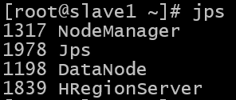
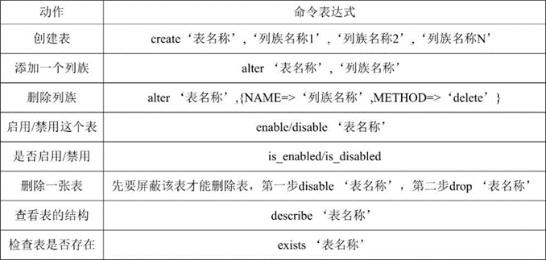
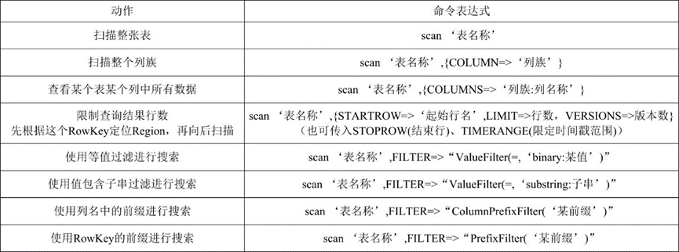

# <span id="top">Hbase 搭建文档</span>

## 前提条件
- hadoop 集群已经启动
- mysql 已部署完毕
- hive 已部署完毕
- hbase-1.2.0-bin.tar.gz（位于/opt/tar下）

---

## 1.解压
进入 /opt/app/ 目录内：
``` shell
cd /opt/apps
```

解压 hbase-1.2.0-bin.tar.gz 到当前目录：
``` shell
tar -zxf /opt/tar/hbase-1.2.0-bin.tar.gz
```

重命名 hbase ：
``` shelll
mv ./hbase-1.2.0 ./hbase
```

---

## 2.配置环境变量
编辑用户根目录下的 .bashrc 文件：
``` shell
vi ~/.bashrc
```

在文件末尾添加：
``` shell
export HBASE_HOME=/opt/apps/hbase
export PATH=$PATH:$HBASE_HOME/bin
```

生效环境变量：
``` shell
source ~/.bashrc
```

---

## 3.修改配置文件
进入配置文件目录：
```shell
cd /opt/apps/hbase/conf/
```

修改hbase-env.sh：
```shell
vi hbase-env.sh
```

取消注释并修改:
>因为使用的zookeeper是手动安装的，并非自带的，所以修改为false
```diff
# The java implementation to use.  Java 1.7+ required.
- export JAVA_HOME=/usr/java/jdk1.6.0/
+ export JAVA_HOME=/opt/apps/jdk

# Tell HBase whether it should manage it's own instance of Zookeeper or not.
- export HBASE_MANAGES_ZK=true
+ export HBASE_MANAGES_ZK=false
```

注释以下配置：
>目前使用jdk版本为jdk1.8，无须配置此项，故注释（不注释会出错）
```shell
# Configure PermSize. Only needed in JDK7. You can safely remove it for JDK8+
#export HBASE_MASTER_OPTS="$HBASE_MASTER_OPTS -XX:PermSize=128m -XX:MaxPermSize=128m"
#export HBASE_REGIONSERVER_OPTS="$HBASE_REGIONSERVER_OPTS -XX:PermSize=128m -XX:MaxPermSize=128m"
```

配置hbase-site.xml：
```shell
vi hbase-site.xml
```

配置如下：
```xml
<!--hbase的数据保存在hdfs对应目录下-->
<property>
	<name>hbase.rootdir</name>
	<value>hdfs://master:9000/hbase</value>
</property>
<!--是否是分布式环境-->
<property> 
	<name>hbase.cluster.distributed</name> 
	<value>true</value> 
</property> 
<!--冗余度-->
<property>
	<name>dfs.replication</name>
	<value>2</value>
</property>
<!--链接zookeeper-->
<property>
	<name>hbase.zookeeper.property.clientPort</name>
	<value>2181</value>
</property>
<!--zookeeper数据目录-->
<property> 
	<name>hbase.zookeeper.property.dataDir</name> 
	<value>/opt/apps/hbase</value>       
</property>
<!--配置zk的地址，三个节点都启动-->
<property> 
	<name>hbase.zookeeper.quorum</name> 
	<value>master,slave1,slave2</value>     
</property>
```

修改配置文件(master节点)：
```shell
vi regionservers
```

将内容改为：
```shell
slave1
slave2
```

如图所示:  


---

## 4.分发文件
分发：
```shell
scp -r /opt/apps/hbase @slave1:/opt/apps/
scp -r /opt/apps/hbase @slave2:/opt/apps/
```

修改slave1、slave2下regionservers文件：
```shell
vi /opt/apps/hbase/conf/regionservers
```

>添加master节点

如图所示：  


---

## 5.启动测试
master节点上启动：
```shell
start-hbase.sh
```

检查进程（三个节点）：
```shell
jps
```

> master节点从出现Hmaster进程  
> slave1,slave2上出现HregionServer进程

如图所示：  
  


---

## 6.Hbase shell
使用hbase shell命令进入shell命令行：
```shell
hbase shell
```

shell常用命令：
>表操作：



>增删改查：  


>搜索：



退出hbase shell:
```shell
exit
```

>至此Hbase配置完毕

---

## 快速跳转
[回到顶部](#top)  
[KAFAKA 部署文档](../kafaka/README.md)