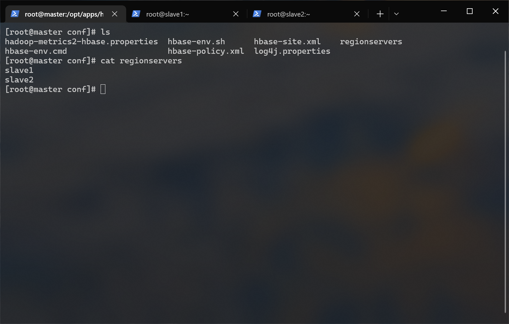
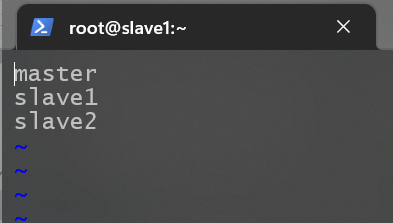
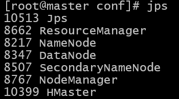

# <span id="top">Hbase 搭建文档</span>

## 前提条件
- hadoop 集群已经启动
- mysql 已部署完毕
- hive 已部署完毕
- zookeeper 已经启动
- hbase-1.2.0-bin.tar.gz（位于/opt/tar下）

---

## 1.解压
进入 /opt/app/ 目录内：
``` shell
cd /opt/apps
```

解压 hbase-1.2.0-bin.tar.gz 到当前目录：
``` shell
tar -zxf /opt/tar/hbase-1.2.0-bin.tar.gz
```

重命名 hbase ：
``` shelll
mv ./hbase-1.2.0 ./hbase
```

---

## 2.配置环境变量
编辑用户根目录下的 .bashrc 文件：
``` shell
vi ~/.bashrc
```

在文件末尾添加：
``` shell
export HBASE_HOME=/opt/apps/hbase
export PATH=$PATH:$HBASE_HOME/bin
```

生效环境变量：
``` shell
source ~/.bashrc
```

---

## 3.修改配置文件
进入配置文件目录：
```shell
cd /opt/apps/hbase/conf/
```

修改hbase-env.sh：
```shell
vi hbase-env.sh
```

取消注释并修改:
> 因为使用的 zookeeper 是手动安装的，并非自带的，所以修改 HBASE_MANAGES_ZK 为 false
```diff
# The java implementation to use.  Java 1.7+ required.
- export JAVA_HOME=/usr/java/jdk1.6.0/
+ export JAVA_HOME=/opt/apps/jdk

# Tell HBase whether it should manage it's own instance of Zookeeper or not.
- export HBASE_MANAGES_ZK=true
+ export HBASE_MANAGES_ZK=false
```

注释以下配置：
>目前使用 jdk 版本为 jdk1.8，无须配置此项，故注释（不注释会出错）
```shell
# Configure PermSize. Only needed in JDK7. You can safely remove it for JDK8+
#export HBASE_MASTER_OPTS="$HBASE_MASTER_OPTS -XX:PermSize=128m -XX:MaxPermSize=128m"
#export HBASE_REGIONSERVER_OPTS="$HBASE_REGIONSERVER_OPTS -XX:PermSize=128m -XX:MaxPermSize=128m"
```

配置hbase-site.xml：
```shell
vi hbase-site.xml
```

配置如下：
```xml
<!-- hbase 的数据保存在 hdfs 对应目录下 -->
<property>
	<name>hbase.rootdir</name>
	<value>hdfs://master:9000/hbase</value>
</property>
<!-- 是否是分布式环境 -->
<property> 
	<name>hbase.cluster.distributed</name> 
	<value>true</value> 
</property> 
<!-- 冗余度 -->
<property>
	<name>dfs.replication</name>
	<value>2</value>
</property>
<!-- 连接 zookeeper -->
<property>
	<name>hbase.zookeeper.property.clientPort</name>
	<value>2181</value>
</property>
<!-- zookeeper 数据目录 -->
<property> 
	<name>hbase.zookeeper.property.dataDir</name> 
	<value>/opt/apps/hbase</value>       
</property>
<!-- 配置 zookeeper 数据目录的地址，三个节点都启动 -->
<property> 
	<name>hbase.zookeeper.quorum</name> 
	<value>master,slave1,slave2</value>     
</property>
```

修改配置文件(master节点)：
```shell
vi regionservers
```

将内容改为：
```shell
slave1
slave2
```


---

## 4.分发文件
分发文件到 slave1、slave2 ：
```shell
scp -r /opt/apps/hbase slave1:/opt/apps/
scp -r /opt/apps/hbase slave2:/opt/apps/
```

修改 slave1、slave2 下 regionservers 文件：
> 分别在 slave1、slave2 节点执行此步骤  
> 附属节点的 regionservers 文件需要包含 master 节点

```shell
echo "master" >> /opt/apps/hbase/conf/regionservers
```


---

## 5.启动测试
master 节点上启动：
```shell
start-hbase.sh
```

检查进程（三个节点）：
```shell
jps
```

master 节点从出现 Hmaster 进程，slave1、slave2 上出现 HregionServer 进程：


---

## 6.Hbase shell
进入 hbase 命令行：
> 确保您已经启动了 hadoop 和 zookeeper
```shell
hbase shell
```

常用命令 - 表操作：
行为|命令
-|-
创建表|`create '表名', '列簇名1', '列簇名2', '列簇名N'`
添加列簇|`alter '表名', '列簇名'`
删除列簇|`alter '表名', {NAME=>'列簇名', METHOD=>'delete'}`
启用/禁用表|`enable/disable '表名'`
是否启用/禁用|`is_enabled/is_disabled`
删除表|仅能删除已被禁用的表：`drop '表名'`
查看表结构|`describe '表名'`
检查表是否存在|`exists '表名'`

常用命令 - 增删改查：
行为|命令
-|-
添加记录|`put '表名', '行键', '列簇:列名', '值'`
删除记录|`delete '表名', '行键', '列簇:列名'`
删除整行的值|`deleteall '表名', '行键'`
更新记录|再添加一次，覆盖原来的（put）
查看记录|`get '表名', '行键'`
查看表中记录数|`count '表名'`

常用命令 - 搜索：
行为|命令
-|-
扫描整张表|`scan '表名'`
扫描整个列簇|`scan '表名', {COLUMN=>'列簇'}`
查看某表某列所有数据|`scan '表名', {COLUMN=>'列簇:列名'}`
限制查询结果行数（先根据 RowKey 定位 Region，再向后扫描）|`scan '表名', {STARTROW=>'起始行名', LIMIT=>行数, VERSIONS=>版本数}`
限制查询结果行数（先根据 RowKey 定位 Region，再向后扫描）|`scan '表名', {STARTROW=>'起始行名', STOPROW=>终止行名, VERSIONS=>版本数}`
限制查询结果行数（先根据 RowKey 定位 Region，再向后扫描）|`scan '表名', {TIMERANGE=>[起始时间戳（毫秒）, 终止时间戳（毫秒）], VERSIONS=>版本数}`
使用等值过滤进行搜索|`scan '表名', FILTER=>"ValueFilter(=, 'binary': 值)"`
使用值包含子串过滤进行搜索|`scan '表名', FILTER=>"ValueFilter(=, 'subsreing': 字串)"`
使用列名的前缀进行搜索|`scan '表名', FILTER=>"ColumnPrefixFilter('前缀')"`
使用 RowKey 的前缀进行搜索|`scan '表名', FILTER=>"PrefixFilter('前缀')"`

退出 hbase 命令行:
```shell
exit
```

---

## 快速跳转
[回到顶部](#top)  
[KAFAKA 部署文档](../kafaka/README.md)