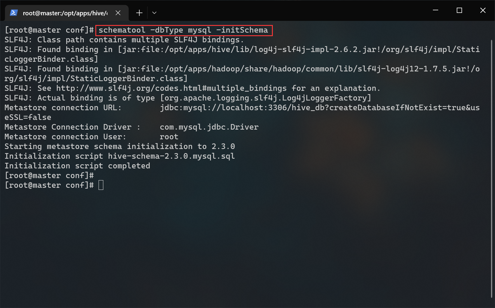
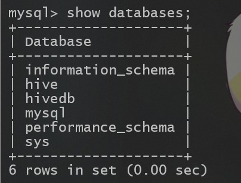
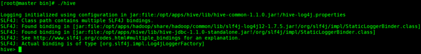

# hive 搭建文档

## 前提条件
- hadoop集群已经启动
- mysql已部署完毕
- apache-hive-2.3.4-bin.tar.gz（位于/opt/tar下）

## 1.解压 hive
``` shell
# 进入 /opt/apps 目录
cd /opt/apps/

# 解压 apache-hive-2.3.4-bin.tar.gz 到当前目录
tar -zxf /opt/tar/apache-hive-2.3.4-bin.tar.gz

# 重命名 hive
mv ./apache-hive-2.3.4-bin ./hive
```

##2.放入 MySQL 驱动包
``` shell
# 将 mysql 驱动包移动到 hive/lib 目录下
cp /opt/tar/mysql-connector-java-5.1.32.jar /opt/apps/hive/lib/
```
> 将 hadoop 中的jline-0.0.94.jar替换为 hive 中的jline-2.12.jar：
> ```shell
> # 备份jline-0.0.94.jar（以防万一）
> cd /opt/apps/hadoop/share/hadoop/yarn/lib/
> cp ./jline-0.9.94.jar ./jline-0.9.94.jar.bak
> # 替换jline-0.0.94.jar
> cp /opt/apps/hive/lib/jline-2.12.jar /opt/apps/hadoop/share/hadoop/yarn/lib/jline-0.9.94.jar
> ```

##3.配置环境变量
编辑用户根目录下的 .bashrc 文件：
``` shell
vi ~/.bashrc
```
在文件末尾添加：
```shell
export HIVE_HOME=/opt/apps/hive
export PATH=$PATH:$HIVE_HOME/bin
```
生效环境变量
```shell
source ~/.bashrc
```

##4.配置hive-env.sh
拷贝模板：
```shell
cp ./hive-env.sh.template ./hive-env.sh
```
编辑hive-env.sh
```shell
vi ./hive-env.sh
```
在文件末尾添加：
```shell
export JAVA_HOME=/opt/apps/jdk
export HADOOP_HOME=/opt/apps/hadoop
export HIVE_HOME=/opt/apps/hive
export HIVE_CONF_DIR=$HIVE_HOME/conf
```

##5.配置hive-site.xml
拷贝模板：
```shell
cp ./hive-default.xml.template ./hive-site.xml
```
编辑hive-site.xml
```shell
vi ./hive-site.xml
```
修改以下配置：
> 直接在原文件查找对应项修改参数，切勿全部删除  
> vi编辑器命令模式下使用"/"+"关键字"搜索
```xml
<property>
	<name>javax.jdo.option.ConnectionURL</name>
	<value>jdbc:mysql://localhost:3306/hivedb?createDatabaseIfNotExist=true&amp;useSSL=false</value>	
</property>
<!--配置数据库驱动-->
<property>
	<name>javax.jdo.option.ConnectionDriverName</name>
	<value>com.mysql.jdbc.Driver</value>
</property>
<!--配置数据库用户名-->
<property>
	<name>javax.jdo.option.ConnectionUserName</name>
	<value>root</value>
</property>
<!--配置MySQL数据库root的密码-->
<property>
	<name>javax.jdo.option.ConnectionPassword</name>
	<value>你的MySQL root密码</value>
</property>
```
删除文件中system路径：
```shell
#sed -i "s/要替换的/替换为/g" 文件路径
sed -i "s/system://g" hive-site.xml
```
##6.schema 格式化
执行格式化：
```shell
schematool -dbType mysql -initSchema
```


##7.新建 hive 数据库
使用mysql
```shell
mysql -root -p
```
新建数据库
```sql
create database hivedb;
```


退出mysql
```shell
exit
```

##8.启动 hive
执行:
```shell
hive
```

>至此hive配置完毕