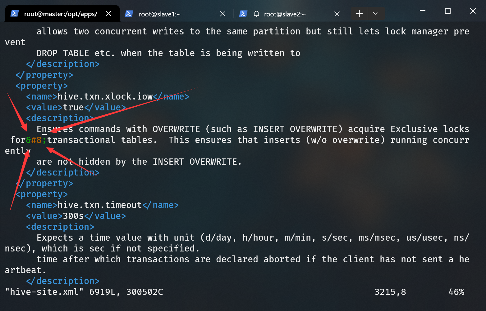
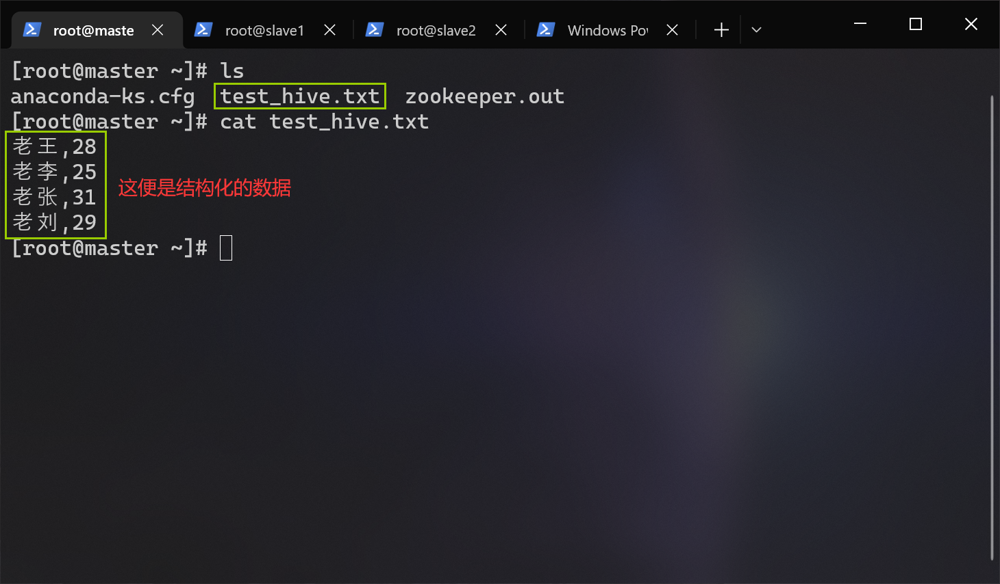
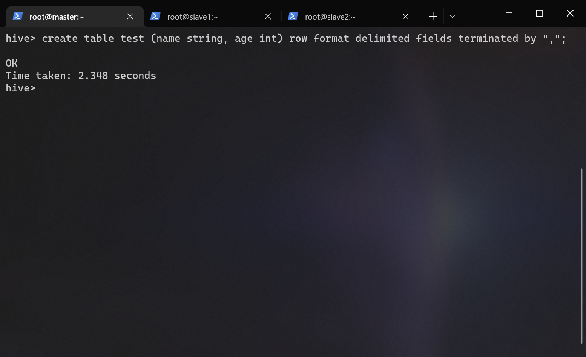
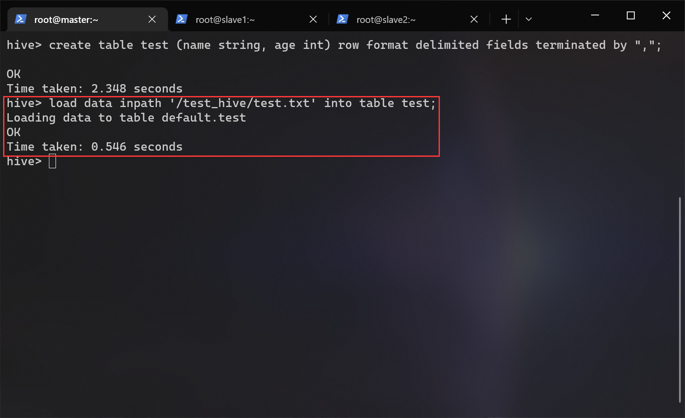
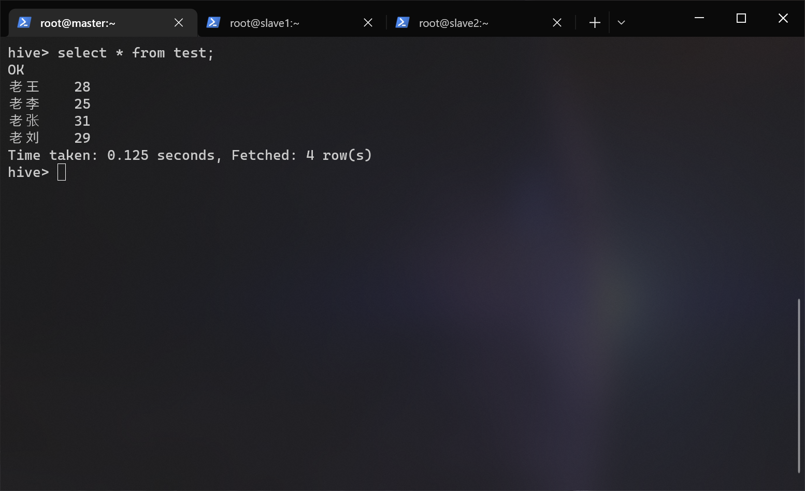
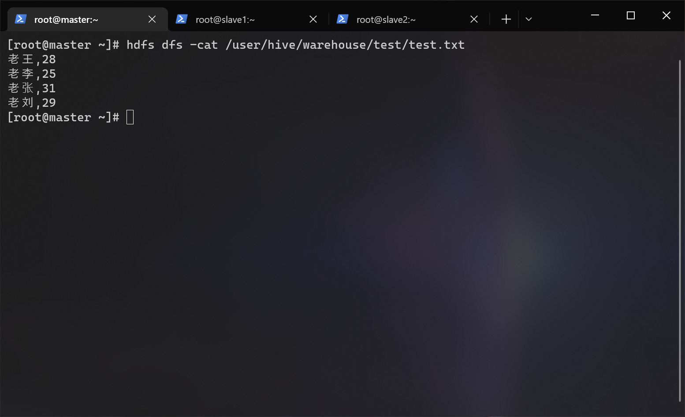

# <span id="top">HIVE 搭建文档</span>

## 前提条件
- hadoop 集群已经启动
- mysql 已部署完毕
- apache-hive-2.3.4-bin.tar.gz（位于/opt/tar下）
- mysql-connector-java-5.1.32.jar（位于/opt/tar下）
- 非分布式搭建

---

## 1.解压 hive
``` shell
# 进入 /opt/apps 目录
cd /opt/apps/

# 解压 apache-hive-2.3.4-bin.tar.gz 到当前目录
tar -zxf /opt/tar/apache-hive-2.3.4-bin.tar.gz

# 重命名 hive
mv ./apache-hive-2.3.4-bin ./hive
```

---

## 2.放入 MySQL 驱动包
因为 hive 需要操作 mysql，所以需要将 java 连接 mysql 需要用到的驱动复制到 hive/lib/ 下：
``` shell
cp /opt/tar/mysql-connector-java-5.1.32.jar /opt/apps/hive/lib/
```

> 启动 hive 会出现一个警告，解决方案是升级 hadoop 的 jline 库。将 hadoop 中的 jline-0.0.94.jar 替换为 hive 中较新的 jline-2.12.jar：
> ``` shell
> # 备份 jline-0.0.94.jar（以防万一）
> cd /opt/apps/hadoop/share/hadoop/yarn/lib
> cp ./jline-0.9.94.jar ./jline-0.9.94.jar.bak
> # 替换 jline-0.0.94.jar
> cp /opt/apps/hive/lib/jline-2.12.jar /opt/apps/hadoop/share/hadoop/yarn/lib/jline-0.9.94.jar
> ```

---

## 3.配置环境变量
编辑用户根目录下的 .bashrc 文件：
``` shell
vi ~/.bashrc
```

在文件末尾添加：
``` shell
export HIVE_HOME=/opt/apps/hive
export PATH=$PATH:$HIVE_HOME/bin
```

## 4.生效环境变量
``` shell
source ~/.bashrc
```

---

## 5.配置 hive-env.sh
进入到 hive 配置文件的目录下：
``` shell
cd /opt/apps/hive/conf
```

拷贝模板：
``` shell
cp ./hive-env.sh.template ./hive-env.sh
```

编辑 hive-env.sh：
```shell
vi ./hive-env.sh
```

在文件末尾添加：
```shell
export JAVA_HOME=/opt/apps/jdk
export HADOOP_HOME=/opt/apps/hadoop
export HIVE_HOME=/opt/apps/hive
export HIVE_CONF_DIR=$HIVE_HOME/conf
```

编辑完后长这样：
``` diff
# Licensed to the Apache Software Foundation (ASF) under one
# or more contributor license agreements.  See the NOTICE file
# distributed with this work for additional information
# regarding copyright ownership.  The ASF licenses this file
# to you under the Apache License, Version 2.0 (the
# "License"); you may not use this file except in compliance
# with the License.  You may obtain a copy of the License at
#
#     http://www.apache.org/licenses/LICENSE-2.0
#
# Unless required by applicable law or agreed to in writing, software
# distributed under the License is distributed on an "AS IS" BASIS,
# WITHOUT WARRANTIES OR CONDITIONS OF ANY KIND, either express or implied.
# See the License for the specific language governing permissions and
# limitations under the License.

# Set Hive and Hadoop environment variables here. These variables can be used
# to control the execution of Hive. It should be used by admins to configure
# the Hive installation (so that users do not have to set environment variables
# or set command line parameters to get correct behavior).
#
# The hive service being invoked (CLI etc.) is available via the environment
# variable SERVICE


# Hive Client memory usage can be an issue if a large number of clients
# are running at the same time. The flags below have been useful in
# reducing memory usage:
#
# if [ "$SERVICE" = "cli" ]; then
#   if [ -z "$DEBUG" ]; then
#     export HADOOP_OPTS="$HADOOP_OPTS -XX:NewRatio=12 -Xms10m -XX:MaxHeapFreeRatio=40 -XX:MinHeapFreeRatio=15 -XX:+UseParNewGC -XX:-UseGCOverheadLimit"
#   else
#     export HADOOP_OPTS="$HADOOP_OPTS -XX:NewRatio=12 -Xms10m -XX:MaxHeapFreeRatio=40 -XX:MinHeapFreeRatio=15 -XX:-UseGCOverheadLimit"
#   fi
# fi

# The heap size of the jvm stared by hive shell script can be controlled via:
#
# export HADOOP_HEAPSIZE=1024
#
# Larger heap size may be required when running queries over large number of files or partitions.
# By default hive shell scripts use a heap size of 256 (MB).  Larger heap size would also be
# appropriate for hive server.


# Set HADOOP_HOME to point to a specific hadoop install directory
# HADOOP_HOME=${bin}/../../hadoop

# Hive Configuration Directory can be controlled by:
# export HIVE_CONF_DIR=

# Folder containing extra libraries required for hive compilation/execution can be controlled by:
# export HIVE_AUX_JARS_PATH=
+ export JAVA_HOME=/opt/apps/jdk
+ export HADOOP_HOME=/opt/apps/hadoop
+ export HIVE_HOME=/opt/apps/hive
+ export HIVE_CONF_DIR=$HIVE_HOME/conf
```

---

## 6.配置 hive-site.xml
拷贝模板：
``` shell
cp ./hive-default.xml.template ./hive-site.xml
```

编辑 hive-site.xml：
``` shell
vi ./hive-site.xml
```

修改以下配置：
> 直接在 hive-site.xml 文件查找对应项修改参数，切勿全部删除！！！  
> vi 编辑器命令模式下使用 "/"+"关键字" 搜索。
``` xml
<property>
	<name>javax.jdo.option.ConnectionURL</name>
	<value>jdbc:mysql://localhost:3306/hivedb?createDatabaseIfNotExist=true&amp;useSSL=false</value>	
</property>
<!--配置数据库驱动-->
<property>
	<name>javax.jdo.option.ConnectionDriverName</name>
	<value>com.mysql.jdbc.Driver</value>
</property>
<!--配置数据库用户名-->
<property>
	<name>javax.jdo.option.ConnectionUserName</name>
	<value>root</value>
</property>
<!--配置MySQL数据库root的密码-->
<property>
	<name>javax.jdo.option.ConnectionPassword</name>
	<value>你的MySQL root密码</value>
</property>
```

---

## 7.schema 格式化
执行格式化：
``` shell
schematool -dbType mysql -initSchema
```


---

## 8.启动 hive
启动 hive ：
```shell
hive
```

如果出现这个报错：（绝对URI中的相对路径）


解决方案是把 hive-site.xml 文件中绝对路径字眼 “system:” 全部删掉：
``` shell
# sed -i "s/要替换的/替换为/g" 文件路径
sed -i "s/system://g" /opt/apps/hive/conf/hive-site.xml
```

再次尝试启动 hive：
```shell
hive
```

成功：


---

## 9.使用 hive
目的：使用 hive 处理存储在 hdfs 内的结构化数据，使得我们可以通过 SQL 语句操作这些数据。  

我们先来创建一个结构化的数据：
``` shell
# 进入根目录
cd ~

# 新建一个文本文件
vi test.txt
```

写入这些东西：
```
老王,28
老李,25
老张,31
老刘,29
```


在 hdfs 里创建一个 test_hive 目录：
``` shell
# hdfs dfs -命令 值
hdfs dfs -mkdir /test_hive
```

把我们刚刚写的 test.txt 发送到 hdfs 文件系统的 /test_hive 目录里 ：
``` shell
hdfs dfs -put ~/test.txt /test_hive/test.txt
```
如果发送文件到 hdfs 时遇到错误，请尝试重启您的 hadoop 。  
```
# 停止 hadoop 集群
stop-yarn.sh && stop-dfs.sh

# 启动 hadoop 集群
start-dfs.sh && start-yarn.sh
```
如果还是不行，请尝试此方案：
```
# 清空您在 core-site.xml 里设置的 hadoop.tmp.dir 目录
rm -rf /opt/apps/hadoop/data/*

# 重新格式化 namenode
hdfs namenode -format
```
具体请参考 [hadoop 搭建文档 ](../hadoop/README.md)第八步的引用部分。  

回到正题，cat 一下，证明已经发送到 hdfs 里了：
```shell
hdfs dfs -cat /test_hive/test.txt
```


启动 hive ：
``` shell
hive
```

执行这段指令：
- 创建一个数据表 test。
- 这个表的有两个字段 name 和 age。
- 这个表的行格式：
	-	以 “,” 分隔字段
	- 换行符结尾
``` shell
create table test (name string, age int) row format delimited fields terminated by ",";
```


从 hdfs 导入 /test_hive/test.txt 	内的数据到 test 数据表：
``` shell
# load data inpath 'hdfs 路径' into table 表名;
load data inpath '/test_hive/test.txt' into table test;
```


执行一个大家熟悉的命令来验证下：
``` shell
select * from test;
```


输入 exit 或按下 ctrl + d 退出 hive 控制台：
``` shell
exit;
```

在 hdfs 里可查看到 hive 的数据表信息：
``` shell
hdfs dfs -cat /user/hive/warehouse/test/test.txt
```


---

## 快速跳转
[回到顶部](#top)  
[SQOOP 部署文档](../sqoop/README.md)