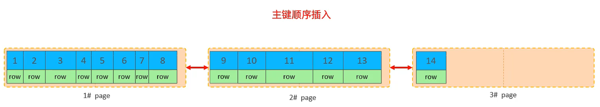

# SQL 进阶

## MySQL 体系结构


### 连接层

最上层是一些客户端和链接服务，主要完成一些类似于连接处理、授权认证、及相关的安全方案。服务器也会为安全接入的每个客户端验证它所具有的操作权限。

### 服务层

第二层架构主要完成大多数的核心服务功能，如 SQL 接口，并完成缓存的查询，SQL 的分析和优化，部分内置函数的执行。所有跨存储引擎的功能也在这一层实现，如过程、函数等。

### 引擎层

存储引擎真正的负责了 MySQL 中数据的存储和提取，服务器通过API和存储引擎进行通信。不同的存储引擎具有不同的功能，这样我们可以根据自己的需要，来选取合适的存储引擎。

### 存储层

主要是将数据存储在文件系统之上，并完成与存储引擎的交互。

## 存储引擎

### 查看数据库支持的引擎

通过此方式查看数据库支持的存储引擎：

```sql
SHOW ENGINES;
```

### MyISAM

MyISAM 是 MySQL 5.5 之前的默认数据库引擎。由早期的 ISAM 所改良。性能极佳，在这几年的发展下，InnoDB 数据库引擎以强化参照完整性与并发违规处理机制，在一些方面逐渐取代了 MyISAM 数据库引擎。

#### 特点

- 支持全文索引，在涉及全文索引领域的查询效率上 MyISAM 速度更高。（5.7 以后的 InnoDB 也支持全文索引）
- 遇到错误，必须完整扫描后才能重建索引或修正未写入硬盘的错误。且 MyISAM 的修复时间与数据量的多少成正比。
- MyISAM 引擎的数据表被压缩后仍然可以进行查询操作。
- 执行 `SELECT COUNT(*) FROM 数据表` 时不需要全表扫描，因为 MyISAM 保存了表的具体行数。执行上述语句时如果加有 WHERE 条件，就会退化为全表扫描。
- 读写互相堵塞。在 MyISM 类型的表中，向表中写入数据的同时另一个会话无法向该表中写入数据，也不允许其他的会话读取该表中的数据。只允许多个会话同时读取数据表中的数据。
- 只会缓存索引，不会缓存数据。所谓缓存，就是指数据库在访问磁盘数据时，将更多的数据读取进入内存，这样可以使得当访问这些数据时，直接从内存中读取而不是再次访问硬盘。MyISAM 可以通过 key_buffer_size 缓存索引，以减少磁盘 I/O，提升访问性能。但数据表并不会被缓存。
- 不支持行级锁，仅支持表级锁定。即发生数据更新时，会锁定整个表，以防止其他会话对该表中数据的同时修改所导致的混乱。这样做可以使得操作简单，但是会减少并发量。
- 不支持外键约束和事务。

#### 存储形式

MyISAM 表在磁盘上对应着三个文件，他们以表名作为文件名：`.frm` 存储了表的结构；`.MYD` 存储了表的数据；`.MYI` 存储了表的索引。

#### 创建方法

```sql
CREATE TABLE 表名 (
  字段 字段类型 [约束条件],
  字段 字段类型 [约束条件]
) ENGINE=MyISAM;
```

### InnoDB

**InnoDB 是一种兼顾高可靠性和高性能的通用存储引擎，支持事务、行级锁、外键约束。并在 MySQL 5.5 之后成为 MySQL 的默认存储引擎。**

#### 特点

- InnoDB 是聚集索引，使用 B+Tree 作为索引结构，数据文件是和（主键）索引绑在一起的（表数据文件本身就是按 B+Tree 组织的一个索引结构），必须要有主键，通过主键索引效率很高。但是辅助索引需要两次查询，先查询到主键，然后再通过主键查询到数据。因此，主键不应该过大，因为主键太大，其他索引也都会很大。
- InnoDB 可借由事务记录档（Transaction Log）来恢复程序崩溃，或非预期结束所造成的数据错误（修复时间，大略都是固定的）相对而言，随着数据量的增加，InnoDB 会有较佳的稳定性。
- InnoDB 有自己的读写缓存管理机制。（InnoDB 不会将被修改的数据页立即交给操作系统）因此在某些情况下，InnoDB 的数据访问会更快。
- 支持行级锁，并发性能优异。
- 支持外键约束和事务。

#### 逻辑存储结构

表空间 -> 段 -> 区 -> 页 -> 行


有以下几点需要注意：

- 区的大小是固定的 1MB 。
- 页的大小是固定的 16KB。
- 一个区最多存储 64 个页。
- 磁盘操作的最小单元是页。

#### 存储形式
>
> ibd 对应着[逻辑存储结构](#逻辑存储结构)中的表空间

查看 INNODB_FILE_PER_TABLE 状态：

```sql
SHOW VARIABLES LIKE 'INNODB_FILE_PER_TABLE';
```

创建 InnoDB 表时，分两种情况：  

- 如果通过 `SET GLOBAL INNODB_FILE_PER_TABLE = 1;` 将 INNODB_FILE_PER_TABLE 设置为 ON，然后再去创建一个 InnoDB 表，创建表的同时，磁盘上也会出现两个文件，他们以表名作为文件名：`.ibd` 内部存储了表的数据，`.frm` 内部存储了表的结构和索引。
- 如果通过 `SET GLOBAL INNODB_FILE_PER_TABLE = 0;` 将 INNODB_FILE_PER_TABLE 设置为 OFF，然后再去创建一个 InnoDB 表，创建表的同时，磁盘上也会出现两个文件，后缀为 `.ibd`。内部存储了数据表的结构、数据和索引。

我们可以通过命令查看 `.ibd` 内部存储的表结构：

```bash
ibd2sdi 表名.ibd
```

#### 创建方法

InnoDB 是 MySQL 的默认引擎，创建表时不指定引擎参数，MySQL 会默认创建 InnoDB 引擎的数据表：

```sql
CREATE TABLE 表名 (
  字段 字段类型 [约束条件],
  字段 字段类型 [约束条件]
);
```

### MRG_MYISAM

**MERGE 存储引擎，也被称为 MRG_MYISAM 引擎（又叫分表）**是一个相同的可以被当作一个来用的 MyISAM 表的集合。“相同”意味着所有表结构、索引、字段顺序都需要一致。而且，任何或者所有的表都可以用 MyISAMPack 来压缩。表选项的差异，比如 AVG_ROW_LENGTH，MAX_ROWS 或 PACK_KEYS 都不重要。

#### 特点

当你创建 MRG_MYISAM 表时，你必须指定 `UNION=(子表1, 子表2, ...)` 子句，它用来说明你要把哪些表当作一个来用。MRG_MYISAM 表默认是只读的，如果你想要自己对 MRG_MYISAM 表的插入操作生效，那么可以指定 `INSERT_METHOD` 选项，它支持三个值：

- `NO`：只读（默认值）
- `FIRST`：插入操作发生在第一个子表上
- `LAST`：插入操作发生在最后一个子表上

如果你没有指定 `INSERT_METHOD` 选项，那么 MRG_MYISAM 表将会是只读的。  
你可以对表的集合使用 `SELECT`, `DELETE`, `UPDATE` 和 `INSERT`，并且你必须拥有所有子表的 `SELECT`, `DELETE`, `UPDATE` 和 `INSERT` 权限。对 MRG_MYISAM 表做出的操作只能生效于子表的第一个或最后一个。  
删除 MRG_MYISAM 表不会影响子表。

#### 存储形式

MRG_MYISAM 表在磁盘上对应着两个文件，他们以表名作为文件名：`.frm` 后缀名的文件文件存储表定义；`.mrg` 后缀名的文件包含被当作一个来用的表的名字。（这些子表作为 MRG_MYISAM 表自身，不必要在同一个数据库中）

#### 创建方法
>
> 所有子表与主表的结构必须一致。  

先创建三个子表：

```sql
CREATE TABLE 子表1 (
  字段 字段类型 [约束条件],
  字段 字段类型 [约束条件]
) ENGINE=MyISAM;

-- 复制表操作
CREATE TABLE 子表2 LIKE 子表1;
CREATE TABLE 子表3 LIKE 子表1;
```

创建主表（只读）：

```sql
CREATE TABLE 主表 (
  字段 字段类型 [约束条件],
  字段 字段类型 [约束条件]
) ENGINE=MRG_MyISAM INSERT_METHOD=NO UNION(子表1, 子表2, 子表3);
```

### MEMORY

Memory 引擎的表数据是存储在内存中的，受硬件问题、断电问题的影响，只能将这些表作为临时表或缓存使用。

#### 特点

- 数据单独存放，索引上保存的是数据的位置，该方式称之为堆组织表。
- 不支持行锁，支持表锁。
- 表的锁力度过大，在处理并发事务时性能较低。
- 数据存放在内存中，如果数据库重启，表中的数据将会被清除，无法将数据持久化。
- 当表的数据大于 `max_heap_table_size` 设定的容量大小时，会转换超出的数据存储到磁盘上，因此性能会大打折扣。
- 使用哈希散列索引把数据保存在内存中，因此具有极快的速度，适合作为中小型缓存数据库使用。
- 不允许使用 `xxxTEXT` 和 `xxxBLOB` 数据类型；**只精确搜索记录**；不支持 `AUTO_INCREMENT`；只允许对非空数据列进行索引。
- 如果是复制的某数据表，则复制之后所有主键、索引、自增等格式将不复存在，如果需要的话，请重新添加主键和索引。

#### max_heap_table_size

我们可以根据实际情况调整 max_heap_table_size，例如在 `my.cnf` 文件中的 \[mysqld\] 下面加入：

```cnf
max_heap_table_size = 2048M
```

#### 存储形式

MEMORY 表在磁盘上对应着一个文件，以表名作为文件名，后缀为 `.frm`，内部存储的是表结构。

#### 创建方法
>
> 在建表时，我们可以通过 MAX_ROWS 来控制表的记录数。

正常情况：

```sql
CREATE TABLE 表名 (
  字段 字段类型 [约束条件],
  字段 字段类型 [约束条件]
) ENGINE=MEMORY;
```

创建一个最大存储 100 行数据的 Memory 表：

```sql
CREATE TABLE 表名 (
  字段 字段类型 [约束条件],
  字段 字段类型 [约束条件]
) ENGINE=MEMORY MAX_ROWS=100;
```

### CSV

CSV 存储引擎可以将 csv 文件作为表进行处理。存储格式就是普通的 csv 文件。

#### 特点

- 直接将使用逗号分隔值格式的文本数据存储到表。
- 不支持索引、事务、查询下推等，一般用于日志表的数据存储或者作为数据转换的中间表。
- 可以直接导入 EXCEL 表或者 CSV 文件，使用起来非常方便。
- 所有的列必须都是非空的。
- 可以对数据文件直接编辑（保存文本文件内容）

#### 存储形式

创建 CSV 表时，其对应着磁盘上的三个文件，文件名以表的名字开始：`.CSV` 后缀名的文件存储表内容；`.CSM` 后缀名的文件存储表的元数据如表状态和数据量；`.frm` 后缀名的文件存储表结构信息。
如果是 8.0 版本的数据库，则没有 `.frm` 文件，取而代之的是 `.sdi` 文件。

#### 创建方法

```sql
CREATE TABLE 表名 (
  字段 字段类型 NOT NULL [约束条件],
  字段 字段类型 NOT NULL [约束条件]
) ENGINE=CSV;
```

### FEDERATED

MySQL 提供了一个类似 Oracle 中的数据库链接（DBLINK）功能的存储引擎——FEDERATED，说人话就是“远程表”。本地只创建一个表定义文件（`.frm`），数据在服务端。自 5.1.26 版本开始，默认情况下不启用 FEDERATED 存储引擎。

#### 安装方法

FEDERATED 存储引擎支持动态安装（命令在 SQL 里面执行）：

```sql
-- 全平台（推荐）
INSTALL PLUGIN FEDERATED SONAME 'ha_federated';

-- Windows
INSTALL PLUGIN FEDERATED SONAME 'ha_federated.dll';

-- Linux
INSTALL PLUGIN FEDERATED SONAME 'ha_federated.so';
```

安装完毕后再次查询即可发现 FEDERATED 的 supports 列已经变为了 yes

#### 特点

- 远程服务器必须是一个MySQL服务器。
- FEDERATED 对其它数据库引擎的支持可能会在将来被添加，目前不支持其他数据库，跨服务器远程连接其他类型数据库可以采用创建远程连接服务器的方式。
- FEDERATED 表指向的远程表在你通过 FEDERATED 表访问它之前必须存在。
- FEDERATED 表指向另一个 FEDERATED 表是可能的，小心不要创建一个循环。
- 不支持事务。
- 如果修改 FEDERATED 表，那么对应的远程表也会被改变。
- 如果远程表已经改变，对 FEDERATED 引擎的表而言是无法预知的。
- 您必须拥有目标数据库的权限，才能进行操作。
- FEDERATED 存储引擎支持 SELECT、INSERT、UPDATE、DELETE 和索引。
- 不支持 ALTER TABLE、DROP TABLE 或任何其它的 DDL 语句。且当前的实现不使用预先准备好的语句。
- FEDERATED 表不能对查询缓存不起作用。

#### 存储形式

创建 FEDERATED 表时，其对应着磁盘上的一个文件，文件名以表的名字开始，后缀名为 `.frm`，存储表的定义信息。

#### 创建方法

本地的 FEDERATED 与远程的表机构必须一致（表名可以不一样），CONNECTION 后面的是一个数据库连接字符串：

```sql
CREATE TABLE 表名 (
  字段 字段类型 [约束条件],
  字段 字段类型 [约束条件]
) ENGINE=FEDERATED CONNECTION='mysql://user:host@ip:port/database/table';
```

### PERFORMANCE_SCHEMA

PERFORMANCE_SCHEMA 是运行在较低级别的用于监控 MySQL 运行过程中的资源消耗、资源等待等情况的一个功能特性。也是一个存储引擎。

#### 特点

- 提供了一种在数据库运行时，实时检查数据库服务器内部执行情况的方法。
- 可监控任何事情以及对应的时间消耗，利用这些信息来判断数据库服务器中的相关资源消耗。
- 只被记录在本地数据库服务器的 PERFORMANCE_SCHEMA 中，其表中数据发生变化时不会被写入 binlog 中，也不会通过复制机制被复制到其他数据库服务器中。
- 对于这些表可使用 SELECT 语句查询，也可以使用 SQL 语句更新 PERFORMANCE_SCHEMA 数据库中的表记录，但不建议更新，会影响后续的数据收集。
- 表中数据不会持久化存储在磁盘中，而是保存在内存中，一旦服务器重启，这些数据就会丢失。
- 它不会导致数据库服务器的行为发生变化（查询，优化等）。
- 总体上开销有限也不会影响性能。
- 对某事件监测失败，不影响数据库服务器正常运行。
- 当针对一个数据，同时被 PERFORMANCE_SCHEMA 收集和查询，则**收集优先于查询**。
- 事件监测点可进行配置。

#### 启用方法

查看数据库是否启用了 PERFORMANCE_SCHEMA ：

```sql
SHOW VARIABLES LIKE 'PERFORMANCE_SCHEMA';
```

### BLACKHOLE

### ARCHIVE

## 性能分析

### 查看执行频次

查看当前数据库的 INSERT、UPDATE、DELETE、SELECT 使用频次：

```sql
-- 会话
SHOW SESSION STATUS LIKE 'Com_______

-- 全局
SHOW GLOBAL STATUS LIKE 'Com_______'
```

### 慢查询日志

慢查询日志记录了所有执行时间超过指定参数的SQL语句。此功能在高并发场景存在性能问题。如非必要，请不要在生产环境开启此功能！

#### 查看状态

可以通过这种方式查看慢查询日志的开关状态：

```sql
SHOW VARIABLES LIKE 'SLOW_QUERY_LOG';
```

#### 启用功能

MySQL 的慢查询日志默认没有开启，需要在 MySQL 的配置文件（my.cnf）中添加以下内容：

```cnf
# 开启慢查询日志
slow_query_log=1

# 设置慢查询日志的时间为 2 秒（默认 10 秒）
long_query_time=2
```

修改配置文件后重启 MySQL 服务生效。  

#### 查看日志

慢查询日志文件名：`localhost-slow.log`  
Windows 与 Linux 路径不同，不同版本 SQL 的路径也不同，具体位置请自行百度。

### PROFILE

提供可以用来分析当前会话中语句执行的资源消耗情况，用于 SQL 调优的测量。

#### 查看支持情况

查看当前 MySQL 是否支持 PROFILE 操作：

```sql
SELECT @@HAVE_PROFILING;

-- 或

SHOW VARIABLES LIKE 'HAVE_PROFILING%';
```

#### 开启状态

查看开启状态：

```sql
SELECT @@PROFILING;

-- 或

SHOW VARIABLES LIKE 'PROFILING';
```

#### 开启 PROFILE

```sql
SET PROFILING = 1;
```

#### 使用

查看当前会话所有 SQL 语句的耗时：

```sql
SHOW PROFILES;
```

查看指定 query_id 对应的 SQL 语句在各个阶段的耗时：

```sql
SHOW PROFILE FOR QUERY query_id;
```

查看指定 query_id 对应的 SQL 语句的 CPU 使用情况：

```sql
SHOW PROFILE CPU FOR QUERY query_id;
```

### EXPLAIN/DESC

EXPLAIN 或者 DESC 命令获取 MySQL 如何执行 SELECT 语句的信息，包括在 SELECT 语句执行过程中表如何连接和连接的顺序。

#### 语法

直接在 SELECT 语句之前加上关键字 EXPLAIN 或 DESC：

```sql
EXPLAIN SELECT 字段列表 FROM 表名 WHERE 条件;

-- 或

DESC SELECT 字段列表 FROM 表名 WHERE 条件;
```

#### 各字段含义

字段名|含义
-|-
id|select 查询的序列号，表示查询中执行 SELECT 子句或者操作表的顺序（id 相同，执行顺序从上到下；id 不同，值越大越先执行）
select_type|SELECT 的类型，常见取值有 SIMPLE（简单表，即不适用表连接或者子查询）、PRIMARY（主查询，即外层的查询）、UNION（UNION中的第二个或者后面的查询语句）、SUBQUERY（SELECT/WHERE之后包含了子查询）等
type|连接类型，性能由好到差的连接类型为 NULL、system、const、eq_ref、ref、range、index、all possible_key：可能应用在这张表上的索引，一个或多个
key|实际使用的索引，如果为 NULL，则没有使用索引
key_len|索引中使用的字节数，该值为索引字段最大可能长度，并非实际使用长度，在不损失精确性的前提下，长度越短越好
rows|必须要执行的行数，在 InnoDB 引擎的表中，是一个估计值，可能并不总是准确的
filtered|返回结果的行数占需读取行数的百分比，filtered 的值越大越好

## 索引

索引类似于书的目录，在没有目录的情况下，要从书中查找某项内容就必须阅读全文，而有了目录之后，通过页码就可以很快定位到相关内容。  
从本质上看，索引是根据表的一个或者多个字段生成的子表，该子表中的数据已经进行了排序。子表除了包含指定字段中的数据，还包含一个 rowid 列，用于存储当前记录在原始表中的位置。用户无法看到索引，它只是用来加快查询速度。  
为了提高查询效率，便于后期维护，索引都是基于某种数据结构而创建的，比如 B+ 树、B- 树、位图等。  

优点：

- 提高数据检索效率，降低 I/O 成本。
- 通过索引列对数据进行排序，降低排序成本，更低的 CPU 占用。

缺点：

- 索引列占用额外空间。
- 索引提高查询效率，降低更新数据速度。

### 结构

索引结构|描述
-|-
B+Tree|最常见的索引类型，大部分引擎都支持。
Hash|使用哈希表实现，只能进行精确匹配，不支持模糊查询。
R-Tree（空间索引）|MyISAM 引擎的一个特殊索引，主要用于地理空间数据类型，通常使用较少。
Full-Text（全文索引）|通过建立倒排索引，快速匹配文档的方式，类似于 Lucene, Solr, ES。

### 引擎支持情况

索引类型|InnoDB|MyISAM|Memory
:-:|:-:|:-:|:-:
B+Tree|√|√|√
Hash|||√
R-Tree||√|
Full-text|√（5.6 版本后）|√|

### B-Tree

这是一个常规的二叉树：


二叉树的缺点可以用红黑树来解决：

红黑树解决了 B 数在极端情况下退化为链表的情况，但红黑树也存在大数据量情况下，层级较深，检索速度慢的问题。  
为了解决上述问题，可以使用 B-Tree 结构。  
多路平衡查找树 (B-Tree) 以一棵最大度数（max-degree，指一个节点的子节点个数）为 5（5阶）的 b-tree 为例，每个节点最多存储 4 个key，5 个指针。

B-Tree 演示地址：<https://www.cs.usfca.edu/~galles/visualization/BTree.html>

### B+Tree


与 B-Tree 的区别：

- 所有的数据都会出现在叶子节点
- 叶子节点形成一个单向链表

MySQL 索引数据结构对经典的 B+Tree 进行了优化。在原 B+Tree 的基础上，增加一个指向相邻叶子节点的链表指针，就形成了带有顺序指针的 B+Tree，提高区间访问的性能：


### Hash

哈希索引就是采用一定的 hash 算法，将键值换算成新的 hash 值，映射到对应的槽位上，然后存储在 hash 表中。  
如果两个（或多个）键值，映射到一个相同的槽位上，就会产生 hash 冲突（也称为 hash 碰撞），可以通过链表来解决。


特点：

- Hash索引只能用于对等比较（=、in），不支持范围查询（betwwn、>、<、...）
- 无法利用索引完成排序操作
- 查询效率高，通常只需要一次检索就可以了，效率通常要高于 B+Tree 索引

存储引擎支持：

- Memory
- InnoDB（具有自适应 hash 功能，hash 索引是存储引擎根据 B+Tree 索引在指定条件下自动构建的）

### 面试题

为什么 InnoDB 存储引擎选择使用 B+Tree 索引结构？

- 相对于二叉树，层级更少，搜索效率高
- 对于 B-Tree，无论是叶子节点还是非叶子节点，都会保存数据，这样导致一页中存储的键值减少，指针也跟着减少，要同样保存大量数据，只能增加树的高度，导致性能降低
- 相对于 Hash 索引，B+Tree 支持范围匹配及排序操作

### 索引分类

分类|含义|特点|关键字
-|-|-|-
主键索引|针对于表中主键创建的索引|默认自动创建，只能有一个|PRIMARY
唯一索引|避免同一个表中某数据列中的值重复|可以有多个|UNIQUE
常规索引|快速定位特定数据|可以有多个|
全文索引|全文索引查找的是文本中的关键词，而不是比较索引中的值|可以有多个|FULLTEXT

在 InnoDB 存储引擎中，根据索引的存储形式，又可以分为以下两种：
分类  | 含义  | 特点
-|-|-
聚集索引（Clustered Index|将数据存储与索引放一块，索引结构的叶子节点保存了行数据|必须有，而且只有一个
二级索引（Secondary Index）|将数据与索引分开存储，索引结构的叶子节点关联的是对应的主键|可以存在多个

结构图：


聚集索引选取规则：

- 如果存在主键，主键索引就是聚集索引
- 如果不存在主键，将使用第一个唯一（UNIQUE）索引作为聚集索引
- 如果表没有主键或没有合适的唯一索引，则 InnoDB 会自动生成一个 rowid 作为隐藏的聚集索引

### 思考

**以下 SQL 语句，哪个执行效率高？为什么？**

```sql
SELECT * FROM user WHERE id = 10;
SELECT * FROM user WHERE name = 'Arm';
-- 备注：id 为主键，name 字段创建的有索引
```

答：第一条语句，因为第二条需要回表查询。
  
**InnoDB 主键索引的 B+Tree 高度为多少？**  
答：假设一行数据大小为 1k，一页中可以存储 16 行这样的数据。InnoDB 的指针占用 6 个字节的空间，主键假设为 bigint，占用字节数为 8 可得公式：`n * 8 + (n + 1) * 6 = 16 * 1024`，其中 8 表示 bigint 占用的字节数，n 表示当前节点存储的 key 的数量，(n + 1) 表示指针数量（比 key 多一个）。算出 n 约为 1170。  
如果树的高度为2，那么他能存储的数据量大概为：`1171 * 16 = 18736`  
如果树的高度为3，那么他能存储的数据量大概为：`1171 * 1171 * 16 = 21939856`  
另外，如果有成千上万的数据，那么就要考虑分表，涉及运维篇知识。

### 语法

#### 创建索引

```sql
CREATE [ UNIQUE | FULLTEXT ] INDEX 索引名 ON 表明 (列1, ...);
```

如果 CREATE 后面不加索引类型参数，则创建的是常规索引。

#### 查看索引

```sql
SHOW INDEX FROM 表名;
```

#### 删除索引

```sql
DROP INDEX 索引名 ON 表名;
```

#### 一些例子

```sql
-- name 字段为姓名字段，该字段的值可能会重复，为该字段创建索引
CREATE INDEX idx_user_name ON tb_user(name);

-- phone 手机号字段的值非空，且唯一，为该字段创建唯一索引
CREATE UNIQUE INDEX idx_user_phone ON tb_user(phone);

-- 为 profession, age, stat 创建联合索引
CREATE INDEX idx_user_p_a_s ON tb_user(profession, age, stat);

-- 为 email 建立合适的索引来提升查询效率
CREATE INDEX idx_user_email ON tb_user(email);

-- 删除 email 索引
DROP INDEX idx_user_email ON tb_user;
```

### 规则

#### 最左前缀法则

如果索引关联了多列（联合索引），要遵守最左前缀法则，最左前缀法则指的是查询从索引的最左列开始，并且不跳过索引中的列。如果跳跃某一列，索引将部分失效（后面的字段索引失效）。  

联合索引中，遵循了最左前缀法则，并且出现范围查询（<, >）可能导致联合索引失效。可以用 >= 或者 <= 来规避索引失效问题。

#### 索引失效情况

在索引列上调用了函数，索引将失效：

```sql
EXPLAIN SELECT * FROM tb_user WHERE SUBSTRING(phone, 10, 2) = '15';
```

字符串类型字段使用时，不加引号，索引将失效：

```sql
-- 此处 phone 的值没有加引号
EXPLAIN SELECT * FROM tb_user WHERE phone = 17799990015;
```

模糊查询中，如果仅仅是尾部模糊匹配，索引不会失效，如果是头部模糊匹配，索引失效：

```sql
-- 模糊匹配头部导致索引失效
EXPLAIN SELECT * FROM tb_user WHERE profession LIKE '%工程';

-- 模糊匹配头部导致索引失效
EXPLAIN SELECT * FROM tb_user WHERE profession LIKE '%工程%';
```

额外注意：

- 用 or 分割开的条件，如果 or 其中一个条件的列没有索引，那么涉及的索引都不会被用到。  
- 如果 MySQL 评估使用索引比全表更慢，则不使用索引。

#### SQL 索引提示

SQL 索引提示是优化数据库的一个重要手段，简单来说，就是在 SQL 语句中加入一些人为的提示来达到优化操作的目的。

##### 建议使用指定索引

USE 是建议，实际使用哪个索引 MySQL 还会自己权衡运行速度去更改：

```sql
EXPLAIN SELECT * FROM 表 USE INDEX(索引字段) WHERE profession="软件工程";
```

##### 不使用指定索引

```sql
EXPLAIN SELECT * FROM 表 IGNORE INDEX(索引字段) where profession="软件工程";
```

##### 强制使用指定索引

FORCE 即就是无论如何都强制使用该索引：

```sql
EXPLAIN SELECT * FROM 表 FORCE INDEX(索引字段) where profession="软件工程";
```

#### 覆盖索引 & 回表查询

尽量使用覆盖索引（查询时使用了索引，并且需要返回的列在该索引中都能找到），尽可能的减少使用 `SELECT *` 。  

##### EXPLAIN 中 EXTRA 字段含义

`using index condition`：使用了索引，但是需要回表查询。  
`using where; using index;`：使用了索引，而且需要的数据都在索引列中能找到，所以不需要回表查询。  

##### 小提示

如果在聚集索引中直接能找到对应的行，则直接返回行数据，只需要一次查询，哪怕是 `SELECT *`。  
如果在辅助索引中找聚集索引，如 `SELECT id, name FROM xxx WHERE name='xxx'`，也只需要通过辅助索引（name）查找到对应的 id，返回 name 和 name 索引对应的 id 即可，只需要一次查询。  
如果是通过辅助索引查找其他字段，则需要回表查询，如 `SELECT id, name, gender FROM xxx where name='xxx';`  

所以尽量不要用 `SELECT *`，容易出现回表查询，降低效率，除非有联合索引包含了所有字段。  

##### 简单的例子

一张表，有四个字段（id, username, password, status），由于数据量大，需要对以下SQL语句进行优化，该如何进行才是最优方案：

```sql
SELECT id, username, password FROM tb_user WHERE username='itcast';
```

答：给 username 和 password 字段建立联合索引，直接覆盖索引，查询时不需要回表查询。

#### 前缀索引

当字段类型为字符串（varchar, text ...）时，有时候需要索引很长的字符串，这会让索引变得很大，查询时，浪费大量的磁盘 IO，影响查询效率，此时可以将字符串的一部分前缀，建立索引，这样可以大大节约索引空间，从而提高索引效率。

##### 语法

```sql
CREATE INDEX 索引名 on 表名(columnn(前缀长度));
```

前缀长度：  
可以根据索引的选择性来决定，而选择性是指不重复的索引值（基数）和数据表的记录总数的比值，索引选择性越高则查询效率越高，唯一索引的选择性是1，这是最好的索引选择性，性能也是最好的。  

### 索引设计原则

- 针对数据量大，且查询比较频繁的表建立索引。
- 针对常作为查询条件（where）、排序（order by）、分组（group by）操作的字段建立索引。
- 尽量选择区分度高的列作为索引，尽量建立唯一索引，区分度越高使用索引的效率就越高。
- 如果是字符串类型的字段，字段长度较长，可以针对字段的特点建立前缀索引。
- 尽量使用联合索引，减少单列索引。查询时，联合索引很多时候可以覆盖索引，节省存储空间、避免回表，提高查询效率。
- 要控制索引的数量，索引不是多多益善！索引越多，维护索引结构的代价就越大，增删改的效率就越低。
- 如果索引不能存储 NULL 值，请在创建表时使用非空约束（NOT NULL）。当优化器知道每列是否包含 NULL 值时，能更好的确定哪个索引最有效的用于查询。

## SQL 优化

通过优化，有时可以大幅度的降低性能开销。在MySQL学习中，优化是重要的一环。

### 主键优化

在 InnoDB 存储引擎中，表数据是根据主键顺序组织存放的。这种存储方式的表被称为**索引组织表**（Index Organized Table, IOT）。

#### 索引结构


#### 逻辑存储结构


#### 页分裂

页的一些特点：

- 页可以为空，也可以填充一半，也可以填充满。
- 每页至少存放 2 行数据。
- 如果单行数据太大，会发生行溢出。
- 这些行数据根据主键排列。

为什么每页至少存放 2 行数据？如果每个页只有 1 行数据，那么页就和链表没有区别了。所以规定每页最少存放 2 行数据。

**顺序插入**

页分裂过程中没有特殊情况，页剩余的空间存放不下时，就去创建新的页。

**乱序插入**

页分裂过程：

1. 原来有 1#、2# 两个页
2. 插入主键为 50 的数据（乱序插入）
3. 创建 3# 页
4. 移动 1# 一半的数据到 3#
5. 将主键为 50 的数据存入 3#
6. 1# 连接 3#（保持有序）
7. 3# 连接 2#（保持有序）

#### 页合并

删除一行记录时，实际上数据并没有在在磁盘上被删除，只是被标记（flaged）为删除并且允许其他记录使用它的（被标记为删除的记录）空间。

当页中删除的记录达到 `MERGE_THRESHOLD`（默认值是页的 50%），InnDB 数据库引擎会开始寻找这个页前后的页尝试合并，减少磁盘占用。

**删除数据发生的页合并**


**MERGE_THRESHOLD**  
合并页的阈值，可在创建表或创建索引时指定此参数。默认为 50%。

#### 主键设计原则

- 在满足需求的情况下，尽可能降低主键的长度。
- 插入数据时，尽量顺序插入。使用 AUTO_INCREMENT 自增主键。
- 尽量不要使用 uuid 做主键或其他的自然信息作为主键。（如手机号、身份证号、住址等等都是无序数据，插入数据时会发生页分裂）。
- 尽可能避免修改主键。

### insert 优化

插入的数据足够多时，意味着要频繁的与数据库建立连接执行插入、提交事务。  

#### 批量插入

使用批量插入语法，单次批量插入不宜过多，一般在 500-1000 条数据之间：

```sql
INSERT INTO 表名 VALUES (列1，列2，...), (列1，列2，...), (列1，列2，...);
```

#### 手动提交事务

使用手动提交事务来避免默认情况下频繁的提交事务：

```sql
BEGIN;
INSERT INTO 表名 VALUES (列1，列2，...);
INSERT INTO 表名 VALUES (列1，列2，...);
INSERT INTO 表名 VALUES (列1，列2，...);
INSERT INTO 表名 VALUES (列1，列2，...);
COMMIT;
```

#### 主键顺序插入优化

顺序插入的性能要比乱序插入的性能高很多。前面的主键优化里由详细阐述，此处不再过多赘述。

#### 大批量插入数据

如果一次性需要插入大批量的数据，使用 INSERT 显然不是明智之举。建议使用 MySQL 提供的 LOAD 指令，从磁盘文件读取数据，然后大批量插入数据库。  
在插入 100 万条数据的情况下，LOAD 耗时 16 秒左右而 INSERT 则超过 10 分钟。

在使用 load 命令之前，要先开启这个功能：

```sql
-- 连接 MySQL 时加上参数 --local-infile
mysql --local-infile -u root -p

-- 开启 load 功能
SET GLOBAL local_infile=1;
```

开启 load 功能后，就可以通过以下命令导入数据了：

```sql
LOAD DATA LOCAL INFILE '文件路径' INTO TABLE 表名 FIELDS TERMINATED BY '列分隔符' LINES TERMINATED BY '行分隔符';
```

被导入到数据库的文件内容格式类似 csv。每一列由特定的分隔符号。  
我们假设这个文件在 `/home/user/data.txt` 内容类似这样：

```text
1,小明,男,13,汉族
2,小李,男,15,汉族
3,小兰,女,12,满族
4,小王,男,19,汉族
5,小韶,女,16,汉族
```

不难看出，这段文本有 5 列数据：`序号`、`姓名`、`性别`、`年龄`、`民族`；每一列由 `,` 分隔；每一行由 `\n` 分隔。

那么将文件内的数据导入到 test 表中应该这样写：

```sql
LOAD DATA LOCAL INFILE '/home/user/data.txt' INTO TABLE test FIELDS TERMINATED BY ',' LINES TERMINATED BY '\n';
```

### order by 优化

Using filesort：通过表的索引或全表扫描，读取满足条件的行，然后在排序缓冲区（sort buffer）中完成排序操作。  
Usint index：通过有序索引顺序扫描直接返回有序数据，不需要额外排序，效率高。  
Backward index scan（反向扫描索引）：索引默认是正序的，如果使用索引倒序排序，就会触发反向扫描索引。

**所有不是直接通过索引返回结果的排序，都叫 FileSort 排序。**

优化原则：

- 根据排序字段建立合适的索引，多字段排序时，也要遵循最左前缀法则。
- 尽量使用覆盖索引。
- 多字段排序，同时存在升序和降序，可以在创建联合索引时指定排序规则以防止触发 Using filesort。
- 若不可避免的触发 Using filesort，在大数据量排序时可以适当增大排序缓冲区（sort_buffer_size, 默认 256kb）大小。

#### 前提条件

tb_user 表：
字段|类型|索引|注释
-|-|-|-
id|INT|Primary|主键
name|VARCHAR(10)||姓名
gender|CHAR(1)||性别
age|TINYINT||年龄
phone|VARCHAR(11)||手机号

#### 只有主键索引

通过主键索引正序排序时触发 Usint index:

```sql
SELECT id, age, phone FROM tb_user ORDER BY id;
```

通过主键索引倒序排序时触发 Backward index scan; Usint index：

```sql
SELECT id, age, phone FROM tb_user ORDER BY id DESC;
```

其他情况都会触发 Using filesort，效率低。

#### 创建了联合索引

```sql
CREATE INDEX idx_user_union ON tb_user(age, phone);
```

下列是可能会遇到的情况：

```sql
-- 使用索引（Using index）
SELECT id, age, phone FROM tb_user ORDER BY age;
SELECT id, age, phone FROM tb_user ORDER BY age, phone;

-- 使用索引，并且反向扫描（Backward index scan; Using index）
SELECT id, age, phone FROM tb_user ORDER BY age DESC;
SELECT id, age, phone FROM tb_user ORDER BY age DESC, phone DESC;

-- 使用索引（覆盖索引），但没完全使用（Using index; Using filesort）
SELECT id, age, phone FROM tb_user ORDER BY phone;
SELECT id, age, phone FROM tb_user ORDER BY phone DESC;
SELECT id, age, phone FROM tb_user ORDER BY age, phone DESC;
SELECT id, age, phone FROM tb_user ORDER BY age DESC, phone;
```

对于这种情况：

```sql
-- 查询的列在索引内（覆盖索引），但没用上（Using index; Using filesort）
SELECT id, age, phone FROM tb_user ORDER BY age, phone DESC;
```

可以通过添加索引来防止出现 Using filesort：

```sql
CREATE INDEX idx_age_phone_ad ON tb_user(age, phone DESC);
```

### group by 优化

Using temporary：分组时使用了临时表，效率很低。可以理解为没有命中索引。

**大部分优化与 order by 优化一致。**

#### 前提条件

tb_user 表：

字段|类型|索引|注释
-|-|-|-
id|INT|Primary|主键
name|VARCHAR(10)|无|姓名
gender|CHAR(1)|无|性别
age|TINYINT|无|年龄
phone|VARCHAR(11)|无|手机号

#### 只有主键索引

通过主键索引分组时触发 Usint index:

```sql
SELECT id, COUNT(*) FROM tb_user GROUP BY id;
```

其他情况都会触发 Using temporary，效率低。

#### 创建了联合索引

```sql
CREATE INDEX idx_user_union ON tb_user(gender, age, phone);
```

下列是可能会遇到的情况：

```sql
-- 使用索引
SELECT gender, COUNT(*) FROM tb_user GROUP BY gender;
SELECT gender, age, COUNT(*) FROM tb_user GROUP BY gender, age;
SELECT age, COUNT(*) FROM tb_user WHERE gender='女' GROUP BY age;

-- 使用索引，但没完全用上（Using index; Using temporary）
SELECT age, COUNT(*) FROM tb_user GROUP BY age;
```

### limit 优化

一个很平常的 LIMIT：

```sql
SELECT * FROM 表名 LIMIT 1000000, 2;
```

它将查询 1000000 + 2 条数据，丢弃 1000000 条数据，最终返回 2 条数据。可以看出，跳过的数据越多，就越耗时。

#### 子查询优化

使用聚集索引可以得到 \[1000000, 1000002\] 这个区间的数据的 id：

```sql
SELECT id FROM 表名 LIMIT 1000000, 2;
```

通过 id 查询数据：

```sql
SELECT *
FROM 表名
WHERE id = (
  SELECT id
  FROM 表名
  LIMIT 1000000, 2
);
```

如果提示“当前版本数据库不支持在子查询语句内使用 LIMIT 关键字”，可以使用多表查询来规避。

#### 多表查询优化

使用聚集索引得到 \[1000000, 1000002\] 这个区间的数据的 id，将查询结果作为一个表，进行多表查询：

```sql
SELECT A.*
FROM
  tb_user AS A,
  (
    SELECT id
    FROM 表名
    LIMIT 1000000, 2
  ) AS B
WHERE A.id = B.id;
```

### count 优化

MyISAM 引擎把一个表的总行数存到了硬盘上，因此执行 COUNT(\*) 时会直接返回这个数，效率很高。如果使用了 WHERE 那么就会一行一行的读取数据，然后累计计数。
InnoDB 引擎在执行 COUNT(\*) 时会一行一行的读取数据，然后累计计数。

MySQL 没有方法优化 COUNT()，建议自行计数。

<!-- ### 更新数据优化

至此弃坑 -->

## 快速跳转

[回到顶部](#SQL-进阶)
