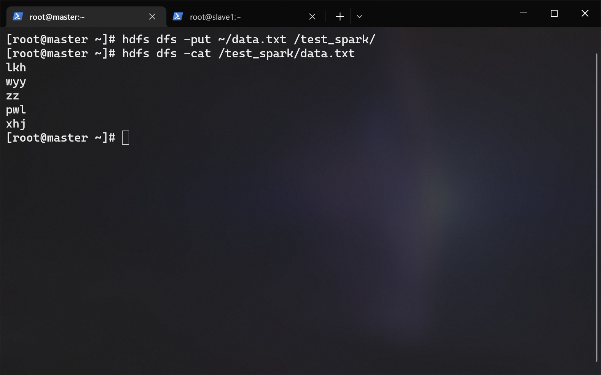

# <span id="top">SCALA & SPARK 搭建文档</span>

## 前提条件
- hadoop 集群已经启动
- scala-2.11.8.tgz（位于/opt/tar下）
- spark-2.0.0-bin-hadoop2.6.tgz（位于/opt/tar下）
- 分布式搭建

---

## 1.解压
> 以下内容在 master 节点上操作

进入 /opt/app/ 目录内：
``` shell
cd /opt/apps
```

分别解压 scala-2.11.8.tgz 与 spark-2.0.0-bin-hadoop2.6.tgz 到当前目录：
``` shell
tar -zxf /opt/tar/scala-2.11.8.tgz
tar -zxf /opt/tar/spark-2.0.0-bin-hadoop2.6.tgz
```

重命名 scala 与 spark ：
``` shelll
mv ./scala-2.11.8 ./scala
mv ./spark-2.0.0-bin-hadoop2.6 ./spark
```

---

## 2.配置环境变量
> 以下内容在 master 节点上操作

编辑用户根目录下的 .bashrc 文件：
``` shell
vi ~/.bashrc
```

在文件末尾添加：
``` shell
export SPARK_HOME=/opt/apps/spark
export SCALA_HOME=/opt/apps/scala
export PATH=$PATH:$SPARK_HOME/bin:$SPARK_HOME/sbin:$SCALA_HOME/bin
```

---

## 3.配置 spark-env.sh
> 以下内容在 master 节点上操作

进入配置目录：
``` shell
cd /opt/apps/spark/conf
```

使用预置模板：
``` shell
cp ./spark-env.sh.template ./spark-env.sh
```

编辑它：
``` shell
vi ./spark-env.sh
```

在末尾添加这些：
``` shell
export SCALA_HOME=/opt/apps/scala
export JAVA_HOME=/opt/apps/jdk
export HADOOP_CONF_DIR=/opt/apps/hadoop/etc/hadoop

export SPARK_MASTER_IP=master
export SPARK_MASTER_HOST=master
export SPARK_MASTER_PORT=7077

export SPARK_WORKER_MEMORY=1g
export SPARK_WORKER_HOST=master
export SPARK_WORKER_PORT=7078
```

---

## 4.配置 slaves
> 以下内容在 master 节点上操作

使用预置模板：
``` shell
cp ./slaves.template ./slaves
```

编辑它：
``` shell
vi ./slaves
```

删掉默认存在的 localhost，在末尾写入这些：
``` shell
master
slave1
slave2
```

---

## 5.分发文件
> 以下内容在 master 节点上操作

分发 scala 到 slave1、slave2 ：
``` shell
scp -r /opt/apps/scala slave1:/opt/apps/
scp -r /opt/apps/scala slave2:/opt/apps/
```

分发 spark 到 slave1、slave2 ：
``` shell
scp -r /opt/apps/spark slave1:/opt/apps/
scp -r /opt/apps/spark slave2:/opt/apps/
```

分发环境变量文件到 slave1、slave2 ：
``` shell
scp ~/.bashrc slave1:~/
scp ~/.bashrc slave2:~/
```

---

## 6.生效环境变量
> 以下内容在所有节点上操作
``` shell
source ~/.bashrc
```

---

## 7.启动与测试
> 以下内容在 master 节点上操作

由于环境变量所映射的目录内存在同名文件，所以我们需要进入目录去执行脚本来启动某些服务。

启动 spark ：
``` shell
/opt/apps/spark/sbin/start-all.sh
```

先往 hdfs 内创建一个测试目录：
``` shell
hdfs dfs -mkdir /test_spark
```


随便写一个测试文件：
``` shell
vi ~/data.txt
```


发送到 hdfs 的 test_spark 目录内：
``` shell
hdfs dfs -put ~/data.txt /test_spark/
```


进入 spark shell ：
``` shell
cd /opt/apps/spark/sbin/
spark-shell
```


统计 hdfs 内的 /test_spark/data.txt 有多少行：
``` scala
// Scala 语法
val file = sc.textFile("hdfs://master:9000/test_spark/data.txt")
file.count()
```


退出 spark shell ：
``` scala
:quit
```
---

## 快速跳转
[回到顶部](#top)  
[FLUME 部署文档](../flume/README.md)