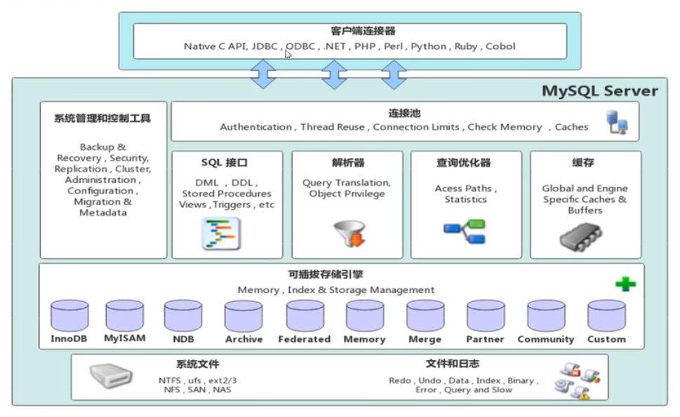
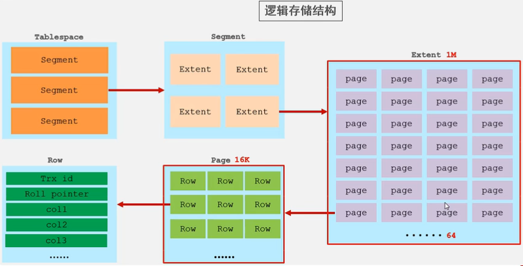

# SQL 进阶

## MySQL 体系结构


### 连接层
最上层是一些客户端和链接服务，主要完成一些类似于连接处理、授权认证、及相关的安全方案。服务器也会为安全接入的每个客户端验证它所具有的操作权限。

### 服务层
第二层架构主要完成大多数的核心服务功能，如 SQL 接口，并完成缓存的查询，SQL 的分析和优化，部分内置函数的执行。所有跨存储引擎的功能也在这一层实现，如过程、函数等。

### 引擎层
存储引擎真正的负责了 MySQL 中数据的存储和提取，服务器通过API和存储引擎进行通信。不同的存储引擎具有不同的功能，这样我们可以根据自己的需要，来选取合适的存储引擎。

### 存储层
主要是将数据存储在文件系统之上，并完成与存储引擎的交互。

## 存储引擎

### 查看数据库支持的引擎
通过此方式查看数据库支持的存储引擎：
``` sql
SHOW ENGINES;
```

### MyISAM
MyISAM 是 MySQL 5.5 之前的默认数据库引擎。由早期的 ISAM 所改良。性能极佳，在这几年的发展下，InnoDB 数据库引擎以强化参照完整性与并发违规处理机制，在一些方面逐渐取代了 MyISAM 数据库引擎。

#### 特点
- 支持全文索引，在涉及全文索引领域的查询效率上 MyISAM 速度更高。（5.7 以后的 InnoDB 也支持全文索引）
- 遇到错误，必须完整扫描后才能重建索引或修正未写入硬盘的错误。且 MyISAM 的修复时间与数据量的多少成正比。
- 引擎的是数据表被压缩后可以进行查询操作。
- 执行 `SELECT COUNT(*) FROM 数据表` 时不需要全表扫描，因为 MyISAM 保存了表的具体行数。执行上述语句时如果加有 WHERE 条件，就会退化为全表扫描。
- 读写互相堵塞。在 MyISM 类型的表中，既不可以在向数据表中写入数据的同时另一个会话也向该表中写入数据，也不允许其他的会话读取该表中的数据。只允许多个会话同时读取该数据表中的数据。
- 只会缓存索引，不会缓存数据。所谓缓存，就是指数据库在访问磁盘数据时，将更多的数据读取进入内存，这样可以使得当访问这些数据时，直接从内存中读取而不是再次访问硬盘。MyISAM 可以通过 key_buffer_size 缓存索引，以减少磁盘 I/O，提升访问性能。但是 MyISAM 数据表并不会缓存数据。
- 不支持行级锁，仅支持表级锁定。即发生数据更新时，会锁定整个表，以防止其他会话对该表中数据的同时修改所导致的混乱。这样做可以使得操作简单，但是会减少并发量。
- 不支持外键约束和事务。

#### 存储形式
创建 MyISAM 表时，MySQL 会在磁盘上创建三个文件，他们以表名作为文件名，后缀名分别是为 `.frm`、`.MYD`、`.MYI`。`.frm` 存储了表的结构，`.MYD` 存储了表的数据，`.MYI` 存储了表的索引。

#### 创建方法
``` sql
CREATE TABLE 表名 (
  字段 字段类型 [约束条件],
  字段 字段类型 [约束条件]
) ENGINE=MyISAM;
```

### InnoDB
**InnoDB 是一种兼顾高可靠性和高性能的通用存储引擎，支持事务、行级锁、外键约束。并在 MySQL 5.5 之后成为 MySQL 的默认存储引擎。**

#### 特点
- InnoDB 是聚集索引，使用 B+Tree 作为索引结构，数据文件是和（主键）索引绑在一起的（表数据文件本身就是按 B+Tree 组织的一个索引结构），必须要有主键，通过主键索引效率很高。但是辅助索引需要两次查询，先查询到主键，然后再通过主键查询到数据。因此，主键不应该过大，因为主键太大，其他索引也都会很大。
- InnoDB 可借由事务记录档（Transaction Log）来恢复程序崩溃，或非预期结束所造成的数据错误（修复时间，大略都是固定的）相对而言，随着数据量的增加，InnoDB 会有较佳的稳定性。
- InnoDB 有自己的读写缓存管理机制。（InnoDB 不会将被修改的数据页立即交给操作系统）因此在某些情况下，InnoDB 的数据访问会更快。
- 支持行级锁，并发性能优异。
- 支持外键约束和事务。

#### 逻辑存储结构
表空间 -> 段 -> 区 -> 页 -> 行


有以下几点需要注意：
- 区的大小是固定的 1MB 。
- 页的大小是固定的 16KB。
- 一个区最多存储 64 个页。
- 磁盘操作的最小单元是页。

#### 存储形式
> ibd 对应着逻辑存储结构中的表空间

创建 InnoDB 表时，分两种情况：  
- 如果通过 `SET GLOBAL INNODB_FILE_PER_TABLE = 1;` 将 INNODB_FILE_PER_TABLE 设置为 ON，然后再去创建一个 InnoDB 表时，MySQL 会在磁盘上创建两个文件，他们以表名作为文件名，后缀名分别是为 `.ibd`、`.frm` 。`.ibd` 内部存储了表的数据，`.frm` 内部存储了表的结构和索引。
- 如果通过 `SET GLOBAL INNODB_FILE_PER_TABLE = 0;` 将 INNODB_FILE_PER_TABLE 设置为 OFF，然后再去创建一个 InnoDB 表时，MySQL 会在磁盘上创建一个文件。这个文件以表名作为文件名，后缀为 `.ibd`。内部存储了数据表的结构、数据和索引。我们可以通过 `ibd2sdi ibd文件` 命令查看 `.ibd` 内部存储的表结构。

查看 INNODB_FILE_PER_TABLE 状态：
``` sql
SHOW VARIABLES LIKE 'INNODB_FILE_PER_TABLE';
```

#### 创建方法
InnoDB 是 MySQL 的默认引擎，创建 InnoDB 时不需要指定任何引擎即可创建 InnoDB 引擎的数据表：
``` sql
CREATE TABLE 表名 (
  字段 字段类型 [约束条件],
  字段 字段类型 [约束条件]
);
```

### MRG_MYISAM
**MERGE 存储引擎，也被称为 MRG_MYISAM 引擎（又叫分表）**是一个相同的可以被当作一个来用的 MyISAM 表的集合。“相同”意味着所有表结构、索引、字段顺序都需要一致。而且，任何或者所有的表都可以用 myisampack 来压缩。表选项的差异，比如 AVG_ROW_LENGTH，MAX_ROWS 或 PACK_KEYS 都不重要。 

#### 特点
当你创建 MRG_MYISAM 表时，你必须指定 `UNION=(子表1, 子表2, ...)` 子句，它用来说明你要把哪些表当作一个来用。MRG_MYISAM 表默认是只读的，如果你想要自己对 MRG_MYISAM 表的插入操作生效，那么可以指定 `INSERT_METHOD` 选项，它支持三个值：
- `NO`：只读（默认值）
- `FIRST`：插入操作发生在第一个子表上
- `LAST`：插入操作发生在最后一个子表上

如果你没有指定 `INSERT_METHOD` 选项，那么 MRG_MYISAM 表将会是只读的。  
你可以对表的集合使用 `SELECT`, `DELETE`, `UPDATE` 和 `INSERT`，并且你必须拥有所有子表的 `SELECT`, `DELETE`, `UPDATE` 和 `INSERT` 权限。对 MRG_MYISAM 表做出的操作只能生效于子表的第一个或最后一个。  
删除 MRG_MYISAM 表不会影响子表。

#### 存储形式
当你创建一个 MRG_MYISAM 表时，MySQL 在磁盘上创建两个文件：文件名以表的名字开始，`.frm` 后缀名的文件文件存储表定义，`.mrg` 后缀名的文件包含被当作一个来用的表的名字。这些表作为 MMRG_MYISAM 表自身，不必要在同一个数据库中。  

#### 创建方法
所有子表与主表的结构需要一致。  

先创建三个子表：
``` sql
CREATE TABLE 子表1 (
  字段 字段类型 [约束条件],
  字段 字段类型 [约束条件]
) ENGINE=MyISAM;

CREATE TABLE 子表2 LIKE 子表1;
CREATE TABLE 子表3 LIKE 子表1;
```

创建主表（只读）：
``` sql
CREATE TABLE 主表 (
  字段 字段类型 [约束条件],
  字段 字段类型 [约束条件]
) ENGINE=MRG_MyISAM INSERT_METHOD=NO UNION(子表1, 子表2, 子表3);
```

### MEMORY
Memory 引擎把数据单独存放，索引上保存的是数据的位置，该方式称之为堆组织表。  
Memory 不支持行锁，支持表锁。  
表的锁力度过大，在处理并发事务时性能较低。  
Memory 表的数据存放在内存中，如果数据库重启，表中的数据将会被清除，无法将数据持久化。


### CSV
CSV 数据库引擎可以直接将使用逗号分隔值格式的文本数据存储到表。CSV 引擎不支持索引、事务、查询下推等，一般用于日志表的数据存储或者作为数据转换的中间表，可以直接导入 EXCEL 表或者 CSV 文件，使用起来非常方便。

### FEDERATED


### PERFORMANCE_SCHEMA


### BLACKHOLE


### ARCHIVE

### 创建表时指定引擎
在创建数据表时可以指定此表使用的存储引擎：  
``` sql
CREATE TABLE 表名 (
  字段 字段类型 [约束条件],
  字段 字段类型 [约束条件]
) ENGINE = 存储引擎;
```

