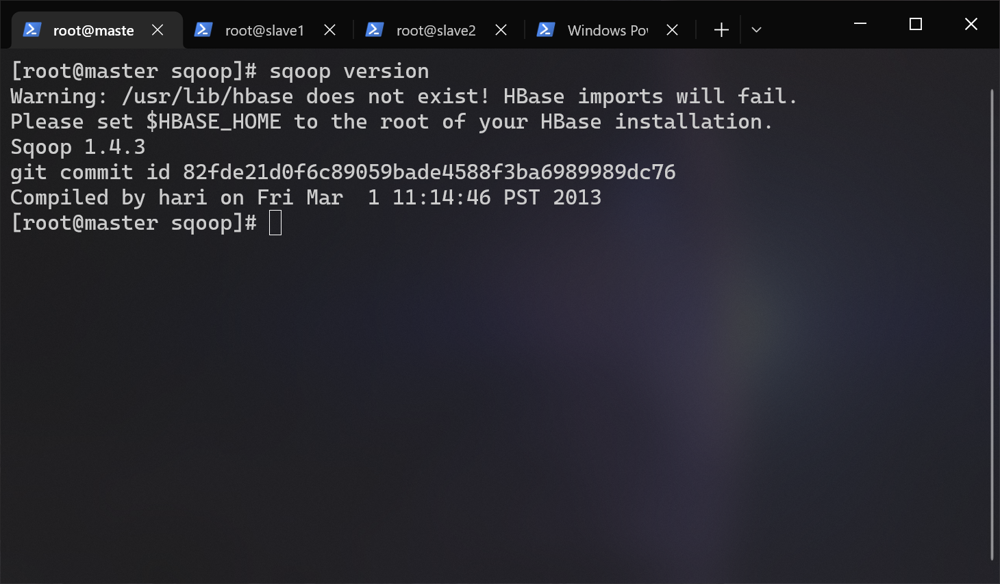
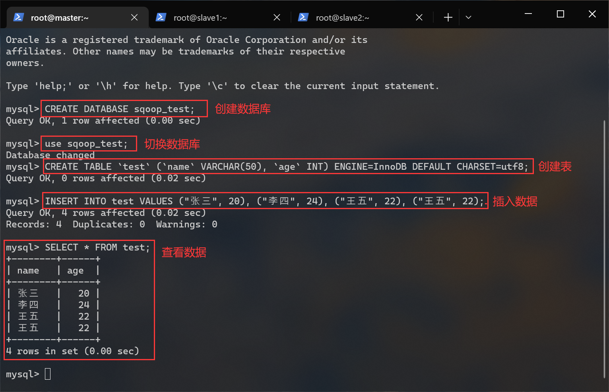

# <span id="top">SQOOP 搭建文档</span>

## 前提条件
- hadoop 集群已经启动
- mysql 已部署完毕
- hive 已部署完毕
- mysql-connector-java-5.1.32.jar（位于/opt/tar下）
- sqoop-1.4.3.bin__hadoop-2.0.0-alpha.tar.gz（位于/opt/tar下）

---

## 1.解压
进入 /opt/app/ 目录内：
``` shell
cd /opt/apps
```

解压 sqoop-1.4.3.bin__hadoop-2.0.0-alpha.tar.gz 到当前目录：
``` shell
tar -zxf /opt/tar/sqoop-1.4.3.bin__hadoop-2.0.0-alpha.tar.gz
```

重命名 sqoop ：
``` shelll
mv ./sqoop-1.4.3.bin__hadoop-2.0.0-alpha ./sqoop
```

## 2.放入 MySQL 驱动包：
因为我们要通过 sqoop 操作 mysql，所以需要将java 连接 mysql 需要用到的驱动复制到 sqoop/lib 下：
``` shell
cp /opt/tar/mysql-connector-java-5.1.32.jar /opt/apps/sqoop/lib/
```

---

## 3.配置环境变量
编辑用户根目录下的 .bashrc 文件：
``` shell
vi ~/.bashrc
```

在文件末尾添加：
``` shell
export SQOOP_HOME=/opt/apps/sqoop
export PATH=$PATH:$SQOOP_HOME/bin
```

生效环境变量：
``` shell
source ~/.bashrc
```

## 4.验证安装
执行这条指令：
``` shell
sqoop version
```


---

## 5.使用sqoop 前的准备工作
修改 mysql 的配置文件：
``` shell
vi /etc/my.cnf
```

在 my.cnf 配置文件中，bind-address 如果是 127.0.0.1，则 mysql 只接受本地连接，不接受远程连接。在 bind-address 后面增加远程访问 IP 地址或者注释掉这句话就可以远程登陆了。所以我们需要注释掉这一行（没有的话就无需这一步操作）：
``` shell
# 注释以井号开头
bind-address = 127.0.0.1
```

以 root 身份登录到 mysql ：
``` shell
mysql -u root -p
```

依照我们之前在[ mysql 搭建文档 ](../mysql/README.md)说过的方法，完全允许 root 远程连接 mysql ：  
命令解释：
  - GRANT：赋权命令
  - ALL PRIVILEGES：当前用户的所有权限
  - ON：介词
  - \*.\*：当前用户对所有数据库和表的操作权限
  - TO：介词
  - 'root'@'%'：权限赋给 root 用户，所有 ip 都能连接
  - WITH GRANT OPTION：允许级联赋权
``` sql
/*
  在开发环境建议这么做，在生产环境上是很危险的操作。
*/
GRANT ALL PRIVILEGES ON *.* TO 'root'@'%' WITH GRANT OPTION;
```

刷新权限：
``` sql
FLUSH PRIVILEGES;
```

创建一个用于测试 sqoop 的数据库和表：
``` sql
# 创建 sqoop_test 数据库
CREATE DATABASE sqoop_test;

# 切换到 sqoop_test 数据库
use sqoop_test;

# 创建 test 表
CREATE TABLE `test` (`name` VARCHAR(50), `age` INT) ENGINE=InnoDB DEFAULT CHARSET=utf8;
```


---

插入一些数据：
``` sql
INSERT INTO test VALUES ("张三", 20), ("李四", 24), ("王五", 22), ("王五", 22);
```


---

## 6.sqoop 指令菜单
查看 sqoop 指令帮助：
``` shell
sqoop help
```


命令|解释
-|-
import|导入数据到集群
export|从集群导出数据
codegen|生成与数据库记录交互的代码
create-hive-table|创建 hive 表
eval|查看 sql 执行结果
import-all-tables|导出某个数据库内的所有表到 hdfs
job|生成一个 job
list-databases|列出所有数据库名称
list-tables|列出某个数据库内的所有表
merge|将 hdfs 中不同目录下的数据合在一起，并存放在指定的目录中
metastore|记录 Sqoop job 的元数据信息，如果不启动 Metastore 实例，则默认的元数据存储日录为 ~/.sqoop
help|打印 sqoop 帮助信息
version|打印 sqoop 版本信息


## 快速跳转
[回到顶部](#top)  
[KAFAKA 部署文档](../kafaka/README.md)