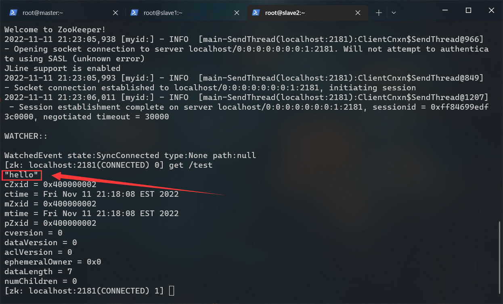

# zookeeper 搭建文档

## 前提条件
- 已经成功部署 Hadoop
- zookeeper-3.4.5.tar.gz（位于 /opt/tar/）

---

## 1.假设
第一台服务器的IP: 192.168.56.101（主机名 master）  
第二台服务器的IP: 192.168.56.102（主机名 slave1）   
第三台服务器的IP: 192.168.56.103（主机名 slave2）

---

## 2.解压 zookeeper
``` shell
# 进入 /opt/apps 目录
cd /opt/apps/

# 解压 zookeeper-3.4.5.tar.gz 到当前目录
tar -zxf /opt/tar/zookeeper-3.4.5.tar.gz

# 重命名 zookeeper
mv ./zookeeper-3.4.5 ./zookeeper
```

---

## 3.配置 zookeeper
创建 data 目录用于存储数据：
``` shell
mkdir /opt/apps/zookeeper/data
```

创建 logs 目录用于存储日志：
``` shell
mkdir /opt/apps/zookeeper/logs
```

进入配置文件夹：
``` shell
cd /opt/apps/zookeeper/conf
```

以 zoo_sample.cfg 为模板创建配置：
``` shell
cp ./zoo_sample.cfg ./zoo.cfg
```

打开配置文件：
``` shell
vi ./zoo.cfg
```

修改完后长这样：（不要复制行首的加号）<a id="zoo-cfg"></a>
``` diff
# The number of milliseconds of each tick
tickTime=2000
# The number of ticks that the initial
# synchronization phase can take
initLimit=10
# The number of ticks that can pass between
# sending a request and getting an acknowledgement
syncLimit=5
# the directory where the snapshot is stored.
# do not use /tmp for storage, /tmp here is just
# example sakes.
+ dataDir=/opt/apps/zookeeper/data
+ dataLogsDir=/opt/apps/zookeeper/logs
# the port at which the clients will connect
clientPort=2181
#
# Be sure to read the maintenance section of the
# administrator guide before turning on autopurge.
#
# http://zookeeper.apache.org/doc/current/zookeeperAdmin.html#sc_maintenance
#
# The number of snapshots to retain in dataDir
#autopurge.snapRetainCount=3
# Purge task interval in hours
# Set to "0" to disable auto purge feature
#autopurge.purgeInterval=1
+ server.1=master:2888:3888
+ server.2=slave1:2888:3888
+ server.3=slave2:2888:3888
```

---

## 4.配置环境变量
编辑用户根目录下的 .bashrc 文件：
``` shell
vi ~/.bashrc
```

在末尾追加以下内容：
``` shell
export  ZK_HOME=/opt/apps/zookeeper
export  PATH=$PATH:$ZK_HOME/bin:$JAVA_HOME/bin
```

> 关于 zookeeper 的一个大坑：  
> jdk 环境变量必须在 zookeeper 环境变量之后配置  
> 如果没有这样做，那么在启动 zookeeper 会提示端口占用  
> 
> 方案1：  
> 将 jdk 环境变量放到文件末尾  
> 
> 方案2：  
> 在 zookeeper 环境变量后面加上 $JAVA_HOME/bin  
> 
> 这里采用方案2

刷新环境变量：
``` shell
source ~/.bashrc
```

测试环境变量：
``` shell
zkServer.sh
```


---

## 5.分发文件
下发 zookeeper：
``` shell
scp -r /opt/apps/zookeeper slave1:/opt/apps/
scp -r /opt/apps/zookeeper slave2:/opt/apps/
```

下发环境变量：
``` shell
scp ~/.bashrc slave1:~/.bashrc
scp ~/.bashrc slave2:~/.bashrc
```

在 slave1 和 slave2 节点上执行此命令刷新环境变量：
``` shell
source ~/.bashrc
```

---

## 6.配置 myid
每台服务器的 myid 对应着 [zoo.cfg](#zoo-cfg) 最下方的数字：
``` shell
# master 节点的 myid 必须是 1
server.1=master:2888:3888
# slave1 节点的 myid 必须是 2
server.2=slave1:2888:3888
# slave2 节点的 myid 必须是 3
server.3=slave2:2888:3888
```

在 master 节点上设置 myid：
``` shell
echo 1 > /opt/apps/zookeeper/data/myid
```

在 slave1 节点上设置 myid：
``` shell
echo 2 > /opt/apps/zookeeper/data/myid
```

在 slave2 节点上设置 myid：
``` shell
echo 3 > /opt/apps/zookeeper/data/myid
```

---

## 7.启动与测试
在所有节点上执行此命令启动 zookeeper：
``` shell
# zkServer.sh 支持下列参数：
# start | start-foreground | stop | restart | status | upgrade | print-cmd
zkServer.sh start
```

打开所有节点的 zookeeper cli：
``` shell
# 记得按几下回车
zkCli.sh
```

在 master 节点的 zookeeper cli 执行此命令：
``` shell
create /test "hello"
```


在 slave1 节点的 zookeeper cli 执行此命令：
``` shell
get /test
```


在 slave2 节点的 zookeeper cli 执行此命令：
``` shell
get /test
```


slave1 与 slave2 均出现 "hello" 即视为部署成功。